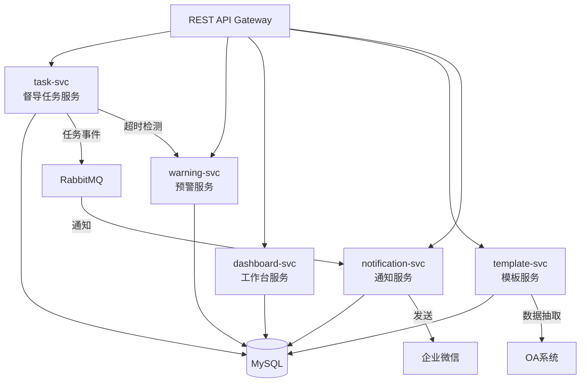
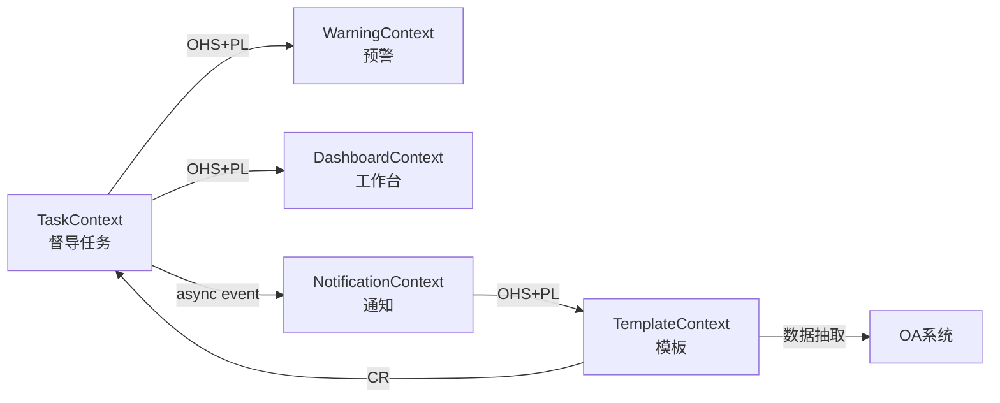
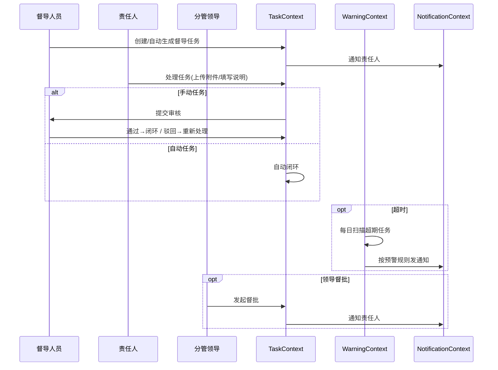
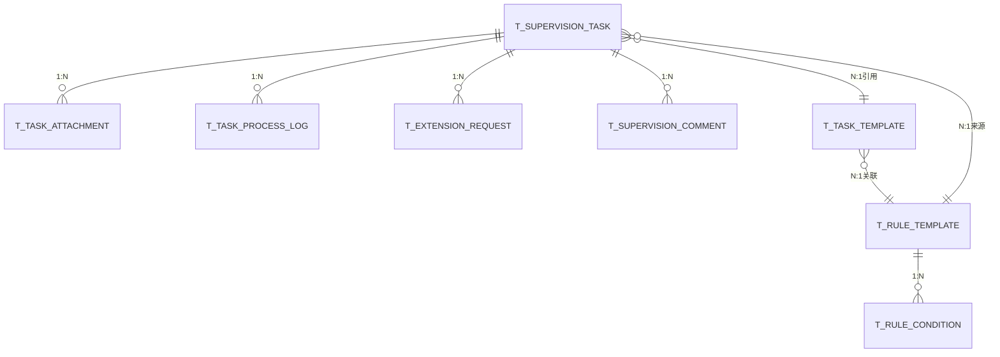

# 椒江农商行数智中心-督导中心 概要设计

> 文档版本：V1.0 | 生成日期：2026-06-01 | 引擎：DDD+AE 融合概设引擎 V2.2 (auto)
> 需求依据：《椒江农商行数智中心需求规格说明书-督导中心-0203.docx》
> 需求成熟度：62/100（功能较完整，接口/非功能细节待补充）

---

## 第1章 功能清单

### 1.1 项目概述

**业务目标**：为椒江农商银行构建督导中心，实现任务从创建→下发→处理→审核→闭环的全生命周期数字化管理，支持自动督导（对接OA等三方系统）和手动督导双模式，配套超时预警、领导督批、数据可视化大屏，落实银行数智化转型。

**核心业务主线**：
1. 督导任务全生命周期：创建→下发→责任人处理→审核→闭环
2. 自动督导：OA系统→规则模板匹配→自动生成任务→下发通知
3. 领导督批：未完结任务→行领导/分管领导发起督批→通知责任人
4. 超时延期：超期任务→延期申请→审批（通过/驳回）

### 1.2 功能模块总览

| 模块 | 子模块 | 优先级 | 主要角色 | 说明 |
|------|--------|:---:|------|------|
| 个人工作台 | 任务概览/待办/督批/分析 | P0 | 普通用户 | 个人任务统一入口+趋势图 |
| 部门工作台 | 部门数据总览/排行/待办 | P0 | 部门负责人/分管领导 | 部门级KPI+钻取 |
| 督导任务管理 | 督导任务(自动+手动) | P0 | 所有人 | 创建/下发/处理/审核/转派/闭环 |
| 督导任务管理 | 领导督批 | P0 | 行领导/分管领导 | 未完结任务督批干预 |
| 超时任务管理 | 超时任务展示+延期申请 | P1 | 所有人 | 延期流程+审批 |
| 超时任务管理 | 预警规则 | P1 | 督导人员 | 多维度超时提醒配置 |
| 督导模板管理 | 规则模板 | P1 | 督导人员 | 自动督导触发规则(O→A对接) |
| 督导模板管理 | 模板管理 | P1 | 督导人员 | 任务模板库+评分规则 |
| 督导模板管理 | 协调调度 | P2 | 所有人 | 手动通知创建与发送 |
| 移动端 | 移动端适配 | P1 | 所有人 | 任务处理/审批/转派 |

### 1.3 角色分析

| 角色 | 数据范围 | 核心职责 |
|------|------|------|
| 普通用户 | 个人数据 | 查看待办、处理任务、查看督批、申请延期 |
| 督导人员 | 全行数据 | 发起督导(手动+自动规则)、查看全部、审核手动任务 |
| 部门负责人 | 本部门 | 查看部门KPI、处理本部门任务、转派任务 |
| 分管领导 | 分管部门 | 查看分管部门数据、发起督批、审批延期 |
| 行领导 | 全行 | 查看全行数据、发起督批 |
| 超级管理员 | 全部 | 后台配置、公开信息维护、最高权限 |

### 1.4 痛点分析

| 痛点 | 严重度 | 说明 |
|------|:---:|------|
| 任务执行无闭环 | high | 缺乏创建→跟踪→审核→闭环的标准化流程 |
| 超期无预警 | high | 任务超期缺少自动化提醒和升级机制 |
| 领导无法干预 | medium | 行领导看不到全局任务进展，无督批手段 |
| 任务来源分散 | medium | OA等系统的待督导任务需人工识别 |
| 数据无沉淀 | medium | 缺乏任务执行数据的分析、排行、考核 |

---

## 第2章 系统架构设计

### 2.1 架构总览

分层架构 + 事件驱动。不采用 CQRS（读写差异小）。不采用微服务（5 Context 内模块化单体即可）。

### 2.2 分层架构

| 层 | 组件 | 规则 |
|------|------|------|
| 接口层 | Controller, DTO | 参数校验和转换 |
| 应用层 | ApplicationService, UseCase | 协调领域对象、事务、权限 |
| 领域层 | Entity, VO, DomainService, Repository接口, DomainEvent | 核心业务逻辑 |
| 基础设施层 | Repository实现, MessagePublisher, ExternalAPI | 持久化、消息、OA对接 |

### 2.3 服务划分

| 服务 | Context | 类型 | 职责 |
|------|------|:---:|------|
| task-svc | TaskContext | core | 督导任务CRUD+生命周期+审核+转派 |
| warning-svc | WarningContext | core | 预警规则+超时扫描+延期审批 |
| dashboard-svc | DashboardContext | core | 个人/部门工作台+数据钻取+排行 |
| template-svc | TemplateContext | supporting | 规则模板+任务模板+协调调度 |
| notification-svc | NotificationContext | generic | 站内信/企业微信/短信 |

### 2.4 技术栈

| 层 | 选型 |
|------|------|
| 后端 | Spring Boot 2.x + MyBatis-Plus |
| 数据库 | MySQL 8.0 (InnoDB, utf8mb4) |
| 缓存 | Redis |
| 定时任务 | XXL-Job |
| 前端 | Vue 3 + Element Plus + ECharts |
| 通知 | 企业微信API + 站内信 |
| 部署 | Docker |

### 2.5 系统结构图



---

## 第3章 业务流程设计

### 3.1 事件风暴

| CMD | 命令 | Actor | → 事件 |
|-----|------|------|--------|
| CMD-01 | 创建手动督导 | 督导人员 | TaskCreated |
| CMD-02 | 自动生成督导 | 系统 | TaskAutoGenerated |
| CMD-03 | 下发任务 | 督导人员 | TaskDispatched |
| CMD-04 | 处理任务 | 责任人 | TaskProcessed |
| CMD-05 | 审核任务 | 督导人员 | TaskReviewed(通过/驳回) |
| CMD-06 | 转派任务 | 部门负责人 | TaskReassigned |
| CMD-07 | 发起督批 | 行领导/分管领导 | SupervisionInitiated |
| CMD-08 | 申请延期 | 责任人 | ExtensionRequested |
| CMD-09 | 审批延期 | 分管领导 | ExtensionApproved/Rejected |
| CMD-10 | 配置预警规则 | 督导人员 | WarningRuleConfigured |
| CMD-11 | 触发预警扫描 | 系统 | WarningTriggered |
| CMD-12 | 创建规则模板 | 督导人员 | RuleTemplateCreated |
| CMD-13 | 创建任务模板 | 督导人员 | TaskTemplateCreated |
| CMD-14 | 发送协调通知 | 督导人员 | NotificationSent |

### 3.2 Context Map



### 3.3 核心时序图



---

## 第4章 数据模型设计

### 4.1 实体识别

| Context | 表名 | 聚合根 | 说明 |
|------|------|:---:|------|
| TaskContext | t_supervision_task | ✅ | 督导任务(含自动/手动) |
| TaskContext | t_task_attachment | - | 任务附件子表 |
| TaskContext | t_task_process_log | - | 处理日志子表 |
| TaskContext | t_supervision_comment | ✅ | 领导督批记录 |
| WarningContext | t_extension_request | ✅ | 延期申请 |
| WarningContext | t_warning_rule | ✅ | 预警规则 |
| WarningContext | t_warning_log | - | 预警发送记录 |
| DashboardContext | — | — | 纯查询，无独立表 |
| TemplateContext | t_rule_template | ✅ | 规则模板(含条件子表) |
| TemplateContext | t_rule_condition | - | 规则条件子表 |
| TemplateContext | t_task_template | ✅ | 任务模板(含评分规则) |
| TemplateContext | t_coordination_notice | ✅ | 协调调度通知 |
| NotificationContext | t_notification | ✅ | 通知记录 |

### 4.2 核心表 DDL

```sql
-- 9标准字段规范：data_id, create_member, create_time, create_member_ip_address,
--   last_mod_member, last_mod_time, last_mod_member_ip_address, del_flag, source_system

CREATE TABLE t_supervision_task (
    data_id VARCHAR(64) PRIMARY KEY COMMENT '主键',
    task_name VARCHAR(256) NOT NULL COMMENT '任务名称',
    task_type VARCHAR(32) NOT NULL COMMENT '自动/手动',
    supervision_type VARCHAR(32) COMMENT '日常督办/专项督办',
    task_status VARCHAR(32) NOT NULL DEFAULT '进行中' COMMENT '进行中/已完成/已超期',
    responsible_dept VARCHAR(256) COMMENT '负责部门(多选,JSON数组)',
    responsible_person VARCHAR(64) COMMENT '负责人ID',
    start_time DATETIME COMMENT '开始时间',
    end_time DATETIME COMMENT '截止时间',
    template_id VARCHAR(64) COMMENT 'FK→t_task_template.data_id',
    rule_template_id VARCHAR(64) COMMENT 'FK→t_rule_template.data_id',
    warning_rule_id VARCHAR(64) COMMENT 'FK→t_warning_rule.data_id',
    supervision_content TEXT COMMENT '督导信息内容',
    source_task_id VARCHAR(64) COMMENT '来源OA任务ID',
    creator_id VARCHAR(64) NOT NULL COMMENT '创建人',
    create_member VARCHAR(64), create_time DATETIME,
    create_member_ip_address VARCHAR(64),
    last_mod_member VARCHAR(64), last_mod_time DATETIME,
    last_mod_member_ip_address VARCHAR(64),
    del_flag CHAR(1) DEFAULT '0', source_system VARCHAR(64) DEFAULT 'supervision',
    INDEX idx_status (task_status), INDEX idx_creator (creator_id),
    INDEX idx_deadline (end_time), INDEX idx_type (task_type)
) ENGINE=InnoDB DEFAULT CHARSET=utf8mb4 COMMENT='督导任务';

CREATE TABLE t_extension_request (
    data_id VARCHAR(64) PRIMARY KEY COMMENT '主键',
    task_id VARCHAR(64) NOT NULL COMMENT 'FK→t_supervision_task',
    original_deadline DATETIME NOT NULL COMMENT '原截止时间(快照)',
    extension_reason TEXT NOT NULL COMMENT '延期原因',
    new_deadline DATETIME NOT NULL COMMENT '申请延期至',
    next_plan TEXT COMMENT '下一步计划',
    status VARCHAR(32) NOT NULL DEFAULT '已延期审批中' COMMENT '已延期审批中/申请延期通过/申请延期驳回',
    reject_reason VARCHAR(512) COMMENT '驳回原因',
    applicant_id VARCHAR(64) NOT NULL,
    approver_id VARCHAR(64),
    create_member VARCHAR(64), create_time DATETIME,
    create_member_ip_address VARCHAR(64),
    last_mod_member VARCHAR(64), last_mod_time DATETIME,
    last_mod_member_ip_address VARCHAR(64),
    del_flag CHAR(1) DEFAULT '0', source_system VARCHAR(64) DEFAULT 'supervision',
    INDEX idx_task (task_id), INDEX idx_status (status)
) ENGINE=InnoDB DEFAULT CHARSET=utf8mb4 COMMENT='延期申请';

CREATE TABLE t_warning_rule (
    data_id VARCHAR(64) PRIMARY KEY COMMENT '主键',
    rule_name VARCHAR(128) NOT NULL COMMENT '预警名称',
    notify_type VARCHAR(128) NOT NULL COMMENT '通知类型(JSON数组)',
    is_enabled CHAR(1) DEFAULT '1' COMMENT '是否启用',
    overdue_days INT NOT NULL COMMENT '超时天数',
    remind_person VARCHAR(512) COMMENT '预警提醒人(JSON数组)',
    create_member VARCHAR(64), create_time DATETIME,
    create_member_ip_address VARCHAR(64),
    last_mod_member VARCHAR(64), last_mod_time DATETIME,
    last_mod_member_ip_address VARCHAR(64),
    del_flag CHAR(1) DEFAULT '0', source_system VARCHAR(64) DEFAULT 'supervision',
    UNIQUE KEY uk_name (rule_name)
) ENGINE=InnoDB DEFAULT CHARSET=utf8mb4 COMMENT='预警规则';

CREATE TABLE t_rule_template (
    data_id VARCHAR(64) PRIMARY KEY COMMENT '主键',
    rule_name VARCHAR(128) NOT NULL COMMENT '规则名称',
    deadline_days INT COMMENT '期限完成时间(天)',
    is_enabled CHAR(1) DEFAULT '1',
    source_table VARCHAR(128) NOT NULL COMMENT '来源表',
    create_member VARCHAR(64), create_time DATETIME,
    create_member_ip_address VARCHAR(64),
    last_mod_member VARCHAR(64), last_mod_time DATETIME,
    last_mod_member_ip_address VARCHAR(64),
    del_flag CHAR(1) DEFAULT '0', source_system VARCHAR(64) DEFAULT 'supervision',
    UNIQUE KEY uk_name (rule_name)
) ENGINE=InnoDB DEFAULT CHARSET=utf8mb4 COMMENT='规则模板';

CREATE TABLE t_rule_condition (
    data_id VARCHAR(64) PRIMARY KEY,
    template_id VARCHAR(64) NOT NULL COMMENT 'FK→t_rule_template',
    source_field VARCHAR(128) NOT NULL COMMENT '来源字段',
    operator VARCHAR(32) NOT NULL COMMENT '=,≠,>,<,≥,≤,包含,不包含,为空,不为空',
    target_value VARCHAR(256) COMMENT '目标值',
    relation VARCHAR(8) DEFAULT 'AND' COMMENT 'AND/OR',
    is_enabled CHAR(1) DEFAULT '1',
    remark VARCHAR(200),
    sort_order INT DEFAULT 0,
    create_member VARCHAR(64), create_time DATETIME,
    create_member_ip_address VARCHAR(64),
    last_mod_member VARCHAR(64), last_mod_time DATETIME,
    last_mod_member_ip_address VARCHAR(64),
    del_flag CHAR(1) DEFAULT '0', source_system VARCHAR(64) DEFAULT 'supervision',
    INDEX idx_template (template_id)
) ENGINE=InnoDB DEFAULT CHARSET=utf8mb4 COMMENT='规则条件子表';

CREATE TABLE t_supervision_comment (
    data_id VARCHAR(64) PRIMARY KEY,
    task_id VARCHAR(64) NOT NULL COMMENT 'FK→t_supervision_task',
    comment_content VARCHAR(200) NOT NULL COMMENT '督批意见',
    commenter_id VARCHAR(64) NOT NULL COMMENT '督批领导',
    comment_time DATETIME NOT NULL,
    create_member VARCHAR(64), create_time DATETIME,
    create_member_ip_address VARCHAR(64),
    last_mod_member VARCHAR(64), last_mod_time DATETIME,
    last_mod_member_ip_address VARCHAR(64),
    del_flag CHAR(1) DEFAULT '0', source_system VARCHAR(64) DEFAULT 'supervision',
    INDEX idx_task (task_id)
) ENGINE=InnoDB DEFAULT CHARSET=utf8mb4 COMMENT='领导督批记录';

CREATE TABLE t_task_template (
    data_id VARCHAR(64) PRIMARY KEY,
    template_code VARCHAR(64) NOT NULL,
    template_name VARCHAR(128) NOT NULL,
    template_type VARCHAR(64) NOT NULL,
    status VARCHAR(32) DEFAULT '启用',
    rule_template_id VARCHAR(64) COMMENT 'FK→t_rule_template',
    notify_type VARCHAR(128),
    supervision_content TEXT,
    score_max INT COMMENT '满分分值',
    score_rules TEXT COMMENT '评分规则(JSON)',
    create_member VARCHAR(64), create_time DATETIME,
    create_member_ip_address VARCHAR(64),
    last_mod_member VARCHAR(64), last_mod_time DATETIME,
    last_mod_member_ip_address VARCHAR(64),
    del_flag CHAR(1) DEFAULT '0', source_system VARCHAR(64) DEFAULT 'supervision',
    UNIQUE KEY uk_code (template_code)
) ENGINE=InnoDB DEFAULT CHARSET=utf8mb4 COMMENT='任务模板';
```

### 4.3 ER 关系



---

## 第5章 功能设计

### 5.1 限界上下文→页面映射

| Context | 聚合 | 页面 | 操作 |
|---------|------|------|------|
| TaskContext | AGG-01 督导任务 | 督导任务列表/表单/详情 | 新增(手动)/处理/审核/转派/导出 |
| TaskContext | AGG-04 领导督批 | 督批列表/督批表单 | 发起督批/详情 |
| WarningContext | AGG-02 延期申请 | 超时任务列表/延期表单 | 申请延期/审批延期 |
| WarningContext | AGG-03 预警规则 | 预警规则列表/编辑 | 新增/编辑/启用停用 |
| TemplateContext | AGG-05 规则模板 | 规则模板列表/编辑 | 配置条件/启用/手动触发 |
| TemplateContext | AGG-06 任务模板 | 模板列表/编辑 | 新增/编辑/启用停用/评分配置 |
| TemplateContext | AGG-07 协调调度 | 通知列表/新建 | 选择渠道/部门/用户/发送 |
| DashboardContext | — | 个人工作台/部门工作台 | 查看+钻取 |

### 5.2 核心交互：手动督导全流程

```
登录 → 督导任务管理 → 新增督导任务
   → 选择任务模板(自动填充)/手动填写
   → 下发(通知责任人)
   → 责任人: 个人工作台 → 待办 → 处理(上传附件/填写说明)
   → [可选] 转派(部门负责人指定他人)
   → 提交
   → 创建人: 审核 → 通过(闭环)/驳回(重新处理)
```

### 5.3 自动督导流程

```
XXL-Job定时触发 → 规则模板→来源表(O→A)匹配规则条件
   → 去重(排除已有督导任务)
   → 自动生成TaskAutoGenerated
   → 下发通知 → 后续同手动流程
```

---

## 第6章 权限设计

### 6.1 角色权限矩阵

| 功能 | 普通用户 | 督导人员 | 部门负责人 | 分管领导 | 行领导 | 超管 |
|------|:---:|:---:|:---:|:---:|:---:|:---:|
| 个人工作台 | R/W | R/W | R/W | R/W | R/W | R/W |
| 部门工作台 | — | — | R(本部门) | R(分管) | R(全行) | R |
| 督导任务-新增 | — | W | — | — | — | W |
| 督导任务-处理 | W(本人) | W(全部) | W(本部门) | — | — | W |
| 督导任务-审核 | — | W(本人创建) | — | — | — | W |
| 督导任务-转派 | — | — | W(本部门) | — | — | W |
| 领导督批 | — | — | — | W | W | W |
| 延期申请 | W(本人) | W | W(本部门) | — | — | W |
| 延期审批 | — | — | — | W | — | W |
| 预警规则 | — | W | — | — | — | W |
| 规则模板 | — | W | — | — | — | W |
| 模板管理 | — | W | — | — | — | W |
| 协调调度 | R | W | R | R | R | W |

### 6.2 数据隔离

三层隔离：角色级(菜单) → 数据级(WHERE filtered by org/dept) → 分级(普通用户仅见个人，部门见部门，行领导见全行)

---

## 第7章 非功能设计

### 7.1 性能
- 工作台首页响应≤2秒，数据钻取≤1秒
- 预警扫描每日凌晨执行，不阻塞业务
- 列表分页默认20条/页

### 7.2 缓存策略
| 数据 | TTL | 失效 |
|------|-----|------|
| 任务模板+规则模板 | 1小时 | 变更时主动刷新 |
| 部门组织树 | 24小时 | — |
| 工作台统计数据 | 5分钟 | 任务状态变更时刷新 |

### 7.3 安全
- OAuth2+JWT认证
- 数据隔离按部门/角色WHERE裁剪
- 操作全程留痕(create_member/create_time/last_mod_member)
- 通知防骚扰：同一规则同任务每天最多1次

---

## 第8章 遗留问题

| # | 问题 | 影响 | 建议 |
|---|------|------|------|
| Q1 | 评分规则细节未明确（需求：待客户提供） | 模板管理 | 🔶 预留JSON字段 |
| Q2 | OA系统对接接口规范未提供 | 规则模板 | ⚠️ 需确认字段映射 |
| Q3 | 移动端适配范围未细化 | 移动端 | ⚠️ 仅描述了任务处理/审批/转派 |
| Q4 | 非功能性需求标注"无" | 全部 | ❓ 需补充性能/安全/可用性指标 |
| Q5 | 督导类型/模板类型的字典值未定义 | FUNC-03/07/08 | 🔶 需与客户确认枚举 |

---

## 第9章 工作量评估

| 服务 | 配置 | 开发 | 测试 | 小计 |
|------|:---:|:---:|:---:|:---:|
| task-svc | 1 | 12 | 4 | 17 |
| warning-svc | 1 | 8 | 3 | 12 |
| dashboard-svc | 1 | 10 | 3 | 14 |
| template-svc | 1 | 10 | 3 | 14 |
| notification-svc | 0.5 | 4 | 2 | 6.5 |
| 基础框架+部署 | 2 | 4 | 2 | 8 |
| OA对接 | 1 | 5 | 2 | 8 |
| **总计** | **7.5** | **53** | **19** | **~80人天** |

开发顺序：Phase1(notification+template 20天) → Phase2(task 17天) → Phase3(warning 12天) → Phase4(dashboard 14天) → Phase5(OA对接 8天)

---

## 附录A：事件清单

| EVT-ID | 事件 | 触发命令 | 下游 |
|:---:|------|------|------|
| EVT-01 | TaskCreated | 创建手动督导 | 通知→责任人 |
| EVT-02 | TaskAutoGenerated | 自动生成 | 通知→责任人 |
| EVT-03 | TaskDispatched | 下发任务 | 通知接收方 |
| EVT-04 | TaskProcessed | 处理任务 | 通知创建人审核 |
| EVT-05 | TaskReviewed | 审核任务 | 闭环/退回 |
| EVT-06 | TaskReassigned | 转派任务 | 通知新责任人 |
| EVT-07 | SupervisionInitiated | 发起督批 | 通知责任人 |
| EVT-08 | ExtensionRequested | 申请延期 | 通知审批人 |
| EVT-09 | ExtensionApproved | 延期通过 | 更新截止时间 |
| EVT-10 | ExtensionRejected | 延期驳回 | 通知申请人 |
| EVT-11 | WarningTriggered | 预警触发 | 发通知 |
| EVT-12 | RuleTemplateCreated | 创建规则模板 | — |
| EVT-13 | TaskTemplateCreated | 创建任务模板 | — |
| EVT-14 | NotificationSent | 协调通知发送 | — |
