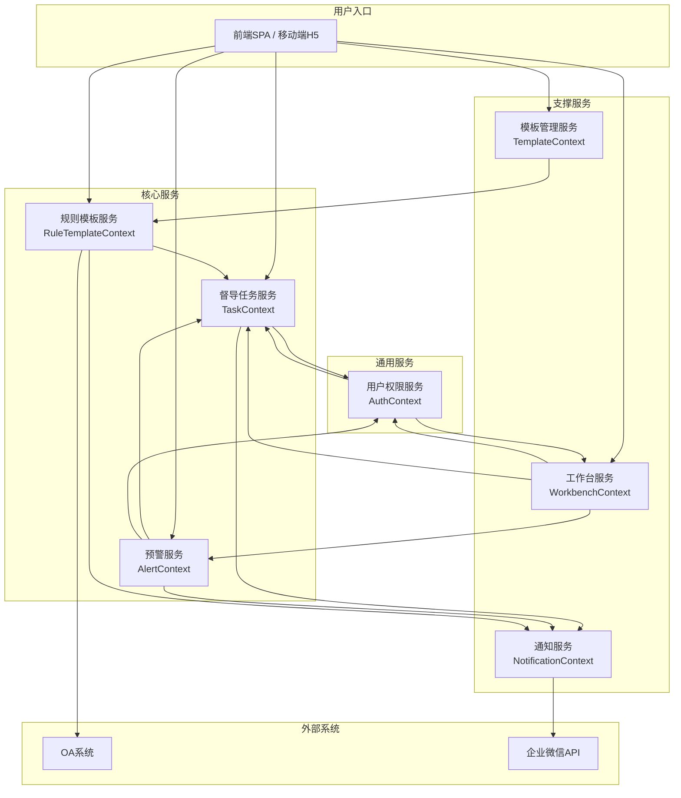
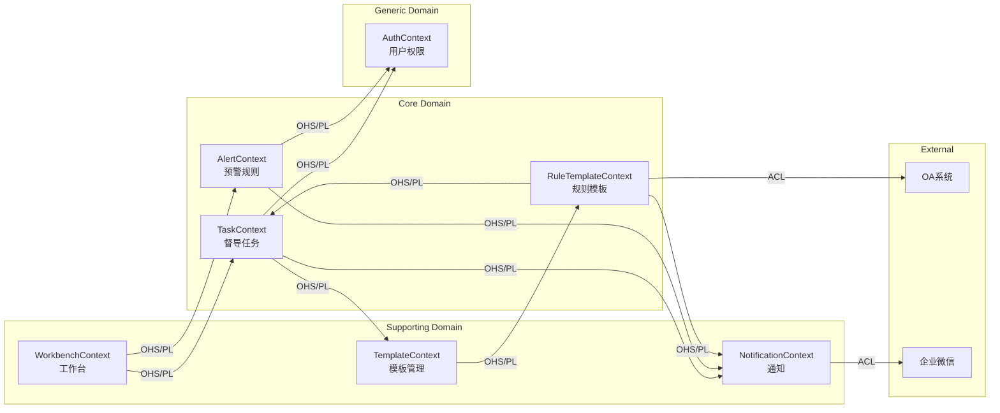
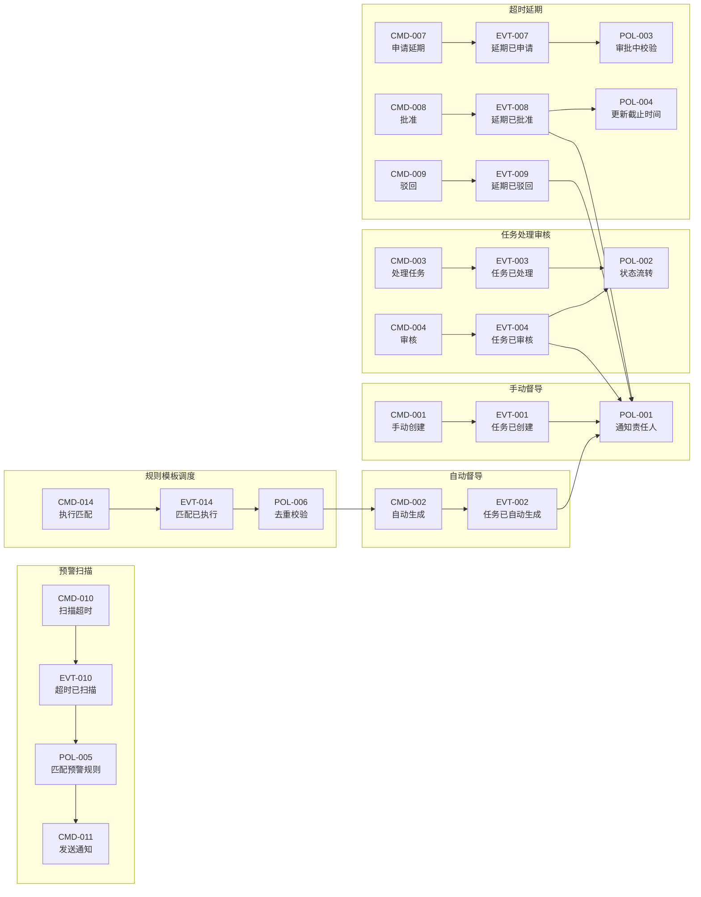
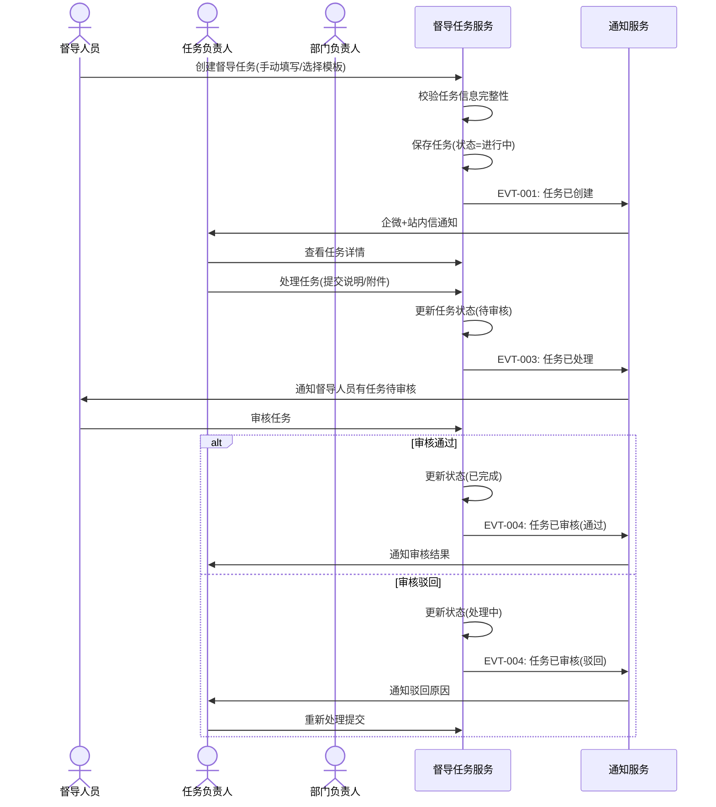
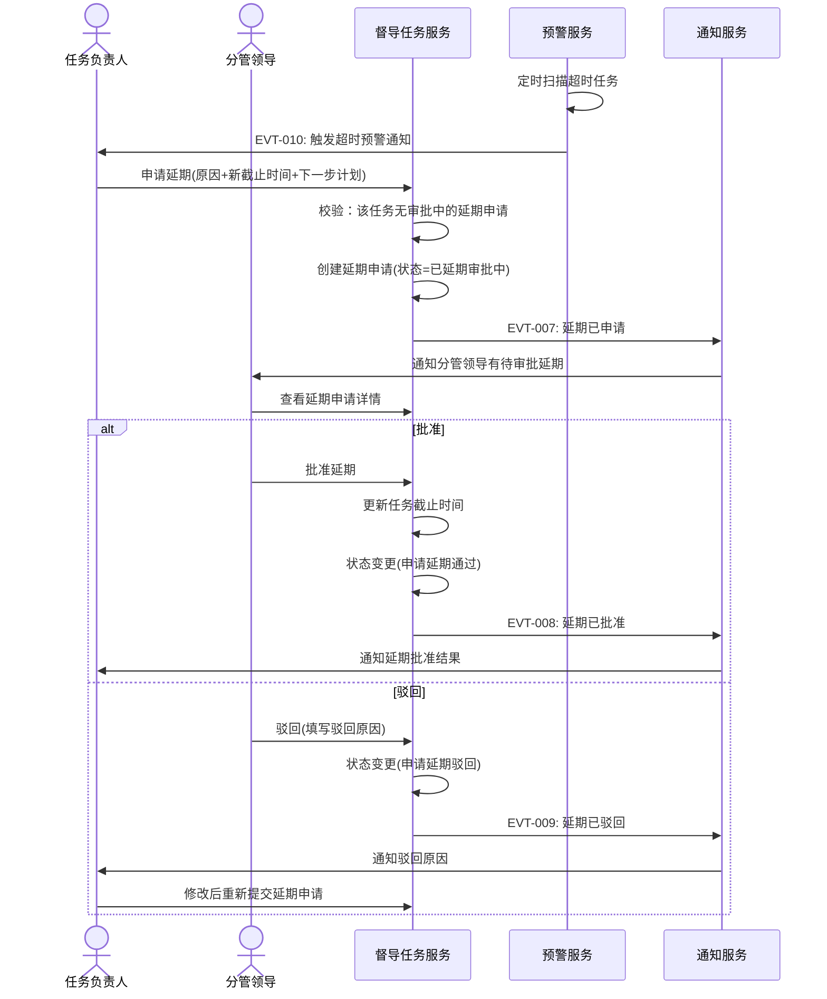
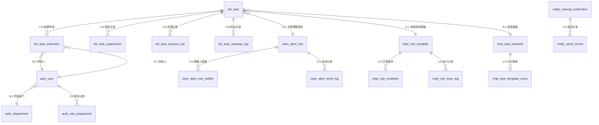

# 椒江农商银行数智中心-督导中心 概要设计

---

**文档信息**

| 项 | 内容 |
|---|---|
| 项目名称 | 椒江农商银行数智中心-督导中心 |
| 文档类型 | 概要设计说明书（AE 9章） |
| 版本 | V1.4 |
| 设计方法论 | DDD + AE 融合概设引擎 |
| 设计模式 | auto（直通模式） |
| 需求来源 | 《椒江督导中心_需求规格说明书》V1.0 |
| 生成日期 | 2026-06-01 |

---

## 第1章 功能清单

### 1.1 项目概述

**业务目标**：构建任务标准化管控机制，实现"自动+手动"双模督导、多维度督导大屏、超时预警联动，支持全行/部门/个人分权限统计，为管理决策与绩效考核提供量化指标支撑。

**核心价值**：
- **高效督办**：支持手动/自动一键督办，触发预警干预，保障任务按时落地
- **精准通知**：批量或单独向任务负责人/团队推送规范督导通知
- **数据可视化**：全维度展示工作质量，为管理决策、绩效考核提供量化指标

### 1.2 功能模块总览

| 模块 | 子模块 | 主要功能 | 优先级 |
|------|--------|---------|:---:|
| **个人工作台** | 任务概览 | 待处理任务/超时任务/领导督批/站内信概览卡片 | P0 |
| | 任务分析 | 个人任务状态占比分布图 | P0 |
| | 超时趋势 | 近6周超时任务趋势分析（周/月/年切换） | P0 |
| | 待办列表 | 我的待办任务列表（筛选：待处理/超时/已处理） | P0 |
| | 领导督批入口 | 领导督批任务列表（未完成/已完成） | P0 |
| **部门工作台** | 数据总览 | 任务总数/进行中/完成率/超时数/超时占比/发起督导/督批任务/站内信 | P0 |
| | 状态分布 | 已完成/进行中/已延期比例图 | P0 |
| | 超时趋势 | 部门超时任务趋势图（周/月/年切换） | P0 |
| | 负责人排行 | 部门成员任务量排行（按状态颜色区分） | P1 |
| | 待办列表 | 个人待处理&超时任务 | P0 |
| **督导任务管理** | 自动督导 | 对接OA系统→按规则模板触发→自动生成督导任务 | P0 |
| | 手动督导 | 手动创建/草稿/下发→通知责任人 | P0 |
| | 任务列表 | 筛选/搜索/批量导出/快捷操作 | P0 |
| | 任务处理 | 处理提交（上传附件/填写说明） | P0 |
| | 任务审核 | 审核闭环（通过/驳回） | P0 |
| | 任务转派 | 部门负责人进行任务转派处理 | P1 |
| **领导督批** | 督批列表 | 未完结任务列表筛选/查询 | P0 |
| | 发起督批 | 输入督批意见→提交→通知责任人 | P0 |
| | 督批详情 | 查看督批意见/历史记录 | P1 |
| **超时任务管理** | 超时展示 | 已延期/审批中/驳回/通过状态展示 | P0 |
| | 延期申请 | 提交延期原因/新截止时间/下一步计划 | P0 |
| | 延期审批 | 批准/驳回→记录审批历史→通知 | P0 |
| | 重新提交 | 驳回后可修改后重新提交 | P1 |
| **预警规则** | 规则管理 | 新增/编辑/启用停用预警规则 | P0 |
| | 触发机制 | 定时扫描→多规则匹配→防骚扰通知 | P0 |
| | 发送记录 | 预警发送历史记录 | P1 |
| **规则模板** | 模板管理 | 规则模板新增/编辑/启用停用 | P0 |
| | 自动调度 | 定时获取OA数据→规则匹配→去重→创建任务→通知 | P0 |
| | 执行记录 | 执行历史记录查看 | P1 |
| **模板管理** | 模板库 | 模板新增/编辑/启用停用、按类型筛选 | P1 |
| | 模板选择 | 创建任务时选择模板快速应用 | P1 |
| | 评分规则 | 任务流转过程按状态扣分 | P2 |
| **协调调度** | 通知创建 | 手动创建通知（标题/类型/接收人/内容） | P0 |
| | 通知发送 | 企微+站内信双通道发送 | P0 |
| | 发送记录 | 发送状态追踪（未发送/发送中/已发送/发送失败） | P1 |
| **移动端适配** | 任务审批 | 移动端处理任务流转、填写数据 | P0 |
| | 任务转派 | 移动端转派功能 | P1 |

### 1.3 角色分析

| 角色 | 类型 | 核心职责 | 数据范围 |
|------|:---:|------|:---:|
| 普通用户 | business | 查看待办、处理任务、提交延期申请 | 本人 |
| 督导人员 | business | 创建/下发督导任务、配置规则/模板、查看全行数据 | 全行 |
| 部门负责人 | business | 查看部门数据、处理任务、任务转派、审批延期 | 本部门 |
| 分管领导 | business/approval | 查看分管部门数据、发起督批 | 分管部门 |
| 行领导 | business/approval | 查看全行数据、发起督批 | 全行 |
| 超级管理员 | system | 系统配置、权限管理、数据维护 | 全行 |

### 1.4 痛点分析

| 痛点 | 描述 | 严重程度 |
|:---:|------|:---:|
| PAIN-001 | 任务缺乏标准化管控流程，手工督办效率低 | high |
| PAIN-002 | 超时任务无自动预警机制，被动跟踪 | high |
| PAIN-003 | 领导无法快速了解任务执行全局状态 | medium |
| PAIN-004 | 督导数据分散，缺乏多维度统计分析 | medium |
| PAIN-005 | 多系统（OA等）任务无法统一监管 | medium |

### 1.5 需求成熟度5维评估 ⭐V1.4

```yaml
requirement_maturity:
  total: 65
  assessment_summary: >
    需求文档118段落+15表格，功能描述覆盖9大模块相对完整，角色6个划分明确，
    但流程细节（状态机、审批流转）、异常处理（退回补正闭环）、外部系统接口规范
    （OA对接具体协议/表结构）、数据模型（DDL级别字段）等维度的明确度不足。
    可使用行业经验推断补充，建议部分决策放入第8章待确认清单。
  dimensions:
    business_completeness: 70    # 9模块功能描述较完整，但有评分规则等细节待客户明确
    data_certainty: 60           # 字段定义较完整但缺少DDL级别细则和关联关系
    process_clarity: 55          # 基本流程描述简单，状态机未完整定义
    role_clarity: 80             # 6角色划分明确，职责边界清楚
    integration_certainty: 50    # OA对接仅说明"来源系统：OA系统"，无接口规范
  evidence:
    - "9个功能模块均有功能描述表+角色+数据字段+基本流程，business_completeness充足"
    - "评分规则描述'具体评分规则待客户提供明确细化'降低 data_certainty"
    - "基本流程仅写'督导中心业务流程-ProcessOn'外部链接，process_clarity不足"
    - "OA对接仅提'来源系统：OA系统内的流程数据'和'定时任务获取数据'，integration_certainty低"
    - "6角色数据范围明确（本人/本部门/分管部门/全行），role_clarity高"
```

---

## 第2章 系统架构设计

### 2.1 架构总览

采用**微服务 + 事件驱动 + 前后端分离**架构模式。

| 架构决策 | 选择 | 理由 |
|------|:---:|------|
| 架构风格 | 微服务 | 督导/预警/通知各模块独立演进，部署隔离 |
| 通信模式 | 同步REST + 异步事件 | 查询用REST直查，跨服务通知/状态同步用事件 |
| 前端架构 | SPA单页应用 + 移动端H5 | 工作台多面板需要SPA，移动端审批用H5适配 |
| 数据层 | MySQL主库 + Redis缓存 | 任务数据强一致性用MySQL，工作台统计查询用Redis缓存 |
| CQRS | 部分启用（工作台查询） | 工作台统计查询与任务写操作分离，降低高并发读压力 |
| 事件驱动 | 启用 | 任务状态变更→通知、预警扫描→任务创建等跨服务异步解耦 |

**五层架构**：

```
┌─────────────────────────────────────────┐
│           Interface Layer                │  API网关 + 前端SPA + 移动端H5
├─────────────────────────────────────────┤
│         Application Layer               │  应用服务：用例编排、事务管理、DTO转换
├─────────────────────────────────────────┤
│           Domain Layer                  │  领域模型：聚合根/实体/值对象/领域服务/领域事件
├─────────────────────────────────────────┤
│        Infrastructure Layer             │  仓储实现、消息队列、通知网关、外部系统适配器
├─────────────────────────────────────────┤
│           Data / Platform               │  MySQL、Redis、消息队列、企业微信API、OA系统
└─────────────────────────────────────────┘
```

### 2.2 服务划分

| 服务 | 类型 | 所属Context | 核心职责 |
|------|:---:|------|------|
| **督导任务服务** (SupervisionTaskService) | core | TaskContext | 任务创建/下发/处理/审核/转派/督批 全生命周期管理 |
| **工作台服务** (WorkbenchService) | supporting | WorkbenchContext | 个人/部门工作台数据聚合展示（统计+趋势+排行） |
| **预警服务** (AlertService) | core | AlertContext | 预警规则配置 + 定时扫描超时任务 + 多级通知 |
| **规则模板服务** (RuleTemplateService) | core | RuleTemplateContext | 规则模板配置 + OA数据自动调度 + 任务自动生成 |
| **通知服务** (NotificationService) | supporting | NotificationContext | 企微+站内信双通道通知发送 + 发送记录 |
| **模板管理服务** (TemplateService) | supporting | TemplateContext | 任务模板库管理 + 评分规则 |
| **用户权限服务** (UserAuthService) | generic | AuthContext | 角色权限校验 + 数据范围过滤 |

### 2.3 技术栈

| 层 | 技术选型 |
|------|------|
| 前端 | Vue3 + Element Plus / 移动端H5 |
| 后端框架 | Spring Boot 2.7+ / Spring Cloud |
| 数据库 | MySQL 8.0 (InnoDB, utf8mb4) |
| 缓存 | Redis 6+ |
| 消息队列 | RabbitMQ |
| 流程引擎 | Flowable / Camunda（审批流） |
| 定时任务 | XXL-JOB |
| 通知通道 | 企业微信API + 站内信（WebSocket推送） |
| 外部集成 | OA系统（视具体接口协议，需确认） |

### 2.4 服务依赖图



### 2.5 系统整体结构图（Context Map）



---

## 第3章 业务流程设计

### 3.1 事件风暴概览

#### Commands（命令）

| ID | 命令 | 执行者 | 触发事件 |
|:---:|------|------|:---:|
| CMD-001 | CreateTaskManually | 督导人员 | EVT-001 |
| CMD-002 | AutoGenerateTask | 系统(规则模板) | EVT-002 |
| CMD-003 | ProcessTask | 普通用户/负责人 | EVT-003 |
| CMD-004 | ReviewTask | 督导人员 | EVT-004 |
| CMD-005 | ReassignTask | 部门负责人 | EVT-005 |
| CMD-006 | SubmitSuperviseOpinion | 分管领导/行领导 | EVT-006 |
| CMD-007 | ApplyExtension | 任务负责人 | EVT-007 |
| CMD-008 | ApproveExtension | 分管领导 | EVT-008 |
| CMD-009 | RejectExtension | 分管领导 | EVT-009 |
| CMD-010 | ScanOverdueTasks | 系统(预警规则) | EVT-010 |
| CMD-011 | SendNotification | 督导人员/系统 | EVT-011 |
| CMD-012 | ConfigureAlertRule | 督导人员 | EVT-012 |
| CMD-013 | ConfigureRuleTemplate | 督导人员 | EVT-013 |
| CMD-014 | ExecuteRuleMatching | 系统(规则模板定时) | EVT-014 |
| CMD-015 | CreateManualNotification | 任何人 | EVT-015 |

#### Events（事件）

| ID | 事件 | 来源命令 | 触发策略 |
|:---:|------|:---:|------|
| EVT-001 | TaskCreatedManually | CMD-001 | POL-001(通知) |
| EVT-002 | TaskAutoGenerated | CMD-002 | POL-001(通知) |
| EVT-003 | TaskProcessed | CMD-003 | POL-002(状态流转) |
| EVT-004 | TaskReviewed | CMD-004 | POL-002(状态流转) + POL-001(通知) |
| EVT-005 | TaskReassigned | CMD-005 | POL-001(通知新负责人) |
| EVT-006 | SupervisionOpinionSubmitted | CMD-006 | POL-001(通知责任人) |
| EVT-007 | ExtensionApplied | CMD-007 | POL-003(审批流) |
| EVT-008 | ExtensionApproved | CMD-008 | POL-001(通知) + POL-004(更新截止时间) |
| EVT-009 | ExtensionRejected | CMD-009 | POL-001(通知申请人) |
| EVT-010 | OverdueTaskScanned | CMD-010 | POL-005(匹配预警规则) |
| EVT-011 | NotificationSent | CMD-011 | — |
| EVT-012 | AlertRuleConfigured | CMD-012 | — |
| EVT-013 | RuleTemplateConfigured | CMD-013 | — |
| EVT-014 | RuleMatchingExecuted | CMD-014 | POL-006(匹配→创建任务) |
| EVT-015 | ManualNotificationCreated | CMD-015 | POL-007(发送) |

#### Policies（策略）

| ID | 策略 | 触发事件 | 说明 |
|:---:|------|:---:|------|
| POL-001 | 任务状态变更后通知相关责任人 | EVT-001/002/004/005/006/008/009 | 通过站内信+企微双通道通知 |
| POL-002 | 任务状态按流转规则自动推进 | EVT-003/004 | 处理提交→待审核/已完成；审核通过→已完成；驳回→处理中 |
| POL-003 | 同一任务同时只能有一个延期申请在审批中 | EVT-007 | 提交前校验，存在审批中的延期申请则阻止提交 |
| POL-004 | 延期审批通过后更新任务截止时间 | EVT-008 | 任务截止时间更新为延期申请中的新时间 |
| POL-005 | 超时任务匹配预警规则 | EVT-010 | 当前时间 > 任务截止时间+超时天数，按规则通知阶梯推进 |
| POL-006 | 规则模板匹配的去重校验 | EVT-014 | 排除已存在督导任务的OA数据，防止重复创建 |
| POL-007 | 协调调度通知双通道发送 | EVT-015 | 按通知类型选择企微和/或站内信通道发送 |

#### 核心事件流链路

| 流程 | 类型 | 描述 |
|:---:|:---:|------|
| FLOW-001 | primary | 手动督导：创建任务→下发→通知→负责人处理→审核→完成 |
| FLOW-002 | primary | 自动督导：规则模板匹配OA数据→自动创建任务→下发→通知→处理→审核 |
| FLOW-003 | primary | 超时处理：超时触发→申请人提交延期→审批（批准/驳回）→更新状态 |
| FLOW-004 | supporting | 领导督批：查看未完结任务→发起督批意见→通知责任人→任务继续流转 |
| FLOW-005 | supporting | 预警通知：定时扫描→匹配预警规则→分级通知→记录发送 |
| FLOW-006 | supporting | 协调调度：手动创建通知→选择接收人→发送→追踪状态 |
| FLOW-007 | supporting | 任务转派：部门负责人将任务转派给新负责人→通知新负责人 |

#### Mermaid 事件流图



### 3.2 业务能力地图

| 能力 | 分类 | 说明 |
|------|:---:|------|
| 督导任务全生命周期管理 | **core** | 任务创建/下发/处理/审核/转派 全流程，系统核心差异化能力 |
| 超时预警与通知 | **core** | 多级预警规则+防骚扰机制，主动式任务管控能力 |
| 自动化规则调度 | **core** | 从OA自动发现待督导任务，智能触发，区别于手工管理模式 |
| 工作台数据聚合 | supporting | 个人/部门工作台的数据统计与可视化 |
| 领导督批 | supporting | 管理层对未完结任务的直接干预通道 |
| 模板管理 | supporting | 标准化任务模板库，提升创建效率 |
| 协调调度通知 | supporting | 跨部门手动通知，企微+站内信双通道 |
| 用户权限管理 | general | 6角色权限+数据范围隔离 |
| 移动端审批 | supporting | 移动端任务处理与转派 |

### 3.3 核心业务流程序列图

#### 手动督导任务全流程（序列图）



#### 超时延期审批流程（序列图）



### 3.4 异常场景枚举（E1-E1n）⭐V1.4

| # | 异常场景 | 触发条件 | 建议处理 |
|:---:|------|------|------|
| E1 | 任务重复创建 | 同一OA数据源被规则模板两次匹配 | 去重校验：按来源系统+来源ID+任务类型进行唯一性检查 |
| E2 | 延期申请重复提交 | 任务已有审批中的延期申请 | 提交前校验，存在审批中申请则提示"该任务已有延期申请在审批中" |
| E3 | 预警通知重复发送 | 同一规则对同一任务在短时间内多次触发 | 防骚扰机制：同一规则对同一任务每天最多发送1次 |
| E4 | 任务负责人已离职/调岗 | 下发任务时负责人不再有效 | 下发前校验负责人有效性，无效则提示重新指派 |
| E5 | OA系统不可用 | 规则模板定时执行时OA接口超时/报错 | 记录执行失败日志，下次执行时重试，连续失败3次则告警 |
| E6 | 通知发送失败 | 企微API不可用或用户未绑定企微 | 降级为站内信单通道，记录失败原因，提供重发入口 |
| E7 | 审批超时 | 延期申请提交后分管领导长时间未审批 | 设置审批超时自动提醒（如24小时），超48小时升级通知上级 |
| E8 | 批量操作超限 | 一次导出的任务数量过大 | 设置单次导出上限（如5000条），超限提示分批导出 |
| E9 | 规则模板匹配数据为空 | OA系统对应来源表当前无可匹配数据 | 正常结束，记录"本次无匹配数据"，不报错 |
| E10 | 权限越权操作 | 用户尝试操作非本人/本部门权限范围外的任务 | 后端拦截，返回权限不足提示 |
| E11 | 任务转派循环 | A转给B，B又转回A | 转派时校验目标人是否为任务当前流转链中的前置处理人 |
| E12 | 领导督批内容为空 | 发起督批但未填写意见 | 前端+后端双重校验，督批意见必填 |
| E13 | 移动端附件上传失败 | 移动端上传大附件网络中断 | 支持断点续传，上传失败提示重试，设置文件大小上限 |

---

## 第4章 数据模型设计

### 4.1 实体识别（按Context分组）

#### TaskContext（督导任务上下文）

| 表名 | 实体 | 聚合根 | 说明 |
|------|------|:---:|------|
| tsk_task | 督导任务 | ✅ | 督导任务主表 |
| tsk_task_extension | 延期申请 | — | 任务延期申请表 |
| tsk_task_supervision | 领导督批记录 | — | 领导督批意见记录 |
| tsk_task_process_log | 任务处理记录 | — | 任务处理流转日志 |
| tsk_task_reassign_log | 任务转派记录 | — | 任务转派历史 |

#### AlertContext（预警上下文）

| 表名 | 实体 | 聚合根 | 说明 |
|------|------|:---:|------|
| warn_alert_rule | 预警规则 | ✅ | 预警规则配置 |
| warn_alert_rule_notifier | 预警提醒人 | — | 规则对应的阶梯提醒人 |
| warn_alert_send_log | 预警发送记录 | — | 每次预警发送记录 |

#### RuleTemplateContext（规则模板上下文）

| 表名 | 实体 | 聚合根 | 说明 |
|------|------|:---:|------|
| tmpl_rule_template | 规则模板 | ✅ | 自动督导规则模板 |
| tmpl_rule_condition | 规则条件 | — | 规则模板匹配条件明细 |
| tmpl_rule_exec_log | 规则执行记录 | — | 规则模板执行历史记录 |

#### TemplateContext（模板管理上下文）

| 表名 | 实体 | 聚合根 | 说明 |
|------|------|:---:|------|
| tmpl_task_template | 任务模板 | ✅ | 督导任务业务模板 |
| tmpl_task_template_score | 评分规则 | — | 模板关联的评分规则 |

#### NotificationContext（通知上下文）

| 表名 | 实体 | 聚合根 | 说明 |
|------|------|:---:|------|
| notify_manual_notification | 手动通知 | ✅ | 协调调度手动通知 |
| notify_send_record | 发送记录 | — | 通知发送结果记录 |

#### AuthContext（权限上下文）

| 表名 | 实体 | 聚合根 | 说明 |
|------|------|:---:|------|
| auth_user | 用户 | ✅ | 用户基本信息 |
| auth_department | 部门 | ✅ | 部门组织信息 |
| auth_role_assignment | 角色分配 | — | 用户-角色-部门关系 |

### 4.2 E-R关系



### 4.3 字段语义分类说明

| 语义类型 | 说明 | DDL处理 |
|------|------|:---:|
| **ownership** | 当前实体拥有的原生字段 | ✅ 建列 |
| **foreign_reference** | 外键引用其他聚合的标识 | ✅ 建列(FK) |
| **projection** | 展示投影，通过JOIN获取 | ❌ 不建列 |
| **snapshot** | 历史快照，需固化当时的值 | ✅ 建列+标注三要素 |
| **derived** | 计算字段，运行时计算 | ❌ 不建列 |

### 4.4 数据表结构（DDL）

```sql
-- ============================================================
-- 表名: tsk_task
-- 聚合: AGG-001 (TaskContext)
-- 说明: 督导任务主表，聚合根
-- 投影字段: 申请人姓名(auth_user, JOIN通过 applicant_id), 审批人姓名(auth_user), 部门名称(auth_department)
-- ============================================================
CREATE TABLE tsk_task (
    data_id                     VARCHAR(64)  NOT NULL COMMENT '主键',
    task_name                   VARCHAR(256) DEFAULT NULL COMMENT '任务名称',
    task_status                 VARCHAR(32)  DEFAULT NULL COMMENT '任务状态: 进行中/已完成/已超期/已延期/已延期审批中/申请延期通过/申请延期驳回',
    start_time                  DATETIME     DEFAULT NULL COMMENT '任务开始时间',
    end_time                    DATETIME     DEFAULT NULL COMMENT '任务截止时间',
    task_type                   VARCHAR(32)  DEFAULT NULL COMMENT '任务类型: 自动/手动',
    supervision_type            VARCHAR(32)  DEFAULT NULL COMMENT '督导类型: 日常督办/专项督办等',
    responsible_dept_id         VARCHAR(64)  DEFAULT NULL COMMENT '负责部门ID → auth_department.data_id',
    responsible_user_id         VARCHAR(64)  DEFAULT NULL COMMENT '负责人ID → auth_user.data_id',
    template_id                 VARCHAR(64)  DEFAULT NULL COMMENT '关联模板ID → tmpl_task_template.data_id',
    rule_template_id            VARCHAR(64)  DEFAULT NULL COMMENT '关联规则模板ID → tmpl_rule_template.data_id',
    alert_rule_id               VARCHAR(64)  DEFAULT NULL COMMENT '关联预警规则ID → warn_alert_rule.data_id',
    supervision_content         TEXT         DEFAULT NULL COMMENT '督导信息内容(任务详细描述)',
    attachment_ids              TEXT         DEFAULT NULL COMMENT '附件ID列表(JSON数组)',
    source_system               VARCHAR(64)  DEFAULT NULL COMMENT '来源系统: OA/手动等',
    source_data_id              VARCHAR(128) DEFAULT NULL COMMENT '来源系统数据ID',
    draft_flag                  CHAR(1)      DEFAULT '0' COMMENT '草稿标记: 0=已下发, 1=草稿',
    create_member               VARCHAR(64)  DEFAULT NULL COMMENT '创建人',
    create_time                 DATETIME     DEFAULT NULL COMMENT '创建时间',
    create_member_ip_address    VARCHAR(64)  DEFAULT NULL COMMENT '创建人IP地址',
    last_mod_member             VARCHAR(64)  DEFAULT NULL COMMENT '最后更新人',
    last_mod_time               DATETIME     DEFAULT NULL COMMENT '最后更新时间',
    last_mod_member_ip_address  VARCHAR(64)  DEFAULT NULL COMMENT '最后更新人IP地址',
    del_flag                    CHAR(1)      DEFAULT '0' COMMENT '删除标记',
    PRIMARY KEY (data_id),
    INDEX idx_task_status (task_status),
    INDEX idx_responsible_user (responsible_user_id),
    INDEX idx_responsible_dept (responsible_dept_id),
    INDEX idx_end_time (end_time),
    UNIQUE KEY uk_source (source_system, source_data_id, del_flag) COMMENT '来源去重: 同一来源系统+来源ID唯一'
) ENGINE=InnoDB DEFAULT CHARSET=utf8mb4 COMMENT='督导任务主表 | 投影: applicant_name(auth_user), approver_name(auth_user), dept_name(auth_department)';

-- ============================================================
-- 表名: tsk_task_extension
-- 聚合: AGG-001 (TaskContext)
-- 说明: 任务延期申请表
-- ============================================================
CREATE TABLE tsk_task_extension (
    data_id                     VARCHAR(64)  NOT NULL COMMENT '主键',
    task_id                     VARCHAR(64)  NOT NULL COMMENT '关联任务ID → tsk_task.data_id',
    extension_reason            TEXT         DEFAULT NULL COMMENT '延期原因(≤500字)',
    extension_to_time           DATETIME     NOT NULL COMMENT '申请延期至',
    next_plan                   TEXT         DEFAULT NULL COMMENT '下一步计划(≤500字)',
    extension_status            VARCHAR(32)  DEFAULT NULL COMMENT '延期状态: 已延期审批中/申请延期通过/申请延期驳回',
    reject_reason               TEXT         DEFAULT NULL COMMENT '驳回原因',
    applicant_id                VARCHAR(64)  DEFAULT NULL COMMENT '申请人ID → auth_user.data_id',
    approver_id                 VARCHAR(64)  DEFAULT NULL COMMENT '审批人ID → auth_user.data_id',
    approve_time                DATETIME     DEFAULT NULL COMMENT '审批时间',
    create_member               VARCHAR(64)  DEFAULT NULL COMMENT '创建人',
    create_time                 DATETIME     DEFAULT NULL COMMENT '创建时间',
    create_member_ip_address    VARCHAR(64)  DEFAULT NULL COMMENT '创建人IP地址',
    last_mod_member             VARCHAR(64)  DEFAULT NULL COMMENT '最后更新人',
    last_mod_time               DATETIME     DEFAULT NULL COMMENT '最后更新时间',
    last_mod_member_ip_address  VARCHAR(64)  DEFAULT NULL COMMENT '最后更新人IP地址',
    del_flag                    CHAR(1)      DEFAULT '0' COMMENT '删除标记',
    PRIMARY KEY (data_id),
    INDEX idx_task_id (task_id),
    INDEX idx_extension_status (extension_status),
    UNIQUE KEY uk_task_approving (task_id, extension_status, del_flag) COMMENT '同一任务审批中的延期申请唯一'
) ENGINE=InnoDB DEFAULT CHARSET=utf8mb4 COMMENT='任务延期申请 | 投影: applicant_name(auth_user), approver_name(auth_user), task_name(tsk_task)';

-- ============================================================
-- 表名: tsk_task_supervision
-- 聚合: AGG-001 (TaskContext)
-- 说明: 领导督批记录
-- ============================================================
CREATE TABLE tsk_task_supervision (
    data_id                     VARCHAR(64)  NOT NULL COMMENT '主键',
    task_id                     VARCHAR(64)  NOT NULL COMMENT '关联任务ID → tsk_task.data_id',
    supervision_opinion         TEXT         NOT NULL COMMENT '督批意见(≤100字)',
    supervisor_id               VARCHAR(64)  DEFAULT NULL COMMENT '督批领导ID → auth_user.data_id',
    supervision_time            DATETIME     DEFAULT NULL COMMENT '督批时间',
    create_member               VARCHAR(64)  DEFAULT NULL COMMENT '创建人',
    create_time                 DATETIME     DEFAULT NULL COMMENT '创建时间',
    create_member_ip_address    VARCHAR(64)  DEFAULT NULL COMMENT '创建人IP地址',
    last_mod_member             VARCHAR(64)  DEFAULT NULL COMMENT '最后更新人',
    last_mod_time               DATETIME     DEFAULT NULL COMMENT '最后更新时间',
    last_mod_member_ip_address  VARCHAR(64)  DEFAULT NULL COMMENT '最后更新人IP地址',
    del_flag                    CHAR(1)      DEFAULT '0' COMMENT '删除标记',
    PRIMARY KEY (data_id),
    INDEX idx_task_id (task_id)
) ENGINE=InnoDB DEFAULT CHARSET=utf8mb4 COMMENT='领导督批记录 | 投影: supervisor_name(auth_user), task_name(tsk_task)';

-- ============================================================
-- 表名: tsk_task_process_log
-- 聚合: AGG-001 (TaskContext)
-- 说明: 任务处理流转日志
-- ============================================================
CREATE TABLE tsk_task_process_log (
    data_id                     VARCHAR(64)  NOT NULL COMMENT '主键',
    task_id                     VARCHAR(64)  NOT NULL COMMENT '关联任务ID → tsk_task.data_id',
    process_action              VARCHAR(32)  DEFAULT NULL COMMENT '处理动作: 创建/下发/处理/审核通过/审核驳回/转派/督批/延期申请/延期批准/延期驳回',
    processor_id                VARCHAR(64)  DEFAULT NULL COMMENT '处理人ID → auth_user.data_id',
    process_content             TEXT         DEFAULT NULL COMMENT '处理内容/意见',
    process_time                DATETIME     DEFAULT NULL COMMENT '处理时间',
    create_member               VARCHAR(64)  DEFAULT NULL COMMENT '创建人',
    create_time                 DATETIME     DEFAULT NULL COMMENT '创建时间',
    create_member_ip_address    VARCHAR(64)  DEFAULT NULL COMMENT '创建人IP地址',
    last_mod_member             VARCHAR(64)  DEFAULT NULL COMMENT '最后更新人',
    last_mod_time               DATETIME     DEFAULT NULL COMMENT '最后更新时间',
    last_mod_member_ip_address  VARCHAR(64)  DEFAULT NULL COMMENT '最后更新人IP地址',
    del_flag                    CHAR(1)      DEFAULT '0' COMMENT '删除标记',
    PRIMARY KEY (data_id),
    INDEX idx_task_id (task_id),
    INDEX idx_process_time (process_time)
) ENGINE=InnoDB DEFAULT CHARSET=utf8mb4 COMMENT='任务处理流转日志 | 投影: processor_name(auth_user)';

-- ============================================================
-- 表名: tsk_task_reassign_log
-- 聚合: AGG-001 (TaskContext)
-- 说明: 任务转派历史记录
-- ============================================================
CREATE TABLE tsk_task_reassign_log (
    data_id                     VARCHAR(64)  NOT NULL COMMENT '主键',
    task_id                     VARCHAR(64)  NOT NULL COMMENT '关联任务ID → tsk_task.data_id',
    from_user_id                VARCHAR(64)  DEFAULT NULL COMMENT '原负责人ID → auth_user.data_id',
    to_user_id                  VARCHAR(64)  DEFAULT NULL COMMENT '新负责人ID → auth_user.data_id',
    reassign_reason             TEXT         DEFAULT NULL COMMENT '转派原因',
    reassign_time               DATETIME     DEFAULT NULL COMMENT '转派时间',
    create_member               VARCHAR(64)  DEFAULT NULL COMMENT '创建人',
    create_time                 DATETIME     DEFAULT NULL COMMENT '创建时间',
    create_member_ip_address    VARCHAR(64)  DEFAULT NULL COMMENT '创建人IP地址',
    last_mod_member             VARCHAR(64)  DEFAULT NULL COMMENT '最后更新人',
    last_mod_time               DATETIME     DEFAULT NULL COMMENT '最后更新时间',
    last_mod_member_ip_address  VARCHAR(64)  DEFAULT NULL COMMENT '最后更新人IP地址',
    del_flag                    CHAR(1)      DEFAULT '0' COMMENT '删除标记',
    PRIMARY KEY (data_id),
    INDEX idx_task_id (task_id)
) ENGINE=InnoDB DEFAULT CHARSET=utf8mb4 COMMENT='任务转派记录 | 投影: from_name(auth_user), to_name(auth_user)';

-- ============================================================
-- 表名: warn_alert_rule
-- 聚合: AGG-002 (AlertContext)
-- 说明: 预警规则配置，聚合根
-- ============================================================
CREATE TABLE warn_alert_rule (
    data_id                     VARCHAR(64)  NOT NULL COMMENT '主键',
    alert_name                  VARCHAR(128) NOT NULL COMMENT '预警规则名称(唯一)',
    notify_type                 VARCHAR(64)  DEFAULT NULL COMMENT '通知渠道: 企业微信,站内信 (多选逗号分隔)',
    is_enabled                  CHAR(1)      DEFAULT '1' COMMENT '是否启用: 0=未启用, 1=已启用',
    overdue_days                INT          NOT NULL COMMENT '超时天数阈值',
    rule_description            VARCHAR(512) DEFAULT NULL COMMENT '规则描述',
    create_member               VARCHAR(64)  DEFAULT NULL COMMENT '创建人',
    create_time                 DATETIME     DEFAULT NULL COMMENT '创建时间',
    create_member_ip_address    VARCHAR(64)  DEFAULT NULL COMMENT '创建人IP地址',
    last_mod_member             VARCHAR(64)  DEFAULT NULL COMMENT '最后更新人',
    last_mod_time               DATETIME     DEFAULT NULL COMMENT '最后更新时间',
    last_mod_member_ip_address  VARCHAR(64)  DEFAULT NULL COMMENT '最后更新人IP地址',
    del_flag                    CHAR(1)      DEFAULT '0' COMMENT '删除标记',
    PRIMARY KEY (data_id),
    UNIQUE KEY uk_alert_name (alert_name, del_flag)
) ENGINE=InnoDB DEFAULT CHARSET=utf8mb4 COMMENT='预警规则配置 | 约束: 同一规则对同一任务每天最多发送1次(代码层)';

-- ============================================================
-- 表名: warn_alert_rule_notifier
-- 聚合: AGG-002 (AlertContext)
-- 说明: 预警规则阶梯提醒人配置
-- ============================================================
CREATE TABLE warn_alert_rule_notifier (
    data_id                     VARCHAR(64)  NOT NULL COMMENT '主键',
    alert_rule_id               VARCHAR(64)  NOT NULL COMMENT '关联预警规则ID → warn_alert_rule.data_id',
    overdue_stage_days          INT          NOT NULL COMMENT '超时阶梯天数',
    notifier_id                 VARCHAR(64)  NOT NULL COMMENT '提醒人ID → auth_user.data_id',
    notifier_role               VARCHAR(32)  DEFAULT NULL COMMENT '提醒人角色: 本人/部门负责人/分管领导/行领导',
    create_member               VARCHAR(64)  DEFAULT NULL COMMENT '创建人',
    create_time                 DATETIME     DEFAULT NULL COMMENT '创建时间',
    create_member_ip_address    VARCHAR(64)  DEFAULT NULL COMMENT '创建人IP地址',
    last_mod_member             VARCHAR(64)  DEFAULT NULL COMMENT '最后更新人',
    last_mod_time               DATETIME     DEFAULT NULL COMMENT '最后更新时间',
    last_mod_member_ip_address  VARCHAR(64)  DEFAULT NULL COMMENT '最后更新人IP地址',
    del_flag                    CHAR(1)      DEFAULT '0' COMMENT '删除标记',
    PRIMARY KEY (data_id),
    INDEX idx_alert_rule_id (alert_rule_id)
) ENGINE=InnoDB DEFAULT CHARSET=utf8mb4 COMMENT='预警规则提醒人 | 投影: notifier_name(auth_user)';

-- ============================================================
-- 表名: warn_alert_send_log
-- 聚合: AGG-002 (AlertContext)
-- 说明: 预警发送记录
-- ============================================================
CREATE TABLE warn_alert_send_log (
    data_id                     VARCHAR(64)  NOT NULL COMMENT '主键',
    alert_rule_id               VARCHAR(64)  NOT NULL COMMENT '关联预警规则ID → warn_alert_rule.data_id',
    task_id                     VARCHAR(64)  NOT NULL COMMENT '关联任务ID → tsk_task.data_id',
    receiver_id                 VARCHAR(64)  DEFAULT NULL COMMENT '接收人ID → auth_user.data_id',
    send_time                   DATETIME     NOT NULL COMMENT '发送时间',
    send_channel                VARCHAR(32)  DEFAULT NULL COMMENT '发送渠道: 企微/站内信',
    send_status                 VARCHAR(16)  DEFAULT 'success' COMMENT '发送状态: success/fail',
    send_content                TEXT         DEFAULT NULL COMMENT '发送内容',
    create_member               VARCHAR(64)  DEFAULT NULL COMMENT '创建人',
    create_time                 DATETIME     DEFAULT NULL COMMENT '创建时间',
    create_member_ip_address    VARCHAR(64)  DEFAULT NULL COMMENT '创建人IP地址',
    last_mod_member             VARCHAR(64)  DEFAULT NULL COMMENT '最后更新人',
    last_mod_time               DATETIME     DEFAULT NULL COMMENT '最后更新时间',
    last_mod_member_ip_address  VARCHAR(64)  DEFAULT NULL COMMENT '最后更新人IP地址',
    del_flag                    CHAR(1)      DEFAULT '0' COMMENT '删除标记',
    PRIMARY KEY (data_id),
    INDEX idx_alert_rule_task (alert_rule_id, task_id),
    INDEX idx_send_time (send_time)
) ENGINE=InnoDB DEFAULT CHARSET=utf8mb4 COMMENT='预警发送记录 | 约束: 防骚扰(同一规则+同一任务+同一天唯一，代码层)';

-- ============================================================
-- 表名: tmpl_rule_template
-- 聚合: AGG-003 (RuleTemplateContext)
-- 说明: 规则模板配置，聚合根
-- ============================================================
CREATE TABLE tmpl_rule_template (
    data_id                     VARCHAR(64)  NOT NULL COMMENT '主键',
    rule_name                   VARCHAR(128) NOT NULL COMMENT '规则名称(唯一)',
    is_enabled                  CHAR(1)      DEFAULT '1' COMMENT '是否启用: 0=未启用, 1=已启用',
    default_due_days            INT          DEFAULT NULL COMMENT '默认完成期限(天)',
    source_table                VARCHAR(128) NOT NULL COMMENT '来源表(OA系统表名)',
    source_system               VARCHAR(64)  DEFAULT 'OA' COMMENT '来源系统',
    exec_cron                   VARCHAR(64)  DEFAULT NULL COMMENT '定时执行Cron表达式',
    remark                      VARCHAR(512) DEFAULT NULL COMMENT '备注',
    create_member               VARCHAR(64)  DEFAULT NULL COMMENT '创建人',
    create_time                 DATETIME     DEFAULT NULL COMMENT '创建时间',
    create_member_ip_address    VARCHAR(64)  DEFAULT NULL COMMENT '创建人IP地址',
    last_mod_member             VARCHAR(64)  DEFAULT NULL COMMENT '最后更新人',
    last_mod_time               DATETIME     DEFAULT NULL COMMENT '最后更新时间',
    last_mod_member_ip_address  VARCHAR(64)  DEFAULT NULL COMMENT '最后更新人IP地址',
    del_flag                    CHAR(1)      DEFAULT '0' COMMENT '删除标记',
    PRIMARY KEY (data_id),
    UNIQUE KEY uk_rule_name (rule_name, del_flag)
) ENGINE=InnoDB DEFAULT CHARSET=utf8mb4 COMMENT='规则模板配置 | 去重约束: 按source_system+source_data_id(代码层)';

-- ============================================================
-- 表名: tmpl_rule_condition
-- 聚合: AGG-003 (RuleTemplateContext)
-- 说明: 规则模板匹配条件明细
-- ============================================================
CREATE TABLE tmpl_rule_condition (
    data_id                     VARCHAR(64)  NOT NULL COMMENT '主键',
    rule_template_id            VARCHAR(64)  NOT NULL COMMENT '关联规则模板ID → tmpl_rule_template.data_id',
    source_field                VARCHAR(128) NOT NULL COMMENT '来源字段(OA表字段名)',
    rule_operator               VARCHAR(32)  NOT NULL COMMENT '匹配规则: =/≠/>/</≥/≤/包含/不包含/为空/不为空',
    target_value                VARCHAR(512) DEFAULT NULL COMMENT '目标值',
    relation_type               VARCHAR(8)   DEFAULT 'AND' COMMENT '与下一条条件的关系: AND/OR',
    is_enabled                  CHAR(1)      DEFAULT '1' COMMENT '条件是否启用: 0=否, 1=是',
    sort_order                  INT          DEFAULT 0 COMMENT '排序序号',
    remark                      VARCHAR(200) DEFAULT NULL COMMENT '备注',
    create_member               VARCHAR(64)  DEFAULT NULL COMMENT '创建人',
    create_time                 DATETIME     DEFAULT NULL COMMENT '创建时间',
    create_member_ip_address    VARCHAR(64)  DEFAULT NULL COMMENT '创建人IP地址',
    last_mod_member             VARCHAR(64)  DEFAULT NULL COMMENT '最后更新人',
    last_mod_time               DATETIME     DEFAULT NULL COMMENT '最后更新时间',
    last_mod_member_ip_address  VARCHAR(64)  DEFAULT NULL COMMENT '最后更新人IP地址',
    del_flag                    CHAR(1)      DEFAULT '0' COMMENT '删除标记',
    PRIMARY KEY (data_id),
    INDEX idx_rule_template_id (rule_template_id)
) ENGINE=InnoDB DEFAULT CHARSET=utf8mb4 COMMENT='规则模板匹配条件';

-- ============================================================
-- 表名: tmpl_rule_exec_log
-- 聚合: AGG-003 (RuleTemplateContext)
-- 说明: 规则模板执行记录
-- ============================================================
CREATE TABLE tmpl_rule_exec_log (
    data_id                     VARCHAR(64)  NOT NULL COMMENT '主键',
    rule_template_id            VARCHAR(64)  NOT NULL COMMENT '关联规则模板ID → tmpl_rule_template.data_id',
    exec_time                   DATETIME     NOT NULL COMMENT '执行时间',
    exec_status                 VARCHAR(16)  DEFAULT 'success' COMMENT '执行状态: success/fail',
    matched_count               INT          DEFAULT 0 COMMENT '匹配到的数据条数',
    created_task_count          INT          DEFAULT 0 COMMENT '创建的督导任务数',
    error_message               TEXT         DEFAULT NULL COMMENT '错误信息(执行失败时)',
    exec_detail                 TEXT         DEFAULT NULL COMMENT '执行详情(JSON)',
    create_member               VARCHAR(64)  DEFAULT NULL COMMENT '创建人',
    create_time                 DATETIME     DEFAULT NULL COMMENT '创建时间',
    create_member_ip_address    VARCHAR(64)  DEFAULT NULL COMMENT '创建人IP地址',
    last_mod_member             VARCHAR(64)  DEFAULT NULL COMMENT '最后更新人',
    last_mod_time               DATETIME     DEFAULT NULL COMMENT '最后更新时间',
    last_mod_member_ip_address  VARCHAR(64)  DEFAULT NULL COMMENT '最后更新人IP地址',
    del_flag                    CHAR(1)      DEFAULT '0' COMMENT '删除标记',
    PRIMARY KEY (data_id),
    INDEX idx_rule_exec (rule_template_id, exec_time)
) ENGINE=InnoDB DEFAULT CHARSET=utf8mb4 COMMENT='规则模板执行记录';

-- ============================================================
-- 表名: tmpl_task_template
-- 聚合: AGG-004 (TemplateContext)
-- 说明: 督导任务业务模板，聚合根
-- ============================================================
CREATE TABLE tmpl_task_template (
    data_id                     VARCHAR(64)  NOT NULL COMMENT '主键',
    template_code               VARCHAR(64)  NOT NULL COMMENT '模板编号(唯一)',
    template_name               VARCHAR(128) NOT NULL COMMENT '模板名称',
    template_type               VARCHAR(32)  DEFAULT NULL COMMENT '模板分类',
    status                      CHAR(1)     DEFAULT '1' COMMENT '状态: 0=停用, 1=启用',
    rule_template_id            VARCHAR(64)  DEFAULT NULL COMMENT '关联规则模板ID → tmpl_rule_template.data_id',
    notify_type                 VARCHAR(64)  DEFAULT NULL COMMENT '默认通知渠道: 企业微信,站内信',
    supervision_content         TEXT         NOT NULL COMMENT '督导信息内容(支持格式+变量)',
    score_total                 DECIMAL(5,1) DEFAULT NULL COMMENT '评分满分值(如10分)',
    create_member               VARCHAR(64)  DEFAULT NULL COMMENT '创建人',
    create_time                 DATETIME     DEFAULT NULL COMMENT '创建时间',
    create_member_ip_address    VARCHAR(64)  DEFAULT NULL COMMENT '创建人IP地址',
    last_mod_member             VARCHAR(64)  DEFAULT NULL COMMENT '最后更新人',
    last_mod_time               DATETIME     DEFAULT NULL COMMENT '最后更新时间',
    last_mod_member_ip_address  VARCHAR(64)  DEFAULT NULL COMMENT '最后更新人IP地址',
    del_flag                    CHAR(1)      DEFAULT '0' COMMENT '删除标记',
    PRIMARY KEY (data_id),
    UNIQUE KEY uk_template_code (template_code, del_flag)
) ENGINE=InnoDB DEFAULT CHARSET=utf8mb4 COMMENT='督导任务模板';

-- ============================================================
-- 表名: tmpl_task_template_score
-- 聚合: AGG-004 (TemplateContext)
-- 说明: 模板评分规则明细(待客户明确细化)
-- ============================================================
CREATE TABLE tmpl_task_template_score (
    data_id                     VARCHAR(64)  NOT NULL COMMENT '主键',
    template_id                 VARCHAR(64)  NOT NULL COMMENT '关联模板ID → tmpl_task_template.data_id',
    score_stage                 VARCHAR(64)  DEFAULT NULL COMMENT '扣分节点(对应任务流转状态)',
    deduct_score                DECIMAL(5,1) DEFAULT 0 COMMENT '扣分值',
    score_rule_desc             VARCHAR(256) DEFAULT NULL COMMENT '评分规则描述',
    create_member               VARCHAR(64)  DEFAULT NULL COMMENT '创建人',
    create_time                 DATETIME     DEFAULT NULL COMMENT '创建时间',
    create_member_ip_address    VARCHAR(64)  DEFAULT NULL COMMENT '创建人IP地址',
    last_mod_member             VARCHAR(64)  DEFAULT NULL COMMENT '最后更新人',
    last_mod_time               DATETIME     DEFAULT NULL COMMENT '最后更新时间',
    last_mod_member_ip_address  VARCHAR(64)  DEFAULT NULL COMMENT '最后更新人IP地址',
    del_flag                    CHAR(1)      DEFAULT '0' COMMENT '删除标记',
    PRIMARY KEY (data_id),
    INDEX idx_template_id (template_id)
) ENGINE=InnoDB DEFAULT CHARSET=utf8mb4 COMMENT='模板评分规则(待客户明确细化)';

-- ============================================================
-- 表名: notify_manual_notification
-- 聚合: AGG-005 (NotificationContext)
-- 说明: 协调调度手动通知，聚合根
-- ============================================================
CREATE TABLE notify_manual_notification (
    data_id                     VARCHAR(64)  NOT NULL COMMENT '主键',
    notification_name           VARCHAR(256) NOT NULL COMMENT '通知标题',
    notify_type                 VARCHAR(64)  NOT NULL COMMENT '通知渠道: 企业微信,站内信 (多选逗号分隔)',
    receive_dept_ids            TEXT         DEFAULT NULL COMMENT '接收部门ID列表(JSON数组)',
    receive_user_ids            TEXT         DEFAULT NULL COMMENT '接收用户ID列表(JSON数组)',
    exec_status                 VARCHAR(16)  DEFAULT '未发送' COMMENT '执行状态: 未发送/发送中/已发送/发送失败',
    notification_content        TEXT         NOT NULL COMMENT '通知详细内容',
    send_time                   DATETIME     DEFAULT NULL COMMENT '发送时间',
    create_member               VARCHAR(64)  DEFAULT NULL COMMENT '创建人',
    create_time                 DATETIME     DEFAULT NULL COMMENT '创建时间',
    create_member_ip_address    VARCHAR(64)  DEFAULT NULL COMMENT '创建人IP地址',
    last_mod_member             VARCHAR(64)  DEFAULT NULL COMMENT '最后更新人',
    last_mod_time               DATETIME     DEFAULT NULL COMMENT '最后更新时间',
    last_mod_member_ip_address  VARCHAR(64)  DEFAULT NULL COMMENT '最后更新人IP地址',
    del_flag                    CHAR(1)      DEFAULT '0' COMMENT '删除标记',
    PRIMARY KEY (data_id),
    INDEX idx_exec_status (exec_status),
    INDEX idx_send_time (send_time)
) ENGINE=InnoDB DEFAULT CHARSET=utf8mb4 COMMENT='协调调度手动通知';

-- ============================================================
-- 表名: notify_send_record
-- 聚合: AGG-005 (NotificationContext)
-- 说明: 通知发送结果记录(通用，供协调调度和预警共用)
-- ============================================================
CREATE TABLE notify_send_record (
    data_id                     VARCHAR(64)  NOT NULL COMMENT '主键',
    source_type                 VARCHAR(32)  NOT NULL COMMENT '来源类型: manual_notification/alert_rule/task_event',
    source_id                   VARCHAR(64)  NOT NULL COMMENT '来源ID: 通知ID/预警规则ID/任务事件ID',
    receiver_id                 VARCHAR(64)  NOT NULL COMMENT '接收人ID → auth_user.data_id',
    send_channel                VARCHAR(16)  NOT NULL COMMENT '发送渠道: wecom/站内信',
    send_status                 VARCHAR(16)  DEFAULT 'success' COMMENT '发送状态: success/fail/pending',
    send_result                 TEXT         DEFAULT NULL COMMENT '发送结果详情(JSON,含错误信息)',
    send_time                   DATETIME     NOT NULL COMMENT '发送时间',
    create_member               VARCHAR(64)  DEFAULT NULL COMMENT '创建人',
    create_time                 DATETIME     DEFAULT NULL COMMENT '创建时间',
    create_member_ip_address    VARCHAR(64)  DEFAULT NULL COMMENT '创建人IP地址',
    last_mod_member             VARCHAR(64)  DEFAULT NULL COMMENT '最后更新人',
    last_mod_time               DATETIME     DEFAULT NULL COMMENT '最后更新时间',
    last_mod_member_ip_address  VARCHAR(64)  DEFAULT NULL COMMENT '最后更新人IP地址',
    del_flag                    CHAR(1)      DEFAULT '0' COMMENT '删除标记',
    PRIMARY KEY (data_id),
    INDEX idx_source (source_type, source_id),
    INDEX idx_receiver_time (receiver_id, send_time)
) ENGINE=InnoDB DEFAULT CHARSET=utf8mb4 COMMENT='通知发送记录 | 投影: receiver_name(auth_user)';

-- ============================================================
-- 表名: auth_user
-- 聚合: AGG-006 (AuthContext)
-- 说明: 用户信息表(简化版,实际对接统一组织架构)
-- ============================================================
CREATE TABLE auth_user (
    data_id                     VARCHAR(64)  NOT NULL COMMENT '主键(对应open_id)',
    user_name                   VARCHAR(128) NOT NULL COMMENT '用户姓名',
    dept_id                     VARCHAR(64)  DEFAULT NULL COMMENT '所属部门ID → auth_department.data_id',
    user_status                 CHAR(1)      DEFAULT '1' COMMENT '状态: 0=禁用, 1=启用',
    create_member               VARCHAR(64)  DEFAULT NULL COMMENT '创建人',
    create_time                 DATETIME     DEFAULT NULL COMMENT '创建时间',
    create_member_ip_address    VARCHAR(64)  DEFAULT NULL COMMENT '创建人IP地址',
    last_mod_member             VARCHAR(64)  DEFAULT NULL COMMENT '最后更新人',
    last_mod_time               DATETIME     DEFAULT NULL COMMENT '最后更新时间',
    last_mod_member_ip_address  VARCHAR(64)  DEFAULT NULL COMMENT '最后更新人IP地址',
    del_flag                    CHAR(1)      DEFAULT '0' COMMENT '删除标记',
    PRIMARY KEY (data_id)
) ENGINE=InnoDB DEFAULT CHARSET=utf8mb4 COMMENT='用户信息 | 投影: dept_name(auth_department)';

-- ============================================================
-- 表名: auth_department
-- 聚合: AGG-007 (AuthContext)
-- 说明: 部门组织信息
-- ============================================================
CREATE TABLE auth_department (
    data_id                     VARCHAR(64)  NOT NULL COMMENT '主键',
    dept_name                   VARCHAR(128) NOT NULL COMMENT '部门名称',
    parent_dept_id              VARCHAR(64)  DEFAULT NULL COMMENT '上级部门ID',
    dept_level                  INT          DEFAULT 1 COMMENT '部门层级',
    sort_order                  INT          DEFAULT 0 COMMENT '排序',
    create_member               VARCHAR(64)  DEFAULT NULL COMMENT '创建人',
    create_time                 DATETIME     DEFAULT NULL COMMENT '创建时间',
    create_member_ip_address    VARCHAR(64)  DEFAULT NULL COMMENT '创建人IP地址',
    last_mod_member             VARCHAR(64)  DEFAULT NULL COMMENT '最后更新人',
    last_mod_time               DATETIME     DEFAULT NULL COMMENT '最后更新时间',
    last_mod_member_ip_address  VARCHAR(64)  DEFAULT NULL COMMENT '最后更新人IP地址',
    del_flag                    CHAR(1)      DEFAULT '0' COMMENT '删除标记',
    PRIMARY KEY (data_id)
) ENGINE=InnoDB DEFAULT CHARSET=utf8mb4 COMMENT='部门组织信息';

-- ============================================================
-- 表名: auth_role_assignment
-- 聚合: AGG-006 (AuthContext)
-- 说明: 用户角色分配表
-- ============================================================
CREATE TABLE auth_role_assignment (
    data_id                     VARCHAR(64)  NOT NULL COMMENT '主键',
    user_id                     VARCHAR(64)  NOT NULL COMMENT '用户ID → auth_user.data_id',
    role_code                   VARCHAR(32)  NOT NULL COMMENT '角色代码: NORMAL_USER/SUPERVISOR/DEPT_HEAD/BRANCH_LEADER/BANK_LEADER/SUPER_ADMIN',
    dept_scope                  VARCHAR(64)  DEFAULT NULL COMMENT '数据范围部门ID(分管领导关联分管部门)',
    is_active                   CHAR(1)      DEFAULT '1' COMMENT '是否有效',
    create_member               VARCHAR(64)  DEFAULT NULL COMMENT '创建人',
    create_time                 DATETIME     DEFAULT NULL COMMENT '创建时间',
    create_member_ip_address    VARCHAR(64)  DEFAULT NULL COMMENT '创建人IP地址',
    last_mod_member             VARCHAR(64)  DEFAULT NULL COMMENT '最后更新人',
    last_mod_time               DATETIME     DEFAULT NULL COMMENT '最后更新时间',
    last_mod_member_ip_address  VARCHAR(64)  DEFAULT NULL COMMENT '最后更新人IP地址',
    del_flag                    CHAR(1)      DEFAULT '0' COMMENT '删除标记',
    PRIMARY KEY (data_id),
    UNIQUE KEY uk_user_role_dept (user_id, role_code, dept_scope, del_flag)
) ENGINE=InnoDB DEFAULT CHARSET=utf8mb4 COMMENT='用户角色分配 | 投影: user_name(auth_user), dept_name(auth_department)';

---

## 第5章 功能设计

### 5.1 限界上下文功能框架

#### 5.1.1 TaskContext（督导任务上下文）— 核心域

| 大模块 | 小模块 | 主要功能 |
|------|------|------|
| 督导任务管理 | 任务列表 | 多条件筛选、组合查询、保存筛选方案、批量导出 |
| | 自动督导 | 对接OA系统→规则模板触发→自动生成任务→通知下发 |
| | 手动督导 | 手动填写/选择模板创建→草稿保存→下发→通知 |
| | 任务处理 | 接收通知→查看详情→填写处理说明/上传附件→提交 |
| | 任务审核 | 督导人员审核→通过(完结)/驳回→通知→重新处理 |
| | 任务转派 | 部门负责人转派任务→更改负责人→通知新负责人 |
| 领导督批 | 督批任务列表 | 筛选未完结任务→查看详情 |
| | 发起督批 | 输入督批意见(≤100字)→提交→通知责任人 |
| 超时任务管理 | 超时展示 | 按状态筛选（已延期/审批中/驳回/通过） |
| | 延期申请 | 填写延期原因+新截止时间+下一步计划→提交 |
| | 延期审批 | 分管领导批准/驳回→更新截止时间/恢复状态 |
| | 重新提交 | 驳回后修改申请再次提交 |

#### 5.1.2 AlertContext（预警上下文）— 核心域

| 大模块 | 小模块 | 主要功能 |
|------|------|------|
| 预警规则管理 | 规则CRUD | 新增/编辑/停用启用 预警规则 |
| | 提醒人配置 | 阶梯式配置（超时1天→本人,超时3天→部门负责人...） |
| | 通知类型 | 配置企微/站内信通知渠道 |
| 预警执行 | 定时扫描 | 每日凌晨执行→查询超时任务 |
| | 规则匹配 | 当前时间 > 截止时间+超时天数→匹配规则 |
| | 防骚扰 | 同一规则+同一任务+同一天→最多发送1次 |
| | 发送记录 | 记录每次发送时间/规则/接收人/任务 |

#### 5.1.3 RuleTemplateContext（规则模板上下文）— 核心域

| 大模块 | 小模块 | 主要功能 |
|------|------|------|
| 规则模板管理 | 模板CRUD | 新增/编辑/启停规则模板 |
| | 条件配置 | 多条件组合(AND/OR)，支持多种运算符 |
| | 来源配置 | 配置OA系统来源表+来源字段 |
| 自动调度 | 定时执行 | 按Cron配置定时执行 |
| | 手动触发 | 支持手动触发立即执行 |
| | 数据匹配 | 获取OA数据→应用规则条件→去重→创建任务 |
| | 执行记录 | 查看历史执行记录及匹配详情 |

#### 5.1.4 TemplateContext（模板管理上下文）— 支撑域

| 大模块 | 小模块 | 主要功能 |
|------|------|------|
| 模板管理 | 模板CRUD | 新增/编辑/启用停用模板，按类型筛选 |
| | 关联配置 | 关联规则模板/通知类型 |
| | 内容编辑 | 督导信息内容支持格式+变量插入 |
| 模板使用 | 模板选择 | 创建任务时选择模板快速填充 |
| | 模板预览 | 选择前预览模板内容 |
| 评分规则 | 评分配置 | 设置满分值→按流转状态定义扣分节点(待客户明确) |

#### 5.1.5 NotificationContext（通知上下文）— 支撑域

| 大模块 | 小模块 | 主要功能 |
|------|------|------|
| 协调调度 | 通知创建 | 填写标题+选择渠道+选择接收人/部门+编辑内容 |
| | 通知发送 | 企微+站内信双通道发送 |
| | 发送追踪 | 发送状态查询(未发送/发送中/已发送/发送失败) |

#### 5.1.6 AuthContext（权限上下文）— 通用域

| 大模块 | 小模块 | 主要功能 |
|------|------|------|
| 权限管理 | 角色分配 | 用户-角色-部门范围绑定 |
| | 数据范围 | 按部门层级控制数据可见范围 |

### 5.2 核心功能详细设计

#### 5.2.1 个人工作台（主工作台）

**设计意图**：个人工作台是普通用户的核心工作场所，集中展示个人待办任务、超时预警、领导督批关注等关键信息。

**页面结构**：

| 区域 | 功能 | 交互方式 |
|------|------|------|
| 任务概览卡片 | 待处理/超时/领导督批/站内信 4个数量卡片 | 首屏展示，点击卡片跳转到对应列表 |
| 任务状态分布 | 个人全部任务状态占比饼图 | 固定展示，实时刷新 |
| 超时趋势图 | 近6周超时任务数量折线图 | 支持周/月/年切换视图 |
| 我的待办列表 | 任务名称/截止时间/操作按钮 | 支持状态筛选(待处理/超时/已处理) |
| 领导督批任务 | 领导关注的未完成+已完成任务 | 单独tab显示 |

#### 5.2.2 部门工作台

**设计意图**：为部门负责人、分管领导提供本部门/分管部门任务全局视图。

**页面结构**：

| 区域 | 功能 | 交互方式 |
|------|------|------|
| 数据总览 | 8个核心指标卡片 | 支持钻取到具体任务列表 |
| 任务状态分布 | 已完成/进行中/已延期比例柱状图 | 固定展示 |
| 超时趋势图 | 部门超时任务趋势 | 支持周/月/年切换 |
| 负责人排行 | 部门成员任务量排行(前6) | 按状态颜色区分，按任务量排序 |
| 我的待办 | 部门领导个人待办 | 与个人工作台待办相同逻辑 |

#### 5.2.3 督导任务全生命周期流程

**状态机设计**（假设推断，待与客户确认审批流具体节点）：

```
                           ┌───驳回────┐
                           ↓            │
  创建 → [草稿] → 下发 → 进行中 → 待审核 → 已完成
                          ↓  ↘           ↑
                     已超期  转派(更换负责人)
                          ↓
                     申请延期 → 已延期审批中
                                    ↓
                           ┌───────┴──────┐
                           ↓               ↓
                     申请延期通过      申请延期驳回
                           ↓               ↓
                   更新截止时间      负责人修改后重新申请
```

**状态说明**：

| 状态 | 含义 | 可操作角色 |
|------|------|------|
| 草稿 | 手动创建但尚未下发 | 督导人员(编辑/下发/删除) |
| 进行中 | 已下发，负责人需处理 | 负责人(处理)、部门负责人(转派)、领导(督批) |
| 待审核 | 负责人已提交处理，等待审核 | 督导人员(审核通过/驳回) |
| 已完成 | 审核通过，任务完结 | 所有人(查看) |
| 已超期 | 超过截止时间未完成 | 负责人(处理/申请延期) |
| 已延期审批中 | 延期申请提交，等待审批 | 分管领导(批准/驳回) |
| 申请延期通过 | 延期获批准，新截止时间 | 所有人(查看) |
| 申请延期驳回 | 延期被驳回 | 负责人(重新申请/处理) |

#### 5.2.4 移动端适配

**设计原则**：移动端以"审批处理"为核心功能，简化展示，聚焦操作。

| 移动端功能 | 说明 |
|------|------|
| 任务列表 | 精简版待办任务列表，支持状态筛选 |
| 任务详情 | 任务信息查看+附件查看 |
| 任务处理 | 填写处理说明+上传附件+提交 |
| 任务审批 | 审核通过/驳回操作 |
| 任务转派 | 选择新负责人转派 |
| 延期申请 | 提交延期申请 |
| 延期审批 | 批准/驳回延期申请 |

---

## 第6章 权限设计

### 6.1 角色权限矩阵

| 功能模块 | 普通用户 | 督导人员 | 部门负责人 | 分管领导 | 行领导 | 超级管理员 |
|------|:---:|:---:|:---:|:---:|:---:|:---:|
| **个人工作台** | | | | | | |
| 查看个人工作台 | ✅ | ✅ | ✅ | ✅ | ✅ | ✅ |
| 查看待办任务 | ✅(本人) | ✅ | ✅ | ✅ | ✅ | ✅ |
| **部门工作台** | | | | | | |
| 查看部门工作台 | ❌ | ✅(全行) | ✅(本部门) | ✅(分管部门) | ✅(全行) | ✅ |
| **督导任务** | | | | | | |
| 新建任务 | ❌ | ✅ | ❌ | ❌ | ❌ | ✅ |
| 查看任务详情 | ✅(本人) | ✅(全行) | ✅(本部门) | ✅(分管部门) | ✅(全行) | ✅ |
| 处理任务 | ✅(本人) | ✅ | ✅(本部门) | ❌ | ❌ | ✅ |
| 审核任务 | ❌ | ✅ | ❌ | ❌ | ❌ | ✅ |
| 转派任务 | ❌ | ❌ | ✅(本部门) | ❌ | ❌ | ✅ |
| **领导督批** | | | | | | |
| 发起督批 | ❌ | ❌ | ❌ | ✅(分管部门) | ✅(全行) | ✅ |
| 查看督批 | ✅(本人任务) | ✅(全行) | ✅(本部门) | ✅ | ✅ | ✅ |
| **超时任务** | | | | | | |
| 查看超时任务 | ✅(本人) | ✅(全行) | ✅(本部门) | ✅(分管部门) | ✅(全行) | ✅ |
| 申请延期 | ✅(本人) | ✅ | ✅ | ❌ | ❌ | ✅ |
| 审批延期 | ❌ | ❌ | ❌ | ✅(分管部门) | ✅(全行) | ✅ |
| **预警规则** | | | | | | |
| 配置预警规则 | ❌ | ✅ | ❌ | ❌ | ❌ | ✅ |
| 查看预警规则 | ❌ | ✅ | ❌ | ❌ | ❌ | ✅ |
| **规则模板** | | | | | | |
| 配置规则模板 | ❌ | ✅ | ❌ | ❌ | ❌ | ✅ |
| **模板管理** | | | | | | |
| 管理模板 | ❌ | ✅ | ❌ | ❌ | ❌ | ✅ |
| 使用模板 | ❌ | ✅ | ❌ | ❌ | ❌ | ✅ |
| **协调调度** | | | | | | |
| 创建通知 | ✅ | ✅ | ✅ | ✅ | ✅ | ✅ |
| 查看通知记录 | ✅(本人) | ✅(全行) | ✅(本部门) | ✅(分管部门) | ✅(全行) | ✅ |
| **移动端** | | | | | | |
| 移动端任务处理 | ✅(本人) | ✅ | ✅(本部门) | ❌ | ❌ | ✅ |

### 6.2 数据隔离方案

| 角色 | 数据范围 | 实现方式 |
|------|------|------|
| 普通用户 | 本人负责的任务 | SQL过滤: `responsible_user_id = {current_user_id}` |
| 督导人员 | 全行所有任务 | 无过滤 |
| 部门负责人 | 本部门任务 | SQL过滤: `responsible_dept_id IN ({管辖部门ID列表})` |
| 分管领导 | 分管部门任务 | 通过 `auth_role_assignment.dept_scope` 配置分管部门范围 |
| 行领导 | 全行所有任务(只读) | 查看权限全行，写入权限仅限督批 |
| 超级管理员 | 全部数据 | 无过滤 |

**数据范围计算规则**：

- 部门负责人权限 = 本部门 + 所有子部门（递归）
- 分管领导权限 = 配置的 `dept_scope` 部门 + 其所有子部门

---

## 第7章 非功能设计

### 7.1 性能设计

| 维度 | 策略 | 说明 |
|------|------|------|
| 工作台查询 | Redis缓存 | 工作台统计指标（任务总数/完成率等）定时预计算缓存，避免实时聚合查库 |
| 超时任务扫描 | 索引优化 + 分批处理 | `tsk_task`表 `end_time` + `task_status` 复合索引，扫描时按时间窗口分批 |
| 通知发送 | 异步队列 | 通过RabbitMQ异步发送，不阻塞主流程 |
| 大文件导出 | 异步导出 + 分片 | 批量导出走异步任务，生成文件后通知下载 |
| 移动端图片 | CDN + 压缩 | 附件存储使用OSS+CDN加速，移动端自动压缩预览图 |
| 规则模板匹配 | 查询优化 | 来源表查询限制返回条数上限，防止OA数据量过大造成OOM |

### 7.2 安全设计

| 维度 | 策略 |
|------|------|
| 身份认证 | SSO单点登录（对接行方统一认证平台） |
| 权限鉴权 | 接口级RBAC + 数据级行级过滤 |
| 数据加密 | 传输层HTTPS，敏感数据（用户信息）加密存储 |
| API安全 | 接口防重放（时间戳+Nonce），参数校验 |
| 审计日志 | 关键操作（任务创建/审核/转派/权限变更）记录审计日志 |
| 附件安全 | 上传文件类型白名单校验，病毒扫描 |

### 7.3 可扩展性

| 维度 | 策略 |
|------|------|
| 服务独立性 | 每个Context独立微服务，可独立部署、独立扩缩容 |
| 事件驱动解耦 | 跨服务通信通过领域事件异步解耦，新增消费者不影响上游 |
| 规则引擎化 | 预警规则/规则模板采用可配置化，新增规则不需要代码变更 |
| 通知通道扩展 | 通知服务抽象通道接口，新增通知渠道（如短信/邮件）只需新增实现 |
| 对接系统扩展 | 规则模板的 `source_system` 可配置，新增对接系统只需配数据源 |

### 7.4 可靠性

| 维度 | 策略 |
|------|------|
| 幂等性 | 任务创建（按来源系统+来源ID去重）、通知发送（按发送记录去重） |
| 重试机制 | OA对接失败自动重试，通知发送失败支持手动重发 |
| 故障恢复 | 服务无状态设计，实例故障自动切换 |
| 数据备份 | MySQL主从复制 + 定期全量备份 |
| 降级策略 | 企微不可用时降级为仅站内信，通知发送失败不影响主流程 |

### 7.5 行业建议的非功能需求 ⚠️ 建议

| 建议 | 状态 | 说明 |
|------|:---:|------|
| 统一待办组件 | ⚠️ 建议 | 如使用Smardaten平台，可利用统一待办共性应用组件，减少二开工作量 |
| 统一消息组件 | ⚠️ 建议 | 如使用Smardaten平台，可利用统一消息共性应用(企微+站内信模板配置) |
| 流程引擎选型 | 🔶 假设/待审查 | 假设采用Flowable作为流程引擎管理任务审核流，实际需确认行方技术栈 |
| 数据库分区 | 🔶 假设/待审查 | 建议 `tsk_task` 和 `tsk_task_process_log` 按 `create_time` 按月分区 |

---

## 第8章 遗留问题

### 8.1 需求待确认项

| # | 问题 | 分类 | 影响 | 建议 |
|:---:|------|:---:|------|------|
| Q-001 | OA系统对接的具体接口协议、表结构、数据格式未提供 | missing_info | **blocker**: 规则模板的`source_table`和`source_field`无法确定,自动督导流程不可行 | 需行方提供OA系统接口文档/数据库字典 |
| Q-002 | 评分规则中"按任务流转过程状态扣分"的细化标准未明确 | ambiguous | medium: 模板管理中的评分功能无法实现 | 待客户提供明确的评分规则（扣分节点、扣分值、满分值） |
| Q-003 | 审批流具体流转节点的角色确认（如审核是单人会签还是或签） | missing_info | medium: 状态机设计不够精确 | 确认审核流程：督导人员审核是单人审核还是多人审核 |
| Q-004 | 延期审批是否有审批超时自动处理机制 | missing_info | medium: 审批超时可能导致流程阻塞 | 建议增设审批超时升级提醒机制 |
| Q-005 | 移动端是否需要对所有角色的所有功能做适配，还是仅审批处理功能 | missing_info | medium: 移动端开发范围不确定 | 建议移动端先聚焦"任务审批/处理/转派"核心功能 |
| Q-006 | 企业微信通知是否需要接入行方统一消息平台 | missing_info | low: 通知渠道实现方式可能有调整 | 确认行方消息通道策略 |
| Q-007 | 部门负责人转派任务的权限范围是否包含子部门 | ambiguous | low: 数据权限计算逻辑 | 建议包含子部门(递归)以提升灵活性 |
| Q-008 | 预警规则的通知类型中"短信"是否需要支持 | ambiguous | low: 通知渠道范围 | 需求提到短信但未明确描述，建议一期仅支持企微+站内信 |

### 8.2 设计决策待办

| # | 决策问题 | 推荐默认 | 影响 |
|:---:|------|------|------|
| DEC-001 | OA对接方式（直连数据库 vs API接口 vs 数据同步） | 🔶 假设为API接口对接 | 03-DDD架构 04-数据模型 |
| DEC-002 | 审核流程引擎选型（Flowable vs 自研状态机） | 🔶 假设自研轻量状态机（6状态8事件） | 03-DDD架构 |
| DEC-003 | 数据存储方案（MySQL单库 vs 分库分表） | 🔶 假设MySQL单库（当前数据量预估可支撑） | 04-数据模型 |
| DEC-004 | 前端技术栈（Vue3 vs React vs Smardaten无代码） | 🔶 假设Vue3 SPA | 05-设计综合 |
| DEC-005 | 移动端方案（H5 vs 小程序 vs 原生APP） | 🔶 假设H5内嵌企业微信 | 05-设计综合 |

### 8.3 架构边界问题

| # | 问题 | 处理 |
|:---:|------|------|
| ISS-001 | 通知服务同时被协调调度(手动)和预警(自动)使用，是否合并为同一服务 | 已合并为NotificationContext，通过source_type区分 |
| ISS-002 | 模板Context和规则模板Context是否可以合并 | 独立保持：TemplateContext管理业务模板，RuleTemplateContext管理调度规则，职责不同 |

---

## 第9章 工作量评估

### 9.1 按服务/分项拆分

| 服务/模块 | 配置(人天) | 开发(人天) | 测试(人天) | 小计(人天) |
|------|:---:|:---:|:---:|:---:|
| **督导任务服务** (TaskContext) | 3 | 18 | 6 | **27** |
| ├ 任务CRUD + 列表筛选导出 | 0.5 | 4 | 1.5 | 6 |
| ├ 任务处理/审核/转派流程 | 1 | 6 | 2 | 9 |
| ├ 超时延期申请/审批 | 0.5 | 4 | 1 | 5.5 |
| ├ 领导督批 | 0.5 | 2 | 0.5 | 3 |
| └ 移动端适配 | 0.5 | 2 | 1 | 3.5 |
| **预警服务** (AlertContext) | 2 | 8 | 3 | **13** |
| ├ 预警规则CRUD | 0.5 | 2 | 0.5 | 3 |
| ├ 定时扫描+规则匹配 | 1 | 4 | 1.5 | 6.5 |
| └ 防骚扰+发送记录 | 0.5 | 2 | 1 | 3.5 |
| **规则模板服务** (RuleTemplateContext) | 2 | 10 | 4 | **16** |
| ├ 规则模板CRUD+条件配置 | 0.5 | 3 | 1 | 4.5 |
| ├ OA数据对接适配 | 1 | 4 | 1.5 | 6.5 |
| └ 定时调度+去重+任务生成 | 0.5 | 3 | 1.5 | 5 |
| **工作台服务** (WorkbenchContext) | 1 | 8 | 3 | **12** |
| ├ 个人工作台 | 0.5 | 4 | 1.5 | 6 |
| └ 部门工作台 | 0.5 | 4 | 1.5 | 6 |
| **模板管理服务** (TemplateContext) | 1 | 5 | 2 | **8** |
| **通知服务** (NotificationContext) | 1 | 5 | 2 | **8** |
| **用户权限服务** (AuthContext) | 1 | 4 | 2 | **7** |
| **基础设施** | 3 | 5 | 2 | **10** |
| ├ 项目框架搭建 | 1 | 2 | 0.5 | 3.5 |
| ├ CI/CD + 部署 | 1 | 1 | 0.5 | 2.5 |
| └ 数据库初始化+迁移脚本 | 1 | 2 | 1 | 4 |
| **小结** | **14** | **63** | **24** | **101** |
| **15%缓冲** | — | — | — | **15** |
| **总计** | — | — | — | **116** |

### 9.2 建议开发顺序

| 阶段 | 内容 | 预估周期 |
|:---:|------|:---:|
| Phase 1 | 基础设施 + 用户权限 + 督导任务服务(手动督导核心流程) | 4周 |
| Phase 2 | 个人工作台 + 部门工作台 + 通知服务 | 3周 |
| Phase 3 | 预警服务 + 超时延期流程 | 3周 |
| Phase 4 | 规则模板 + 自动督导(依赖OA对接确认) | 3周(含OA对接联调) |
| Phase 5 | 模板管理 + 领导督批 + 移动端适配 | 2周 |
| Phase 6 | 联调 + 集成测试 + 安全测试 | 2周 |

**总预估工期**：约17周（4个月，含缓冲）


---

**文档结束**

> **生成信息**：本概要设计文档由 design-workflow V1.4 引擎以 auto 模式自动生成，基于《椒江督导中心_需求规格说明书》V1.0。
> 
> **关键指标**：
> - 命令 (Command): 15个
> - 事件 (Event): 15个
> - 限界上下文 (Bounded Context): 6个 (TaskContext/AlertContext/RuleTemplateContext/TemplateContext/NotificationContext/AuthContext)
> - 聚合 (Aggregate): 7个 (tsk_task/warn_alert_rule/tmpl_rule_template/tmpl_task_template/notify_manual_notification/auth_user/auth_department)
> - 数据表: 16张
> - 成熟度总分: 65/100
> - 模式: auto (直通)
> - 附图表: 5张Mermaid图 (事件流图 + 序列图x2 + Context Map + 服务依赖图 + ER图)
