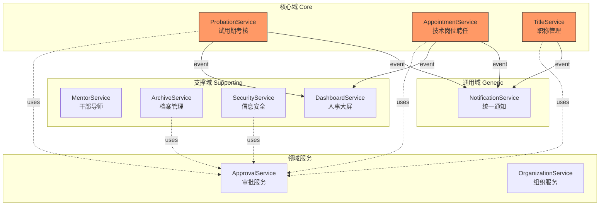
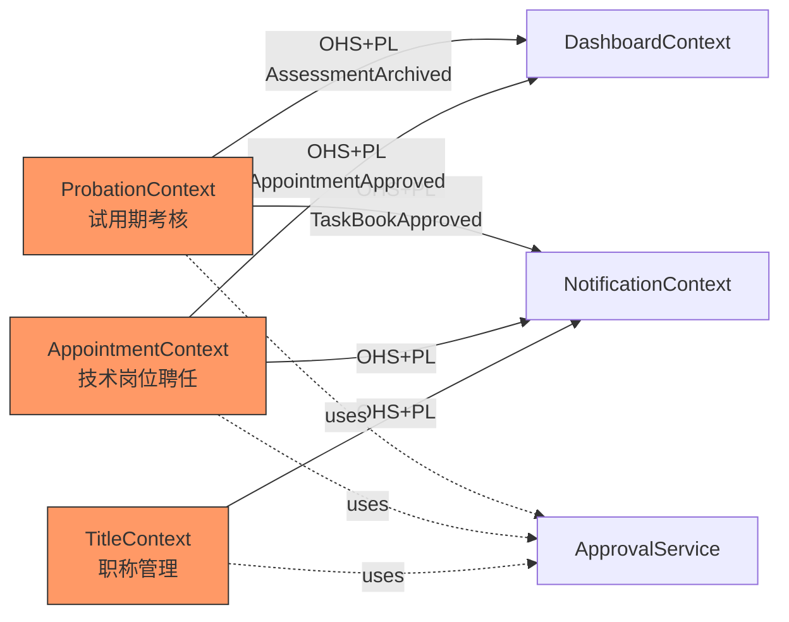
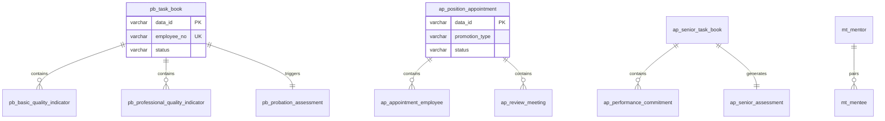

# 苍南二期人事系统 — 概要设计说明书

> **项目名称**: 苍南二期人事系统  
> **文档版本**: V1.0  
> **生成引擎**: Design Workflow V2.2 (Hermes)  
> **生成日期**: 2026-06-01  

---

## 第1章 功能清单

### 1.1 项目概述

**业务目标**: 实现技术岗位聘任、试用期考核、人事管理、干部导师库的全面线上化，达成流程标准化、数据集中化、权限精细化、提醒自动化。

### 1.2 功能模块总览

| 模块 | 子模块 | 主要功能 | 优先级 |
|------|--------|----------|:------:|
| 人事大屏 | 干部数据指标 | 中层/基层干部年龄分布、40岁以下比例可视化 | P2 |
| 人事大屏 | 入职数据指标 | 校招趋势、学历分布、招聘完成率、渠道分布 | P2 |
| 人事大屏 | 离职数据指标 | 离职趋势、部门/职级/年限分布、原因分析 | P2 |
| 技术岗位聘任 | 试用期考核任务书 | 师傅编辑→徒弟确认→科长审核，占比自动校验 | P0 |
| 技术岗位聘任 | 试用期考核 | 人资批量发起→徒弟填写→师傅评分→逐级审核→归档 | P0 |
| 技术岗位聘任 | 集中聘任流程 | 5种晋升类型(A/B/C/D/E)、评审会、多级审批 | P0 |
| 技术岗位聘任 | 高级岗位任务书 | 关键业绩承诺书、人资→部门经理→分管领导审批 | P0 |
| 技术岗位聘任 | 高级岗位考核 | 自动生成考核→述职述廉→部门经理打分→归档 | P0 |
| 技术岗位聘任 | 干部导师库 | 导师信息维护、徒弟结对(≤3人)、赠书记录 | P1 |
| 技术岗位聘任 | 导师书库维护 | 书籍库存管理、赠送记录、自动计算剩余 | P1 |
| 人事管理 | 职称初定 | 提前15天提醒→筛选名单→员工填写→逐级审核 | P0 |
| 人事管理 | 职称评审 | 员工申报(多子表)→组长/主任评审→公示发文 | P0 |
| 人事管理 | 档案转入归档 | 本人发起/代发起/组织新增、在线审批 | P1 |
| 人事管理 | 信息使用申请 | 按敏感等级分级审批→自动授权+有效期+操作日志 | P1 |
| 其他 | 假期提醒 | 中台数据同步→5/8/11月初→钉钉/邮件提醒 | P2 |

### 1.3 角色分析

| 角色 | 类型 | 数据范围 | 核心职责 |
|------|:----:|----------|----------|
| 员工(试用期) | 业务 | 本人 | 确认任务书、填写工作小结 |
| 师傅(指导人) | 业务 | 所带徒弟 | 编辑任务书、评分、考核结果 |
| 科长 | 审批 | 本部门 | 审核任务书、审核考核、审核职称初定 |
| 部门经理 | 审批 | 本部门 | 审核考核、审核任务书、打分(可修改) |
| 人资(HR) | 业务 | 全公司 | 发起考核、归档、查看导师库、维护书库 |
| 组织规划管理员 | 业务 | 聘任数据 | 发起中初级/破格晋升聘任 |
| 培训工程师 | 业务 | 本部门培训数据 | 组织评审会、审核聘任、打分 |
| 部门规划员 | 业务 | 本部门聘任数据 | 发起运行序列聘任 |
| 分管领导 | 审批 | 分管部门 | 审批高级岗位任务书 |
| 高评委 | 审批 | 破格/越级数据 | 审议破格/越级晋升 |
| 党委会 | 审批 | 破格/越级数据 | 最终审批破格/越级晋升 |
| 正式员工 | 业务 | 本人 | 发起任务书/职称申报/档案/信息申请 |

### 1.4 痛点分析

| 痛点 | 严重度 | 系统解决方案 |
|------|:------:|-------------|
| 技术岗位聘任纸质流程效率低 | 🔴 高 | 在线填写、自动流转、审批周期从5天→2天 |
| 试用期考核缺乏系统化 | 🔴 高 | 任务书线上签订、考核标准化、占比自动校验 |
| 人事档案管理不规范 | 🔴 高 | 电子化审批、敏感等级定义、操作留痕 |
| 干部导师管理缺失 | 🟡 中 | 导师信息集中管理、结对可追溯 |

---

## 第2章 系统架构设计

### 2.1 架构总览

**架构风格**: 事件驱动微服务 + 分层架构

- **事件驱动**: 核心域通过领域事件异步通知支撑域(通知/大屏)
- **分层架构**: Interface→Application→Domain→Infrastructure 四层
- **审批横切**: 审批服务(ApprovalService)作为领域服务被各Context复用，不独立成BC

### 2.2 五层架构

```
┌─────────────────────────────────────────┐
│ Interface Layer    │ Controller/DTO     │
├─────────────────────────────────────────┤
│ Application Layer  │ UseCase/ApprovalService │
├─────────────────────────────────────────┤
│ Domain Layer       │ Aggregate/Entity/DomainEvent │
├─────────────────────────────────────────┤
│ Infrastructure     │ Repository/Message/OrgTree │
└─────────────────────────────────────────┘
```

### 2.3 服务划分

| 服务 | Context | 类型 | 聚合 |
|------|---------|:----:|------|
| probation-service | CTX-001 | core | TaskBook + ProbationAssessment |
| appointment-service | CTX-002 | core | PositionAppointment + SeniorTaskBook + SeniorAssessment |
| title-service | CTX-003 | core | TitleDetermination + TitleReview |
| mentor-service | CTX-004 | supporting | Mentor + BookLibrary |
| archive-service | CTX-005 | supporting | ArchiveTransfer |
| security-service | CTX-006 | supporting | InfoAccessRequest |
| dashboard-service | CTX-007 | supporting | DashboardConfig |
| notification-service | CTX-008 | generic | NotificationTemplate |

### 2.4 技术栈

| 层次 | 技术选型 |
|------|---------|
| 后端框架 | Spring Boot 3.x / Java 17 |
| 数据库 | MySQL 8.0+ (InnoDB, utf8mb4) |
| 消息中间件 | RabbitMQ / RocketMQ |
| 缓存 | Redis |
| 认证 | 统一身份认证(OAuth2.0) |

### 2.5 系统结构图 (Mermaid)



---

## 第3章 业务流程设计

### 3.1 事件风暴概览

**核心事件链路**:

```
试用期考核: SyncProbationData → TaskBookEdited → TaskBookConfirmed → TaskBookApproved
           → AssessmentLaunched → WorkSummaryFilled → AssessmentScored 
           → AssessmentReviewed → AssessmentArchived

技术岗位聘任: AppointmentInitiated → ReviewMeetingOrganized → CandidatesScored
             → AppointmentApproved / AppointmentRejected

职称管理: TitleDeterminationInitiated → TitleDeterminationFilled → TitleDeterminationApproved
         TitleReviewApplied → TitleReviewCompleted → PublishAnnouncement
```

### 3.2 业务能力地图

| 能力 | 分类 | 差异化 |
|------|:----:|--------|
| 试用期考核管理 | 🔴 core | 考核标准化+占比校验 |
| 技术岗位聘任管理 | 🔴 core | 5种晋升类型+评审会+复杂筛选 |
| 职称管理 | 🔴 core | 初定+评审+公示发文 |
| 干部导师管理 | 🟡 supporting | 导师结对+书库 |
| 信息安全管理 | 🟡 supporting | 敏感等级分级审批 |
| 人事大屏 | 🟡 supporting | 数据可视化 |
| 通知服务 | ⚪ general | 多渠道推送 |

### 3.3 核心业务流程

**技术岗位聘任(中初级A/B)**:
```
组织规划管理员发起 → 培训工程师授权 → 组织评审会(可跳过)
→ 打分(倒序) → 部门经理审核 → 人资审核 → 聘任台账更新
```

**技术岗位聘任(破格C/高级D)**:
```
同上 + 高评委审议 → 党委会审批
```

**审批退回机制** (⚠️ 行业建议):
```
退回 → 退回原因必填 → 保留修改记录 → 重新提交 → 重新触发审批链
```

### 3.4 领域关系 (Context Map)



关系模式: **OHS+PL** (开放主机+发布语言) — 上游提供标准领域事件，下游异步消费。

---

## 第4章 数据模型设计

### 4.1 实体识别

按Context分组的核心实体:

| Context | 核心表 | 聚合根 |
|---------|--------|--------|
| CTX-001 Probation | pb_task_book, pb_probation_assessment | TaskBook, ProbationAssessment |
| CTX-002 Appointment | ap_position_appointment, ap_senior_task_book, ap_senior_assessment | PositionAppointment, SeniorTaskBook, SeniorAssessment |
| CTX-004 Mentor | mt_mentor | Mentor |
| CTX-006 Security | sc_info_access_request | InfoAccessRequest |

### 4.2 ER关系 (Mermaid)



### 4.3 字段语义分类

| 分类 | 标识 | 建列 | 示例 |
|------|:----:|:----:|------|
| ownership_field | 本实体拥有 | ✅ | employee_name, department |
| foreign_reference | FK引用 | ✅ | task_book_id |
| projection_field | 展示投影 | ❌ | mentor岗位名称(通过JOIN) |
| snapshot_field | 历史快照 | ✅ | recent_performance(JSON) |

### 4.4 企业标准字段（每表必含）

```sql
data_id                    VARCHAR(64) NOT NULL COMMENT '主键'
create_member              VARCHAR(64) DEFAULT NULL COMMENT '创建人'
create_time                DATETIME DEFAULT NULL COMMENT '创建时间'
create_member_ip_address   VARCHAR(64) DEFAULT NULL COMMENT '创建人IP地址'
last_mod_member            VARCHAR(64) DEFAULT NULL COMMENT '最后更新人'
last_mod_time              DATETIME DEFAULT NULL COMMENT '最后更新时间'
last_mod_member_ip_address VARCHAR(64) DEFAULT NULL COMMENT '最后更新人IP地址'
del_flag                   CHAR(1) DEFAULT '0' COMMENT '删除标记'
source_system              VARCHAR(64) DEFAULT NULL COMMENT '来源系统'
```

**完整DDL**: 参见独立文件 `cangnan-hr-ddl-hermes.sql` (7张核心表)

---

## 第5章 功能设计

### 5.1 限界上下文功能框架

| Context | 大模块 | 功能 | 来源FUNC |
|---------|--------|------|----------|
| CTX-001 Probation | 任务书管理 | 编辑/确认/审核 | FUNC-001 |
| CTX-001 Probation | 考核管理 | 批量发起/填写/评分/审核/归档 | FUNC-002 |
| CTX-002 Appointment | 集中聘任 | 5类型筛选/评审会/多级审批 | FUNC-003 |
| CTX-002 Appointment | 高级岗位 | 任务书+述职述廉+打分 | FUNC-004,005 |
| CTX-003 Title | 职称初定 | 自动提醒→填写→审批 | FUNC-008 |
| CTX-003 Title | 职称评审 | 申报(7子表)→组长/主任评审 | FUNC-009 |
| CTX-004 Mentor | 导师管理 | 导师维护+徒弟结对+赠书 | FUNC-006,007 |
| CTX-005 Archive | 档案管理 | 转入归档申请 | FUNC-010 |
| CTX-006 Security | 信息安全 | 敏感等级分级审批+自动授权 | FUNC-011 |

### 5.2 核心功能详细设计

**技术岗位集中聘任** (FUNC-003) — 系统核心差异化功能:

**5种晋升类型自动筛选**:
- **A (中初级)**: 职级<8 + 满2年 + 资格级别≥中级
- **B (绩优)**: 职级<8 + 上年度绩效A + 满18个月
- **C (破格越级)**: 职级<8 + 绩效条件 + 满12个月
- **D (高级)**: 职级≥8满3年 + 近三年绩效至少一个B + 高级职称
- **E (运行序列)**: 部门级规划员发起

**评审会管理** (⚠️ 待确认):
- 培训工程师组织评审会，选择评审员
- 打分100分制，倒序排列
- 可勾选跳过评审会（授权确定后直接到部门经理）
- 🔶 假设: 评审会默认可选，以需求中"待确定"标注为依据

**审批链配置** (⚠️ 行业建议):
- A/B类型: 培训工程师→部门经理→人资
- C/D类型: 上述 + 高评委→党委会
- 🔶 建议采用审批模板配置化，避免硬编码if-else

### 5.3 页面结构策略

| 页面/模块 | 定位 | 主要用户 |
|-----------|------|----------|
| 统一待办中心 | primary_workspace | 师傅/科长/部门经理/人资 |
| 聘任工作台 | primary_workspace | 组织规划管理员/培训工程师 |
| 考核详情页 | object_detail | 徒弟/师傅/科长 |
| 人事大屏 | data_view | 人资/部门经理/分管领导 |
| 导师库管理 | supporting_module | 人资 |

---

## 第6章 权限设计

### 6.1 角色权限矩阵

| 角色 | 任务书 | 考核 | 聘任 | 高级岗位 | 职称 | 档案 | 信息申请 | 大屏 | 导师库 |
|------|:---:|:---:|:---:|:-----:|:---:|:---:|:-----:|:---:|:---:|
| 员工(试用期) | 确认 | 填写 | - | - | - | - | - | - | - |
| 师傅 | 编辑 | 评分 | - | - | - | - | - | - | - |
| 科长 | 审核 | 审核 | - | - | 审核 | - | 审核 | - | - |
| 部门经理 | - | 审核 | 审核 | 审核/打分 | 审核 | 审核 | 审核 | 查看 | - |
| 人资 | 查看 | 发起/归档 | 审核 | 审核/触发 | 发起/审核 | 审核 | 审核 | 查看/编辑 | 查看/编辑 |
| 组织规划管理员 | - | - | 发起 | - | - | - | - | - | - |
| 培训工程师 | - | - | 组织评审 | - | - | - | - | - | - |
| 分管领导 | - | - | - | 审批 | - | - | - | 查看 | - |
| 高评委 | - | - | 审议 | - | - | - | - | - | - |
| 党委会 | - | - | 审批 | - | - | - | - | - | - |
| 正式员工 | - | - | - | 发起 | 申报 | 发起 | 发起 | - | - |

### 6.2 数据隔离方案

| 数据范围 | 实现方式 |
|----------|---------|
| 全公司 | 无过滤 |
| 分管部门 | 按分管关系过滤部门树 |
| 本部门 | 按当前用户部门ID过滤 |
| 本人 | 按当前用户ID过滤 |

🔶 假设: 采用组织树方案（部门→科室层级），支持向上/向下级联。

---

## 第7章 非功能设计

### 7.1 性能设计

| 指标 | 目标值 | 策略 |
|------|--------|------|
| 并发用户数 | ≥200 | 连接池(最大200)、无状态服务 |
| 页面响应 | ≤3秒 | Redis缓存、数据库索引优化 |
| 批量操作 | 支持50+条/批 | 分批提交+幂等键 |

**缓存策略** (🔶 假设):
| 数据 | TTL | 失效策略 |
|------|-----|----------|
| 组织架构树 | 30min | 部门变更时主动失效 |
| 员工基础信息 | 15min | SAP同步后失效 |
| 考核模板/晋升规则 | 1h | 手动刷新 |

### 7.2 安全设计

| 维度 | 方案 |
|------|------|
| 认证 | 统一身份认证体系(OAuth2.0)，适配现有SSO |
| 敏感字段加密 | 身份证/银行卡/薪资等 AES256 加密存储 |
| 防重入 | 幂等键(idempotent_key)唯一约束，防止重复提交 |
| 审计 | 操作全程留痕到IP级别(create_member_ip_address/last_mod_member_ip_address) |
| 权限回收 | 信息使用申请到期自动回收(定时任务) |

### 7.3 可扩展性

- **服务独立部署**: 8个服务各自独立，可独立扩缩容
- **事件驱动解耦**: 核心域与支撑域通过领域事件异步通信
- **审批链配置化**: 审批级别和角色可通过模板表动态调整
- **水平扩展**: 无状态服务支持多实例部署

### 7.4 可靠性

| 策略 | 方案 |
|------|------|
| 故障恢复 | 服务健康检查+自动重启 |
| 数据备份 | MySQL主从+每日备份 |
| 幂等性 | 批量操作幂等键+乐观锁 |
| 数据同步重试 | 培训系统/SAP同步失败自动重试+告警 |

### 7.5 行业增强建议

| 建议 | 状态 |
|------|:---:|
| 统一待办中心聚合跨模块任务 | ⚠️ 建议 |
| 审批链配置化(模板表) | ⚠️ 建议 |
| 敏感等级+审批链联动 | ⚠️ 建议 |
| 批量操作幂等键 | 🔶 假设 |
| 统一消息中心(钉钉/邮件) | 🔶 假设 |

---

## 第8章 遗留问题

| ID | 问题 | 影响 | 分类 |
|:---|------|:----:|------|
| Q-001 | 组织评审会是否必须？(原文标注"待确定") | 🟡 中 | ambiguous |
| Q-002 | 信息使用申请的自动授权+有效期+操作日志是否可实现？ | 🔴 高 | missing_info |
| Q-003 | 假期提醒模板待后续提供 | 🟢 低 | missing_info |
| Q-004 | 高级岗位考核评价说明模板展示方式待确认 | 🟢 低 | ambiguous |
| DEC-001 | 审批链硬编码 vs 配置化？ | 🔴 高 | design_decision |
| DEC-002 | 数据权限隔离：组织树 vs 角色标签？ | 🔴 高 | design_decision |
| DEC-003 | 考核模板内置固定 vs 可配置？ | 🟡 中 | design_decision |

---

## 第9章 工作量评估

### 9.1 按服务拆分

| 服务 | 配置(人天) | 开发(人天) | 测试(人天) | 小计 |
|------|:-----:|:-----:|:-----:|:----:|
| probation-service | 2 | 15 | 5 | 22 |
| appointment-service | 3 | 25 | 8 | 36 |
| title-service | 2 | 18 | 6 | 26 |
| mentor-service | 1 | 8 | 3 | 12 |
| archive-service | 1 | 5 | 2 | 8 |
| security-service | 2 | 10 | 4 | 16 |
| dashboard-service | 2 | 12 | 4 | 18 |
| notification-service | 1 | 6 | 2 | 9 |
| 基础设施+集成 | 5 | 10 | 5 | 20 |
| **小计** | **19** | **109** | **39** | **167** |
| **15%缓冲** | - | - | - | **+25** |
| **总计** | | | | **192人天** |

### 9.2 分阶段开发顺序

| 阶段 | 服务 | 里程碑 |
|:----:|------|--------|
| Phase 1 | probation + appointment | 试用期考核+技术岗位聘任上线 |
| Phase 2 | title + mentor + archive | 职称管理+导师库+档案管理上线 |
| Phase 3 | security + dashboard + notification | 信息安全+大屏+通知上线 |

---

## 附录A 事件清单

| ID | 事件名 | 触发命令 | 下游影响 |
|:---|--------|----------|----------|
| EVT-001 | ProbationDataSynced | SyncProbationData | 生成任务书待办 |
| EVT-002 | TaskBookEdited | EditTaskBook | - |
| EVT-003 | TaskBookConfirmed | ConfirmTaskBook | 触发占比校验 |
| EVT-004 | TaskBookApproved | ApproveTaskBook | 通知相关人员 |
| EVT-005 | ProbationAssessmentLaunched | LaunchProbationAssessment | 通知徒弟 |
| EVT-006 | WorkSummaryFilled | FillWorkSummary | - |
| EVT-007 | AssessmentScored | ScoreAssessment | - |
| EVT-008 | AssessmentReviewed | ReviewAssessment | - |
| EVT-009 | AssessmentArchived | ArchiveAssessment | 大屏更新/通知 |
| EVT-010 | PositionAppointmentInitiated | LaunchPositionAppointment | 筛选逻辑执行 |
| EVT-011 | ReviewMeetingOrganized | OrganizeReviewMeeting | - |
| EVT-012 | CandidatesScored | ScoreCandidates | - |
| EVT-013 | AppointmentApproved | ApproveAppointment | 更新台账/通知/大屏 |
| EVT-014 | AppointmentRejected | RejectAppointment | 通知发起人 |
| EVT-015 | SeniorTaskBookCreated | CreateSeniorTaskBook | - |
| EVT-016 | SeniorTaskBookApproved | ApproveSeniorTaskBook | 自动生成考核 |
| EVT-017 | DutyReportFilled | FillDutyReport | - |
| EVT-018 | SeniorAssessmentScored | ScoreSeniorAssessment | - |
| EVT-022 | TitleDeterminationInitiated | InitiateTitleDetermination | 15天提醒 |
| EVT-023 | TitleDeterminationFilled | FillTitleDetermination | - |
| EVT-024 | TitleDeterminationApproved | ApproveTitleDetermination | 归档/通知 |
| EVT-025 | TitleReviewApplied | ApplyTitleReview | - |
| EVT-026 | TitleReviewCompleted | ReviewTitleApplication | 公示发文 |
| EVT-027 | ArchiveTransferApplied | ApplyArchiveTransfer | - |
| EVT-028 | ArchiveTransferApproved | ApproveArchiveTransfer | 通知 |
| EVT-029 | InfoAccessApplied | ApplyInfoAccess | - |
| EVT-030 | InfoAccessApproved | ApproveInfoAccess | 自动授权+日志 |
| EVT-031 | HolidayReminderSent | TriggerHolidayReminder | - |
| EVT-032 | DashboardDataRefreshed | SyncDashboardData | - |

**事件统计**: 28个业务事件 / 12条事件流 / 11条策略

---

## 附录B 生成记录

| 项目 | 值 |
|------|-----|
| 引擎版本 | Design Workflow V2.2 |
| STAGE_0 | 文档解析: 566段+19表, complete |
| STAGE_1 | 需求提炼: 15功能/32命令/28事件/12事件流 |
| STAGE_2 | 行业增强: 成熟度82/high, 5行业模式, 3决策待办 |
| STAGE_3 | DDD架构: 8域/8Context/13聚合/8服务 |
| STAGE_4 | 数据模型: 7张核心DDL表, 9标准字段 |
| STAGE_5+6 | 设计综合+概设输出: 9章概设 |
| 生成时间 | 2026-06-01 |
