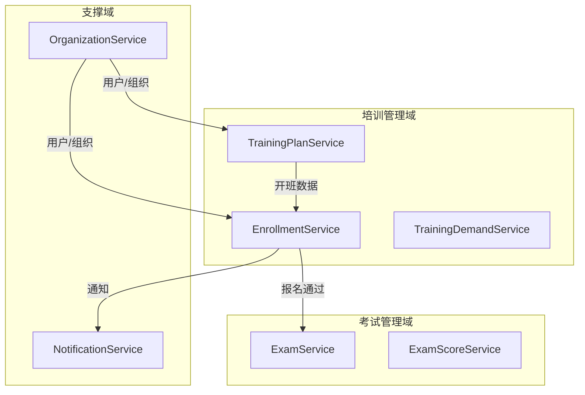
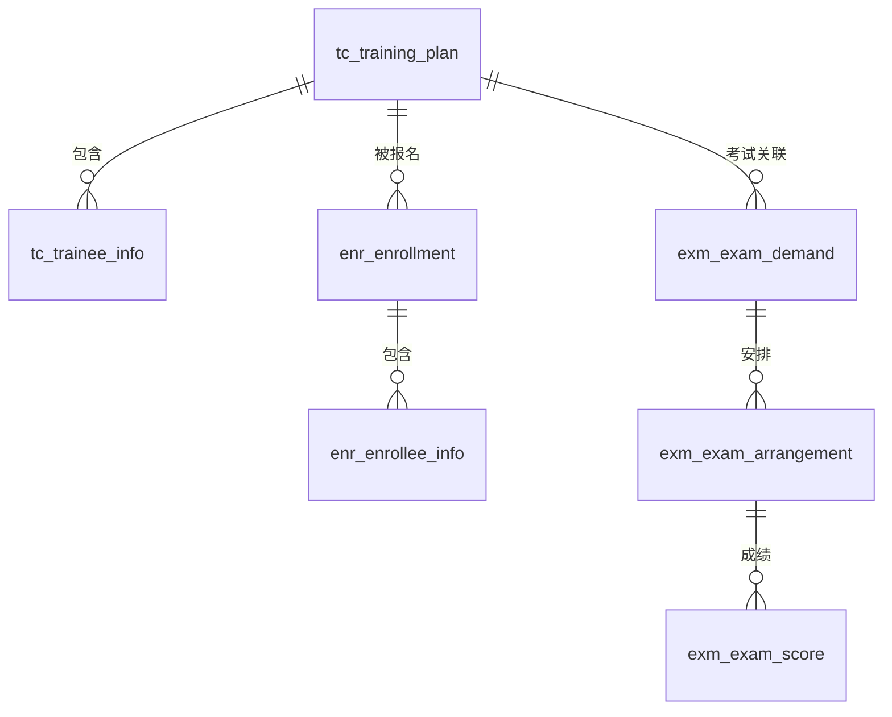

# 承包商培训管理系统 — 概要设计说明书

**文档版本**: V1.0  
**生成引擎**: Design Workflow V2.3 (Harness Engineering)  
**生成日期**: 2026-06-01  
**作者**: Hermes

---

## 第1章 功能清单

### 1.1 项目概述

建立统一的承包商培训管理平台，实现培训计划制定→培训报名→报名审核→培训执行→考试评估的全流程闭环管理。系统支持培训部专员和承包商接口人两种角色协同工作，确保培训资源的有效利用和培训质量的全程可追溯。

### 1.2 功能模块总览

| 模块 | 子模块 | 主要功能 | 优先级 |
|------|--------|----------|:------:|
| 培训管理 | 开班计划 | 创建/查看/编辑/删除开班计划，学员信息管理 | P0 |
| 培训管理 | 培训报名 | 查看开班计划、报名、查看报名状态 | P0 |
| 培训管理 | 报名审核 | 审核报名申请(同意/退回) | P0 |
| 培训管理 | 培训需求 | 提交培训需求、审核培训需求 | P1 |
| 培训管理 | 在岗培训信息 | 录入/查看承包商自主培训信息 | P2 |
| 考试管理 | 考试需求 | 发起考试需求、处理考试需求 | P0 |
| 考试管理 | 考试安排 | 对已审核需求安排考试 | P0 |
| 考试管理 | 培训成绩录入 | 录入考试成绩 | P1 |
| 考试管理 | 培训程序录入 | (需求待补充) | P2 |

### 1.3 角色分析

| 角色 | 类型 | 数据范围 | 核心职责 |
|------|------|----------|----------|
| 培训部专员 | business | 全部数据 | 制定计划、审核报名/需求/考试、安排考试、录入成绩 |
| 承包商接口人 | business | 本单位数据 | 提交报名/需求/考试申请、查看本单位培训信息 |

### 1.4 痛点分析

| 痛点 | 严重程度 | 描述 |
|------|:------:|------|
| PAIN-001 | high | 培训信息分散，开班/报名/考试数据未打通 |
| PAIN-002 | high | 报名审核流程线下处理，效率低 |
| PAIN-003 | medium | 承包商自主培训信息无法统一汇集 |
| PAIN-004 | high | 考试与培训脱节，无法追溯 |

---

## 第2章 系统架构设计

### 2.1 架构总览

采用 **DDD分层架构 + 事件驱动** 模式：

- **核心域**：培训管理（开班+报名）、考试管理
- **支撑域**：培训需求管理、在岗培训、组织用户
- **通用域**：统一消息通知

### 2.2 五层架构

```
┌─────────────────────────────────┐
│      Interface Layer (Web)       │ ← Controller, DTO, 页面
├─────────────────────────────────┤
│    Application Layer (协调)      │ ← ApplicationService, UseCase
├─────────────────────────────────┤
│      Domain Layer (核心)         │ ← Entity, Aggregate, DomainService
├─────────────────────────────────┤
│   Infrastructure Layer (实现)    │ ← Repository Impl, MessagePublisher
└─────────────────────────────────┘
```

### 2.3 服务划分

| 服务 | 类型 | Context | 核心职责 |
|------|------|---------|----------|
| TrainingPlanService | core | CTX-001 | 开班计划CRUD |
| EnrollmentService | core | CTX-002 | 报名+审核+状态流转 |
| TrainingDemandService | supporting | CTX-003 | 培训需求管理 |
| ExamService | core | CTX-005 | 考试需求+安排 |
| ExamScoreService | core | CTX-006 | 成绩管理 |
| OrganizationService | supporting | CTX-007 | 组织用户(Shared Kernel) |
| NotificationService | infrastructure | CTX-008 | 统一消息 |

### 2.4 技术栈

- 后端: Java/Spring Boot
- 前端: Vue.js / React
- 数据库: MySQL 8.0+
- 消息: (如启用事件驱动) RabbitMQ / Kafka

### 2.5 系统结构图 (Mermaid)



---

## 第3章 业务流程设计

### 3.1 核心事件链路

**FLOW-001: 开班报名审批链路**
```
培训专员创建开班(TrainingPlanCreated)
  → 承包商查看开班列表
  → 承包商发起报名(EnrollmentSubmitted)
  → [校验容量POL-001]
  → [通知专员POL-002]
  → 专员审核通过(EnrollmentApproved)
  → [更新容量POL-003]
```

**FLOW-002: 报名退回重提链路**
```
专员退回(EnrollmentRejected)
  → [通知申请人POL-004]
  → 承包商查看"待重新申请"
  → 承包商重新提交(EnrollmentReSubmitted)
  → 或结束流程(EnrollmentClosed)
```

**FLOW-004: 考试需求→安排→成绩链路**
```
培训完成→承包商发起考试需求(ExamDemandInitiated)
  → 专员处理(ExamDemandProcessed)
  → 专员安排考试(ExamArranged)
  → 专员录入成绩(ExamScoreImported)
```

### 3.2 审批状态机

```
┌─────────┐    提交     ┌─────────┐
│  待审核   │ ─────────→ │  审核中   │
└─────────┘             └────┬────┘
     ↑                      │
     │ 重新提交       ┌──────┼──────┐
     │               ↓             ↓
┌────┴──────┐   ┌─────────┐   ┌─────────┐
│ 待重新申请  │ ← │  已退回   │   │  已通过   │ → 闭环
└───────────┘   └─────────┘   └─────────┘
     │
     ↓ 结束
  [流程终止]
```

### 3.3 领域关系 (Context Map)

```
TrainingPlanContext ──OHS+PL──→ EnrollmentContext
EnrollmentContext ───OHS+PL──→ ExamContext
TrainingDemandContext ──CF───→ TrainingPlanContext
OrganizationContext ──SK────→ All Contexts
```

---

## 第4章 数据模型设计

### 4.1 核心实体

共10张数据表，按Context分组：

| Context | 表名 | 聚合根 |
|---------|------|--------|
| CTX-001 | tc_training_plan, tc_trainee_info | TrainingPlan |
| CTX-002 | enr_enrollment, enr_enrollee_info | Enrollment |
| CTX-003 | tdm_training_demand, tdm_demand_personnel | TrainingDemand |
| CTX-005 | exm_exam_demand, exm_exam_arrangement | ExamDemand |
| CTX-006 | exm_exam_score | ExamScore |
| CTX-004 | ojt_on_job_training | — |

### 4.2 E-R 关系 (Mermaid)



### 4.3 字段语义分类

| 语义类型 | 说明 | 建列 | 示例 |
|----------|------|:---:|------|
| ownership_field | 本实体自有字段 | ✅ | plan_name, capacity |
| foreign_reference | 外键引用 | ✅ | course_id → t_course |
| snapshot_field | 历史快照 | ✅ | instructor_name(快照) |
| projection_field | 展示投影 | ❌ | enrolled_count(JOIN+COUNT) |
| derived_field | 计算字段 | ❌ | remaining_capacity(计算) |

### 4.4 核心表DDL

```sql
-- tc_training_plan (开班计划)
CREATE TABLE tc_training_plan (
  data_id VARCHAR(64) NOT NULL COMMENT '主键',
  plan_name VARCHAR(128) NOT NULL COMMENT '班级名称',
  is_contractor CHAR(1) DEFAULT '0' COMMENT '是否承包商开班',
  org_unit VARCHAR(128) NOT NULL COMMENT '开班单位',
  course_id VARCHAR(64) DEFAULT NULL COMMENT '关联课程',
  course_code VARCHAR(64) NOT NULL COMMENT '课程编码(快照)',
  instructor_id VARCHAR(64) DEFAULT NULL COMMENT '教员ID',
  instructor_name VARCHAR(64) NOT NULL COMMENT '教员姓名(快照)',
  start_time DATETIME NOT NULL,
  end_time DATETIME NOT NULL,
  capacity INT NOT NULL COMMENT '培训容量',
  -- 9标准字段
  create_member VARCHAR(64), create_time DATETIME,
  last_mod_member VARCHAR(64), last_mod_time DATETIME,
  del_flag CHAR(1) DEFAULT '0', source_system VARCHAR(64),
  PRIMARY KEY (data_id)
) ENGINE=InnoDB DEFAULT CHARSET=utf8mb4;

-- enr_enrollment (培训报名)
CREATE TABLE enr_enrollment (
  data_id VARCHAR(64) NOT NULL COMMENT '主键',
  plan_id VARCHAR(64) NOT NULL COMMENT '关联开班',
  applicant_id VARCHAR(64) NOT NULL COMMENT '申请人',
  applicant_unit VARCHAR(128) NOT NULL COMMENT '申请单位',
  enrollment_count INT NOT NULL COMMENT '报名人数',
  status VARCHAR(32) NOT NULL DEFAULT '待审核' COMMENT '待审核/已通过/待重新申请',
  -- 9标准字段
  create_member VARCHAR(64), create_time DATETIME,
  last_mod_member VARCHAR(64), last_mod_time DATETIME,
  del_flag CHAR(1) DEFAULT '0', source_system VARCHAR(64),
  PRIMARY KEY (data_id),
  KEY idx_plan_id (plan_id), KEY idx_status (status)
) ENGINE=InnoDB DEFAULT CHARSET=utf8mb4;

-- exm_exam_demand (考试需求)
CREATE TABLE exm_exam_demand (
  data_id VARCHAR(64) NOT NULL COMMENT '主键',
  training_plan_id VARCHAR(64) NOT NULL COMMENT '关联培训',
  applicant_id VARCHAR(64) NOT NULL COMMENT '申请人',
  applicant_unit VARCHAR(128) NOT NULL COMMENT '申请单位',
  status VARCHAR(32) NOT NULL DEFAULT '待处理' COMMENT '待处理/已通过/已退回',
  -- 9标准字段
  create_member VARCHAR(64), create_time DATETIME,
  last_mod_member VARCHAR(64), last_mod_time DATETIME,
  del_flag CHAR(1) DEFAULT '0', source_system VARCHAR(64),
  PRIMARY KEY (data_id),
  UNIQUE KEY uk_plan_demand (training_plan_id, del_flag)
) ENGINE=InnoDB DEFAULT CHARSET=utf8mb4;
```

**投影字段清单**:
| 字段 | 来源 | 获取方式 |
|------|------|----------|
| enrolled_count (已报名人数) | enr_enrollment | JOIN plan_id + WHERE status='已通过' + COUNT |
| remaining_capacity (剩余容量) | 计算 | capacity - enrolled_count |

---

## 第5章 功能设计

### 5.1 培训部专员工作台

**待办中心（主工作台）**:
- 待审核报名列表（按开始时间降序，显示班级名称/申请单位/报名人数/容量）
- 待处理培训需求
- 待处理考试需求
- 行内操作：处理(弹窗)→同意/退回

### 5.2 开班计划管理

**列表页**: 按角色过滤（专员=全部，承包商=本人提交）
**新增(培训专员)**: 选择培训月份→过滤课程→选课自动带出编码/教员/教室→填写容量/时间/学员子表
**新增(承包商)**: 默认"是"承包商开班→选择课程(教员取教员授权台账)

### 5.3 培训报名

**报名列表**: 展示所有承包商开班+培训部发布的开班计划
**报名表单**: 显示开班信息(只读)+填写报名人数+人员子表(选姓名自动带出公司/工号/手机号)
**我已报名**: 跟踪状态(待审核/已通过/待重新申请)→退回可重新发起或结束

### 5.4 报名审核

**处理操作**:
- 同意→状态变为"已通过"，占用容量 ✅
- 退回→状态变为"待重新申请"，释放容量 🔶(待确认)
- 退回时填写原因，通知申请人

### 5.5 考试管理

**考试需求发起**: 自动筛选出该单位已参与且需考试的开班计划→选择→上传培训记录→填写参考人员
**考试需求处理**: 审核(同意/退回)→安排考试→录入成绩

---

## 第6章 权限设计

### 6.1 角色权限矩阵

| 功能 | 培训部专员 | 承包商接口人 |
|------|:---:|:---:|
| 开班计划-查看 | 全部 | 本人提交 |
| 开班计划-新增 | ✅ | ✅(承包商开班) |
| 开班计划-编辑/删除 | 全部 | 本人提交 |
| 培训报名 | ❌ | ✅ |
| 报名审核 | ✅ | ❌ |
| 培训需求-提交 | ❌ | ✅ |
| 培训需求-审核 | ✅ | ❌ |
| 考试需求-发起 | ❌ | ✅ |
| 考试需求-处理 | ✅ | ❌ |
| 考试安排 | ✅ | ❌ |
| 成绩录入 | ✅ | ❌ |
| 在岗培训信息 | ✅(全部) | ✅(本部门) |

### 6.2 数据隔离方案

- **培训部专员**: 跨全部承包商，数据范围=全部
- **承包商接口人**: 数据范围=所属一级单位 + 本人提交
- **实现方式**: 前端菜单权限 + 后端SQL级数据过滤(WHERE org_unit = ?)

---

## 第7章 非功能设计

### 7.1 性能设计

- 支持并发用户≥200 ✅ 已确认
- 页面响应≤3秒 ✅ 已确认
- 列表查询加索引: plan_id, status, applicant_id, org_unit
- **容量校验**: 乐观锁(version字段)，冲突时提示重试

### 7.2 安全设计

- ✅ 操作全程留痕可审计（9标准字段：create_member/time/ip + last_mod_member/time/ip）
- ✅ 数据安全：按角色数据范围过滤（RULE-001, RULE-002）
- 🔶 敏感字段加密：待确认是否有身份证等敏感字段

### 7.3 可扩展性

- 服务按Context独立部署
- Enrollment→Exam 通过事件异步解耦
- 预留SSO接口（适配公司统一身份认证约束）

### 7.4 可靠性

- 审批操作幂等（状态机防重）
- 报名容量校验防超卖
- 数据库主从+定时备份

---

## 第8章 遗留问题

| 编号 | 问题 | 来源 | 影响 | 状态 |
|:----:|------|------|------|:----:|
| Q-001 | 剩余容量=总容量-审核通过人数 or 所有报名人数？ | STAGE_1 | 影响报名逻辑和容量展示 | ❓待确认 |
| Q-002 | "月度培训计划"数据来源（是否已有模块） | STAGE_1 | 影响开班计划-选课联动 | ❓待确认 |
| Q-003 | 考试安排列表是否需要按承包商/课程筛选 | STAGE_1 | 影响列表过滤逻辑 | ❓待确认 |
| Q-004 | 成绩录入后是否需要通知承包商接口人 | STAGE_1 | 影响通知设计 | ❓待确认 |
| Q-005 | 在岗培训信息是外部抓取还是手动录入 | STAGE_1 | 影响数据同步方案 | ❓待确认 |
| Q-007 | 培训程序录入功能需求缺失 | STAGE_1 | 考试管理模块不完整 | ❓待确认 |
| DEC-001 | 退回时是否自动释放容量 | STAGE_2 | 🔶建议释放，待客户确认 | 🔶假设 |
| DEC-003 | 承包商数据隔离层级(一级单位or完整组织树) | STAGE_2 | ⚠️影响权限实现 | ⚠️建议 |

---

## 第9章 工作量评估

| 模块 | 配置(人天) | 开发(人天) | 测试(人天) | 合计 |
|------|:--------:|:--------:|:--------:|:----:|
| 组织用户管理(复用/配置) | 1 | 2 | 1 | 4 |
| 开班计划管理 | 1 | 3 | 2 | 6 |
| 培训报名+审核 | 1 | 4 | 2 | 7 |
| 培训需求管理 | 1 | 2 | 1 | 4 |
| 考试需求+安排 | 1 | 3 | 2 | 6 |
| 成绩录入 | 0.5 | 2 | 1 | 3.5 |
| 在岗培训信息 | 0.5 | 2 | 1 | 3.5 |
| 统一待办+通知 | 1 | 2 | 1 | 4 |
| 权限+审计 | 1 | 2 | 2 | 5 |
| **小计** | **8** | **22** | **13** | **43** |
| 缓冲(15%) | — | — | — | **6.5** |
| **总计** | | | | **~50人天** |

**建议开发顺序**: 
1. Phase1: 组织用户 + 开班计划(基础数据)
2. Phase2: 培训报名+审核(核心链路)
3. Phase3: 考试管理(扩展链路)
4. Phase4: 培训需求+在岗培训(补充模块)

---

## 附录A: 事件清单

| EVT-ID | 事件名 | 触发命令 | 下游影响 |
|--------|--------|----------|----------|
| EVT-001 | TrainingPlanCreated | CMD-001 | Enrollment可引用 |
| EVT-002 | EnrollmentSubmitted | CMD-002 | →审核，→容量校验 |
| EVT-003 | EnrollmentApproved | CMD-003 | →Exam可发起，→容量更新 |
| EVT-004 | EnrollmentRejected | CMD-004 | →通知，→可重提 |
| EVT-005 | EnrollmentReSubmitted | CMD-005 | →重新审核 |
| EVT-009 | ExamDemandInitiated | CMD-009 | →审核处理 |
| EVT-011 | ExamArranged | CMD-011 | →成绩录入 |
| EVT-012 | ExamScoreImported | CMD-012 | →培训记录更新 |

## 附录B: 生成记录

- 引擎版本: Design Workflow V2.3 (Harness Engineering)
- 生成时间: 2026-06-01
- 阶段统计: STAGE_0(489段/11表)→STAGE_1(14事件/15功能/7问题)→STAGE_2(62分/5模式)→STAGE_3(8Context/6聚合)→STAGE_4(10表/DDL)→STAGE_5→STAGE_6
