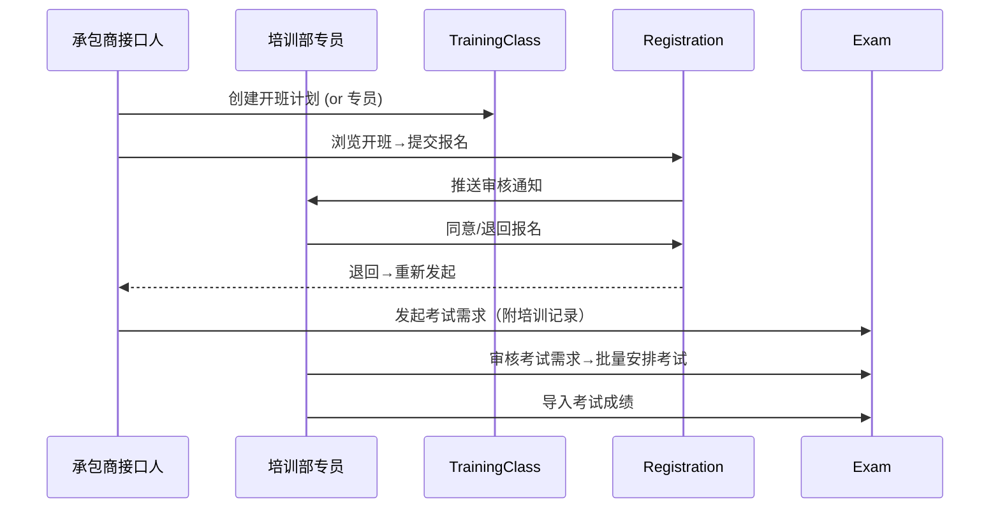
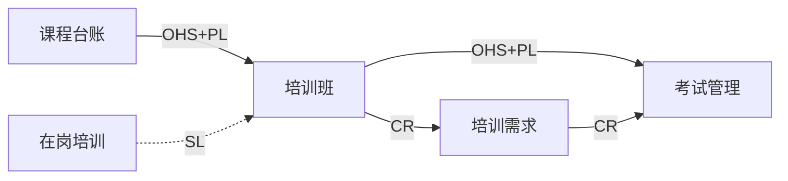
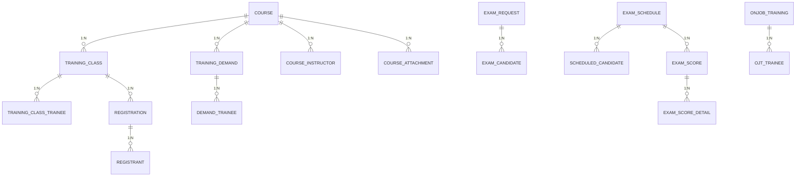

# 承包商培训管理系统 — 概要设计

> 文档类型：概要设计（AE 标准 9 章） | 日期：2026-05-30 | 版本：V1.0-draft  
> 数据来源：承包商培训管理系统需求.docx | 需求成熟度：55（50-69区间，部分设计为假设）

---

## 第1章 功能清单

### 1.1 项目概述

**业务目标**：为某企业培训部门与各承包商单位之间的培训管理提供统一平台，实现从**培训计划 → 报名 → 审核 → 考试 → 成绩**的全流程线上化，确保培训资源高效利用、操作全程留痕可审计。

### 1.2 功能模块总览

| 模块 | 菜单 | 优先级 | 角色 | 说明 |
|------|------|:---:|------|------|
| 培训管理 | 开班计划 | P0 | 专员/承包商 | 创建/编辑/删除培训班级，含学员子表 |
| 培训管理 | 培训报名 | P0 | 承包商 | 查看并报名开班计划，含报名跟踪页签 |
| 培训管理 | 报名审核 | P0 | 专员/发起人 | 审核报名申请（同意/退回） |
| 培训管理 | 培训需求 | P0 | 专员/承包商 | 提交培训需求+专员审核 |
| 培训管理 | 在岗培训信息 | P1 | 专员/承包商 | 记录承包商自主培训及成绩 |
| 考试管理 | 考试需求 | P0 | 专员/承包商 | 双页签：发起+处理考试需求 |
| 考试管理 | 考试安排 | P0 | 专员 | 批量审核→整合安排考试（双页签） |
| 考试管理 | 培训成绩录入 | P1 | 专员 | 导入考试成绩 |
| 课程科目台账 | 课程科目台账 | P1 | 专员 | 课程基础数据（目录+列表+详情+导出） |
| — | 培训程序录入 | P2 | — | 🔶 本期不做（需求标注"无"） |

### 1.3 角色分析

| 角色 | 类型 | 数据范围 | 核心职责 |
|------|------|---------|---------|
| 培训部专员 | business | 全部数据 | 审核需求/报名、安排考试、录入成绩、管理课程 |
| 承包商接口人 | business | 本人+本单位 | 开班、报名、提交培训与考试需求 |
| 开课发起人 | approval | 本人发起 | 审批自己班级的报名 |

### 1.4 痛点分析

- 培训资源利用率低——班级容量跨承包商共享缺系统支持
- 培训→考试衔接依赖人工，无自动化串联
- 承包商自主培训数据分散，无法统一管理

---

## 第2章 系统架构设计

### 2.1 架构总览

**架构模式**：分层架构 + 事件驱动（跨上下文）

**DDD 限界上下文**：5 个上下文，8 个服务

```
┌─────────────────────────────────────────────────┐
│                Interface Layer                    │
│          (Web UI / REST API Gateway)              │
├─────────────────────────────────────────────────┤
│              Application Layer                    │
│   Use Cases: 报名→审核→考试→成绩                  │
├──────────┬──────────┬──────────┬────────────────┤
│ Training │ Training │  Exam    │  OnJobTraining │
│  Class   │  Demand  │ Context  │    Context     │
│ Context  │ Context  │          │                │
├──────────┴──────────┴──────────┴──────┬─────────┤
│         CourseManagement Context       │  Auth   │
├───────────────────────────────────────┴─────────┤
│              Infrastructure Layer                 │
│   (MySQL, Message Queue, File Storage, SSO)       │
└─────────────────────────────────────────────────┘
```

### 2.2-2.4 分层说明 / 服务划分 / 技术栈

**分层**：Interface → Application → Domain → Infrastructure（标准 DDD 四层）

| 服务 | 上下文 | 类型 | 职责 |
|------|--------|------|------|
| training-class-svc | TrainingClassContext | core | 培训班 CRUD |
| registration-svc | TrainingClassContext | core | 报名+审核 |
| training-demand-svc | TrainingDemandContext | core | 培训需求提交+审核 |
| exam-request-svc | ExamContext | core | 考试需求+处理 |
| exam-schedule-svc | ExamContext | core | 考试安排 |
| exam-score-svc | ExamContext | supporting | 成绩导入 |
| onjob-training-svc | OnJobTrainingContext | supporting | 在岗培训 |
| course-svc | CourseManagementContext | supporting | 课程台账 |

**建议技术栈**：Spring Boot / MySQL 8.0 / Redis / RabbitMQ / OAuth2+JWT / MinIO(附件)

---

## 第3章 业务流程设计

### 3.1 事件风暴概览

| Flow | 流程 | 类型 | 链路 |
|------|------|------|------|
| FLOW-01 | 开班→报名→审核 | primary | TrainingClassCreated → RegistrationSubmitted → RegistrationApproved |
| FLOW-02 | 培训需求→审核 | primary | TrainingDemandSubmitted → DemandApproved |
| FLOW-03 | 考试→安排→成绩 | primary | ExamRequestSubmitted → ExamScheduled → ExamScoreEntered |
| FLOW-04 | 成绩录入 | supporting | ExamScheduled → ExamScoreEntered |
| FLOW-05 | 在岗培训 | supporting | OnJobTrainingRecorded |
| FLOW-06 | 课程维护 | supporting | CourseLedgerUpdated |

### 3.2 业务能力地图

| 能力 | 类型 | 关联功能 |
|------|:---:|---------|
| CAP-01 培训班级管理 | core | FUNC-01 |
| CAP-02 培训报名管理 | core | FUNC-02 |
| CAP-03 报名审核管理 | core | FUNC-03 |
| CAP-04 培训需求管理 | core | FUNC-04 |
| CAP-05 在岗培训管理 | supporting | FUNC-05 |
| CAP-06 考试需求管理 | core | FUNC-06 |
| CAP-07 考试安排管理 | core | FUNC-07 |
| CAP-08 成绩管理 | supporting | FUNC-08 |
| CAP-09 基础数据管理 | supporting | FUNC-09 |
| CAP-10 数据对接 | integration | FUNC-10 |

### 3.3 核心业务流程

**主线：开班 → 报名 → 审核 → 考试 → 成绩**



### 3.4 Context Map



---

## 第4章 数据模型设计

### 4.1 实体识别

| 实体 | 说明 | 聚合 |
|------|------|------|
| TrainingClass | 培训班级（含学员子表） | AGG-01 |
| Registration | 报名申请（含人员子表） | AGG-02 |
| TrainingDemand | 培训需求（含人员子表） | AGG-03 |
| ExamRequest | 考试需求（含人员子表） | AGG-04 |
| ExamSchedule | 考试安排（含人员子表） | AGG-05 |
| ExamScore | 考试成绩（含明细子表） | AGG-06 |
| OnJobTraining | 在岗培训（含人员子表） | AGG-07 |
| Course | 课程科目（含教员+附件子表） | AGG-08 |

### 4.2 E-R 关系图



### 4.3 字段语义分类

| 分类 | 数量 | 建列 | 说明 |
|------|:---:|:---:|------|
| ownership_field | ~90 | ✅ | 核心业务字段 |
| foreign_reference (FK) | ~15 | ✅ | 跨表关联 |
| projection_field | 3 | ❌ | course_code/instructor/company 通过JOIN获取 |
| snapshot_field | 5 | ✅ | remaining_capacity/exam_name 等提交时快照 |
| derived_field | 2 | ❌ | candidate_count/remaining_capacity 实时计算 |

### 4.4 DDL

> 完整 DDL 见 `/home/admin/.hermes/output/承包商培训管理系统_DDL.sql`

---

## 第5章 功能设计

### 5.1 限界上下文功能框架

每个上下文的聚合→页面映射：

| Context | 聚合 | 页面 | 主要操作 |
|---------|------|------|---------|
| TrainingClass | AGG-01 培训班 | 开班计划列表/表单/详情 | 新增/编辑/删除/查看 |
| | AGG-02 报名 | 培训报名→报名表单 | 报名/重新发起 |
| | AGG-02 报名 | 报名审核→处理 | 同意/退回 |
| TrainingDemand | AGG-03 培训需求 | 培训需求列表/处理 | 新增/审核(同意/退回) |
| Exam | AGG-04 考试需求 | 考试需求(双页签) | 发起/处理 |
| | AGG-05 考试安排 | 考试安排(双页签) | 新增考试/查看 |
| | AGG-06 成绩 | 成绩录入 | 批量导入 |
| OnJobTraining | AGG-07 在岗培训 | 在岗培训信息 | 查看/录入 |
| Course | AGG-08 课程 | 课程科目台账 | 查看/导出 |

### 5.2 核心功能详细设计

#### FUNC-01 开班计划

- **列表字段**：班级名称/开班单位/关联课程/培训教室/教员/培训容量/开始时间/结束时间/是否承包商开班
- **新增表单**：
  - 专员：班级名称、是否承包商开班、开班单位、培训月份、培训课程(下拉联动)、教室/编码/教员(自动带出)、开始/结束时间、简介、容量、学员子表
  - 承包商：同上但默认"是"承包商开班，缺少培训月份选项
- **行内操作**：详情/编辑/删除
- **过滤逻辑**：承包商仅见本人提交；专员可见全部
- **约束**：已有人报名的班级🔒锁定编辑

#### FUNC-02 培训报名

- **列表字段**：班级名称/开班单位/关联课程/教员/开始/结束/容量
- **报名表单**：展示班级信息(只读) + 本次报名人数 + 剩余容量 + 报名人员子表
- **智能填充**：选择学员姓名→自动带出公司/工号/手机号
- **"我已报名"页签**：列表字段含审核状态(pending/approved/resubmit)
- **唯一性校验**：同一人不能重复报名同一班级
- 🔶 剩余容量 = 容量 - 所有报名人数（含待审核）

#### FUNC-03 报名审核

- **列表**：承包商单位/报名人数/容量/已占容量/班级/开始/结束/课程
- **处理**：查看详情→同意/退回
- **退回后**：原申请人"我已报名"页签出现"重新发起报名"按钮

#### FUNC-06 考试需求

- **考试需求发起**（承包商）：自动筛选需考试培训→上传培训记录证明→填人员子表(含知学云账号)
- **考试需求处理**（专员）：列表+处理(同意/退回)
- 🔶 知学云账号仅记录字段，不实时对接知学云平台

#### FUNC-07 考试安排

- **已审核需求页签**：勾选多条→"新增考试"→合并人员→填时间/地点
- **已安排考试页签**：查看已安排考试列表
- **考试地点**：下拉框选择会议室

---

## 第6章 权限设计

### 6.1 角色权限矩阵

| 功能 | 培训部专员 | 承包商接口人 | 开课发起人 |
|------|:---:|:---:|:---:|
| 开班计划 | RW(全部) | RW(本人) | — |
| 培训报名 | — | RW | — |
| 报名审核 | RW | — | RW(本人班级) |
| 培训需求 | RW(全部) | RW(本人) | — |
| 在岗培训信息 | R(全部) | RW(本部门) | — |
| 考试需求-发起 | — | RW | — |
| 考试需求-处理 | RW | — | — |
| 考试安排 | RW | R | — |
| 培训成绩录入 | R(全部) | R(本部门) | — |
| 课程科目台账 | RW(含导出) | — | — |

R=只读, RW=读写

### 6.2 数据隔离方案

- **承包商接口人**：只能看到自己发起的 + 本单位的数据
- **培训部专员**：全部数据可见
- 🔶 认证方案：OAuth2 + JWT，适配公司现有统一身份认证

---

## 第7章 非功能设计

### 7.1 性能设计
- 并发用户 ≥200，页面响应 ≤3秒
- 报名操作使用数据库行锁防超卖
- 列表分页默认 20 条/页

### 7.2 安全设计
- 所有操作全程留痕审计
- 培训记录证明附件限制：PDF/Word/图片，单文件 ≤10MB
- SQL 注入防护、XSS 防护

### 7.3 可扩展性
- 课程对接接口预留（鲁软平台→标准 API）
- 承包商自主培训数据对接预留
- 🔶 课程台账每日定时批量导入

### 7.4 可靠性
- 🔶 数据归档：3 年在线 + 归档策略
- 培训需求超期未审核 → 建议 30 天自动关闭

### 7.5 行业建议

⚠️ 消息通知：建议报名/审核结果通过系统内消息或飞书通知用户  
⚠️ 退回次数上限：建议最多退回 3 次，防止无限循环

---

## 第8章 遗留问题

### 开放问题（来自需求）

| # | 问题 | 影响 | 建议 |
|---|------|------|------|
| Q1 | 剩余容量 = 总容量 - 审核通过？还是所有报名？ | FUNC-02 | 🔶 暂假设：减去所有报名人数 |
| Q2 | "培训程序录入""实时数据对接"标注"无"，本期是否不做？ | 功能范围 | 🔶 暂假设：本期不做 |
| Q3 | 课程科目从"鲁软平台"导入，接口规范未提供 | FUNC-09 | ⚠️ 需与鲁软确认对接方案 |
| Q4 | 承包商自主培训系统对接方式 | FUNC-05 | ⚠️ 需确认接口格式 |
| Q5 | 知学云账号是否对接知学云平台？ | FUNC-06/07 | 🔶 暂假设：仅记录字段 |
| Q6 | 统一身份认证适配方式（LDAP/OAuth2/SAML）？ | 架构 | ⚠️ 建议 OAuth2+JWT |

### 决策待办

| # | 决策 | 默认假设 | 状态 |
|---|------|---------|:---:|
| D3 | 课程台账导入频率 | 每日定时 | 🔶 |
| D6 | 认证方案 | OAuth2+JWT | ⚠️ |
| D7 | 消息通知方式 | 系统内消息/飞书 | ⚠️ |
| D8 | 数据归档策略 | 3年在线+归档 | ⚠️ |

### 异常场景补充（需求文档未覆盖）

| # | 缺失场景 | 建议处理 |
|---|---------|---------|
| E1 | 满额报名 | 提示"名额已满" |
| E2 | 考试未通过补考 | 需定义补考次数上限 |
| E3 | 开班后有报名→禁止编辑 | 锁定编辑 |
| E4 | 培训需求超期未审核 | 30天自动关闭 |
| E5 | 附件格式/大小限制 | PDF/Word/图片 ≤10MB |
| E6 | 重复报名同一班级 | 唯一性校验 |
| E7 | 考试安排后修改 | 录入成绩后锁定 |

---

## 第9章 工作量评估

### 按 Context 拆分估算

| 上下文 | 服务 | 核心功能数 | 估算人天 | 说明 |
|--------|------|:---:|:---:|------|
| TrainingClassContext | 培训班+报名+审核 | 3 | 25 | 核心流程，审批状态机 |
| TrainingDemandContext | 培训需求 | 1 | 8 | 标准CRUD+审批 |
| ExamContext | 考试需求+安排+成绩 | 3 | 20 | 多页签+批量合并+导入 |
| OnJobTrainingContext | 在岗培训 | 1 | 5 | 简单录入 |
| CourseManagementContext | 课程台账 | 1 | 10 | 复杂详情+子表+导出 |
| 基础框架 | 认证/权限/基础设施 | — | 15 | SSO/审计/文件/部署 |
| **合计** | | **9** | **83** | ~4人·月（不含对接联调） |

⚠️ 以上为开发工作量，不含测试、联调、部署、文档。

---

> **生成方式**：Hermes Agent design-workflow V2.0 自动运行  
> **需求成熟度**：55/100 — 第5章和第8章部分内容为🔶假设，需用户确认后修正
