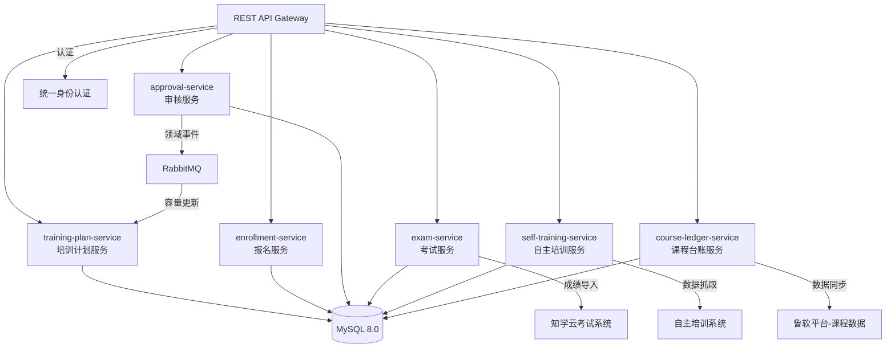
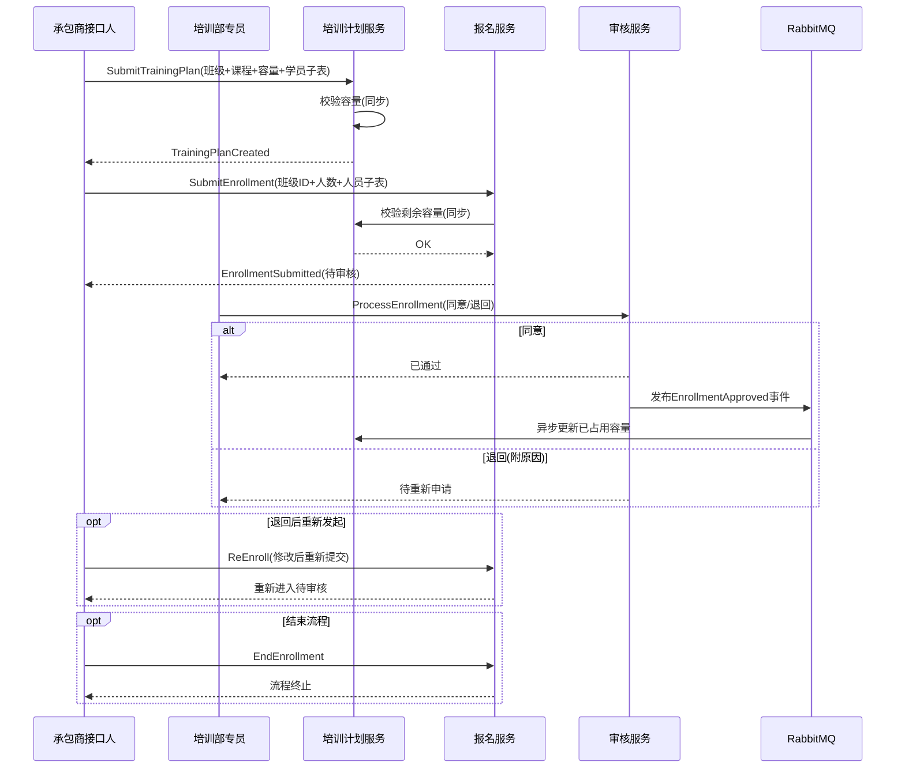
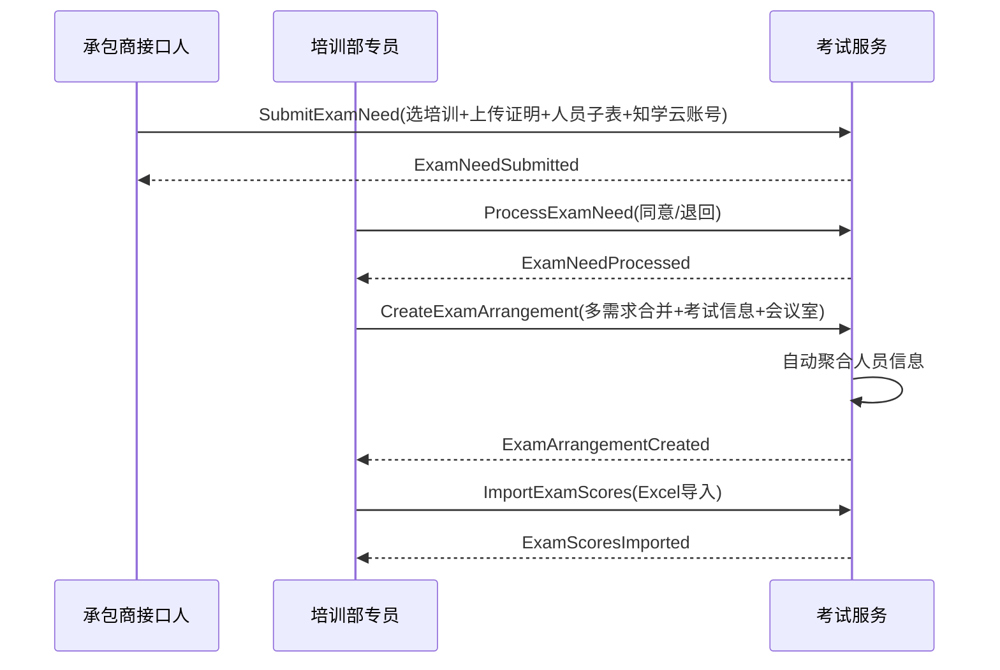
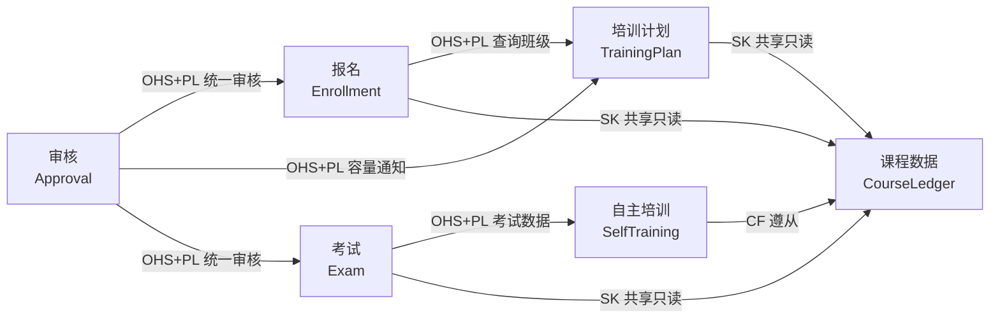
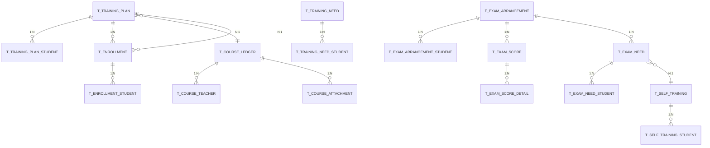

# 承包商培训管理系统 概要设计

> **文档版本**：V1.0 | **生成日期**：2026-05-29 | **引擎**：DDD+AE 融合概设引擎 V1.3 (auto)
> **需求依据**：《承包商培训管理系统需求规格说明书》（45段落+11表格，全部完整提取无截断）
> **设计方法**：STAGE_0文档解析→STAGE_1事件风暴+结构化穷举→STAGE_2行业增强→STAGE_3 DDD架构→STAGE_4数据模型→STAGE_5设计综合→STAGE_6 AE 9章输出

---

## 第1章 功能清单

### 1.1 项目概述

**业务目标**：为承包商单位提供培训计划、报名、审核、考试全流程管理，实现培训资源高效利用与数据可追溯。

**核心业务主线**：
1. **开班→报名→审核闭环链路**：培训部专员/承包商接口人创建开班计划 → 承包商查看开放班级并报名 → 培训部专员审核（同意/退回）→ 退回后重新发起或结束
2. **培训→考试链路**：自主培训信息录入 → 承包商发起考试需求 → 专员审核 → 聚合需求创建考试安排 → 导入考试成绩
3. **培训需求独立链路**：承包商提交培训需求 → 专员审核（同意/退回→退回后重新提交）

### 1.2 功能模块总览

| 模块 | 子模块 | 主要功能 | 优先级 | 能力 |
|------|--------|---------|:---:|:---:|
| 培训管理 | 开班计划 | 新增/编辑/删除/详情；专员模式(月度计划自动填充)与承包商模式；角色数据过滤 | P0 | 核心 |
| 培训管理 | 培训报名 | 双页签(培训报名+我已报名的培训)；容量校验；退回后重新发起/结束 | P0 | 核心 |
| 培训管理 | 报名审核 | 集中处理报名申请；同意/退回 | P0 | 核心 |
| 培训管理 | 培训需求 | 提交→审核→退回→重新提交闭环 | P0 | 核心 |
| 培训管理 | 在岗培训信息 | 从外部系统抓取自主培训数据及成绩 | P1 | 支撑 |
| 考试管理 | 考试需求 | 双页签(发起+处理)；自动筛选需考试培训；上传培训记录证明 | P0 | 核心 |
| 考试管理 | 考试安排 | 双页签(已审核需求+已安排考试)；多需求批量合并；人员自动聚合 | P0 | 核心 |
| 考试管理 | 培训成绩录入 | Excel导入成绩数据；角色数据过滤 | P1 | 支撑 |
| 基础数据 | 课程科目台账 | 目录+列表展示；详情含基本/授权教员/培训/附件；导出功能 | P1 | 通用 |

### 1.3 角色分析

| 角色 | 类型 | 数据范围 | 核心职责 | 菜单权限 |
|------|------|------|------|------|
| 培训部专员 | 业务角色 | 全部数据 | 填写开班计划、审核培训/考试需求、审核报名、安排考试、录入成绩、管理台账 | 全部菜单 |
| 承包商接口人 | 业务角色 | 本人提交+所属承包商单位数据 | 填写开班计划、报名培训、提交培训/考试需求、录入自主培训信息 | 开班计划/培训报名/培训需求/在岗培训信息/考试需求(发起)/考试安排(详情)/成绩(本部门) |

### 1.4 痛点分析

| 痛点 | 严重度 | 说明 | 影响 |
|------|:---:|------|------|
| 培训资源利用率低 | high | 承包商自主开班无法共享名额 | 影响培训ROI |
| 审核流程不闭环 | high | 缺少退回→补正→重新提交闭环 | 流程可能卡死 |
| 数据孤岛 | medium | 培训与考试成绩分散在多系统 | 缺少统一视图 |
| 容量统计口径不明确 | medium | 剩余容量计算方式待确认 | 统计可能偏差 |

---

## 第2章 系统架构设计

### 2.1 架构总览

系统采用**分层架构 + 事件驱动**混合架构：

- ✅ **分层架构**用于服务内部：接口层→应用层→领域层→基础设施层，核心域独立可测
- ✅ **事件驱动**用于跨Context最终一致性：审核通过后异步更新容量
- ❌ **不采用CQRS**：读写差异不显著，统一模型满足<200 QPS
- ❌ **不采用微服务**：6个服务边界内模块化单体即可

### 2.2 分层架构

| 层 | 组件 | 规则 |
|------|------|------|
| 接口层 (Interface) | Controller, DTO | 只做参数校验和转换，不含业务逻辑 |
| 应用层 (Application) | ApplicationService, UseCase | 协调领域对象、事务管理、权限校验 |
| 领域层 (Domain) | Entity, VO, DomainService, Repository接口, DomainEvent | 核心业务逻辑，不依赖基础设施 |
| 基础设施层 (Infrastructure) | Repository实现, MessagePublisher, ExternalAPI | 数据持久化、消息发布、外部集成 |

### 2.3 服务划分

| 服务 | 类型 | Context | 核心职责 |
|------|:---:|------|------|
| training-plan-service | core | 培训计划 | CRUD+自动填充+容量管理+角色过滤 |
| enrollment-service | core | 报名 | 报名/容量校验/状态流转/退回重新发起 |
| approval-service | core | 审核 | 统一审核(报名+培训需求+考试需求) |
| exam-service | core | 考试 | 考试需求/安排/成绩导入/人员聚合 |
| self-training-service | supporting | 自主培训 | 外部系统数据接入 |
| course-ledger-service | supporting | 课程数据 | 课程台账查询/导出 |

### 2.4 技术栈

| 层 | 选型 |
|------|------|
| 后端 | Spring Boot 2.x + MyBatis-Plus |
| 数据库 | MySQL 8.0 (InnoDB, utf8mb4) |
| 缓存 | Redis |
| 消息队列 | RabbitMQ |
| 前端 | Vue 3 + Element Plus |
| 认证 | 统一身份认证 (SSO) |
| 部署 | Docker + K8s |

### 2.5 系统整体结构图



---

## 第3章 业务流程设计

### 3.1 事件风暴概览

系统核心围绕**17个命令(Command)**和**16个领域事件(Domain Event)**运转。事件采用过去时态命名，描述已发生的事实：

**核心命令-事件映射**：

| 命令(Command) | 领域事件(过去时态) | 执行者 |
|------|------|------|
| SubmitTrainingPlan | TrainingPlanCreated | 专员/承包商 |
| SubmitEnrollment | EnrollmentSubmitted | 承包商 |
| ProcessEnrollment | EnrollmentProcessed | 专员 |
| SubmitTrainingNeed | TrainingNeedSubmitted | 承包商 |
| ProcessTrainingNeed | TrainingNeedProcessed | 专员 |
| ResubmitTrainingNeed | TrainingNeedResubmitted | 承包商 |
| SubmitExamNeed | ExamNeedSubmitted | 承包商 |
| ProcessExamNeed | ExamNeedProcessed | 专员 |
| CreateExamArrangement | ExamArrangementCreated | 专员 |
| ImportExamScores | ExamScoresImported | 专员 |
| RecordSelfTraining | SelfTrainingRecorded | 承包商 |
| ReEnroll | EnrollmentReSubmitted | 承包商 |
| EndEnrollment | EnrollmentClosed | 承包商 |

**4条策略(Policy)**：

| POL | 策略 | 触发事件 | 同步/异步 | 职责 |
|:---:|------|------|:---:|------|
| POL-001 | ValidateTrainingCapacity | TrainingPlanCreated | 同步 | 开班时校验容量合法 |
| POL-002 | CheckAvailableCapacity | EnrollmentSubmitted | 同步 | 报名时校验剩余容量充足 |
| POL-003 | UpdateCapacityAfterApproval | EnrollmentProcessed(通过) | 异步 | 审核通过后更新已占用容量 |
| POL-004 | RouteTrainingNeedForReview | TrainingNeedSubmitted | 同步 | 培训需求路由到审核列表 |

### 3.2 业务能力地图

| 能力 | 类型 | 差异化 | 可否采购 |
|------|:---:|------|:---:|
| 培训计划管理 | 核心 | 高(两模式+自动填充+角色过滤) | 否 |
| 报名管理 | 核心 | 高(容量实时校验+退回→重新发起闭环) | 否 |
| 审核管理 | 核心 | 中(统一审核+状态机) | 否 |
| 考试管理 | 核心 | 高(多需求合并+人员聚合，场景特殊) | 否 |
| 自主培训信息 | 支撑 | 低(数据转存) | 可 |
| 成绩录入 | 支撑 | 低(标准导入) | 可 |
| 课程台账 | 通用 | 低(数据字典) | 可采购 |

### 3.3 核心业务流程

#### 链路一：培训开班→报名→审核（主链路）



#### 链路二：培训→考试（完整链路）



### 3.4 领域关系（Context Map）



**关系模式说明**：
- **OHS+PL**(Open Host Service + Published Language)：审核服务作为能力中心，提供统一审核API
- **SK**(Shared Kernel)：课程台账作为共享数据字典，多Context只读访问
- **CF**(Conformist)：自主培训上下文遵从课程数据模型，无权修改

---

## 第4章 数据模型设计

### 4.1 实体识别

共17张数据表，按限界上下文分组：

| Context | 表名 | 聚合根 | 说明 |
|------|------|:---:|------|
| 培训计划 | t_training_plan | ✅ | 开班计划(含容量/已占用容量) |
| 培训计划 | t_training_plan_student | - | 学员信息子表 |
| 报名 | t_enrollment | ✅ | 报名申请(含审核状态) |
| 报名 | t_enrollment_student | - | 报名人员子表 |
| 审核 | t_training_need | ✅ | 培训需求 |
| 审核 | t_training_need_student | - | 培训需求人员子表 |
| 考试 | t_exam_need | ✅ | 考试需求(含附件) |
| 考试 | t_exam_need_student | - | 考试需求人员子表 |
| 考试 | t_exam_arrangement | ✅ | 考试安排(多需求合并) |
| 考试 | t_exam_arrangement_student | - | 考试安排人员子表 |
| 考试 | t_exam_score | ✅ | 考试成绩(导入) |
| 考试 | t_exam_score_detail | - | 成绩明细子表 |
| 自主培训 | t_self_training | ✅ | 自主培训信息(外部抓取) |
| 自主培训 | t_self_training_student | - | 自主培训人员子表 |
| 课程数据 | t_course_ledger | ✅ | 课程科目台账(鲁软导入) |
| 课程数据 | t_course_teacher | - | 授权教员子表 |
| 课程数据 | t_course_attachment | - | 课程附件子表 |

### 4.2 ER 关系图



### 4.3 字段语义分类

| 分类 | 说明 | 建列 | 示例 |
|------|------|:---:|------|
| ownership_field | 实体自身属性 | ✅ 建列 | class_name, capacity, start_time |
| foreign_reference | 外键引用(跨聚合) | ✅ 建列(FK) | plan_id → t_training_plan.data_id |
| projection_field | 展示投影(需JOIN获取) | ❌ 不建列 | 报名列表"班级名称"→JOIN t_training_plan |
| snapshot_field | 历史快照(冗余存储) | ✅ 建列 | remaining_capacity_at_apply(申请时容量) |
| derived_field | 计算字段 | ❌ 不建列 | remaining_capacity = capacity - occupied_capacity |

### 4.4 核心表DDL

**标准字段规范**：每表含9个标准字段
- data_id VARCHAR(64) NOT NULL PRIMARY KEY COMMENT '主键'
- create_member VARCHAR(64) DEFAULT NULL COMMENT '创建人'
- create_time DATETIME DEFAULT NULL COMMENT '创建时间'
- create_member_ip_address VARCHAR(64) DEFAULT NULL
- last_mod_member VARCHAR(64) DEFAULT NULL COMMENT '最后更新人'
- last_mod_time DATETIME DEFAULT NULL COMMENT '最后更新时间'
- last_mod_member_ip_address VARCHAR(64) DEFAULT NULL
- del_flag CHAR(1) DEFAULT '0' COMMENT '删除标记'
- source_system VARCHAR(64) DEFAULT NULL COMMENT '来源系统'

#### t_training_plan（开班计划聚合根）

```sql
-- 投影字段: 课程名称/编码/所属部门(t_course_ledger, JOIN course_id)
CREATE TABLE t_training_plan (
    data_id VARCHAR(64) NOT NULL COMMENT '主键',
    class_name VARCHAR(128) NOT NULL COMMENT '班级名称',
    is_contractor_class CHAR(1) NOT NULL DEFAULT '0' COMMENT '是否承包商开班(0=否,1=是)',
    org_unit VARCHAR(128) DEFAULT NULL COMMENT '开班单位',
    training_month VARCHAR(32) DEFAULT NULL COMMENT '培训月份(专员模式)',
    course_id VARCHAR(64) DEFAULT NULL COMMENT '课程ID FK → t_course_ledger.data_id',
    course_code VARCHAR(64) DEFAULT NULL COMMENT '课程编码(自动带出,快照)',
    classroom VARCHAR(64) DEFAULT NULL COMMENT '培训教室',
    teacher_name VARCHAR(64) DEFAULT NULL COMMENT '教员(自动带出,快照)',
    start_time DATETIME DEFAULT NULL COMMENT '开始时间',
    end_time DATETIME DEFAULT NULL COMMENT '结束时间',
    training_intro TEXT DEFAULT NULL COMMENT '培训简介',
    capacity INT NOT NULL COMMENT '培训容量',
    occupied_capacity INT DEFAULT 0 COMMENT '已占用容量(审核通过后异步更新)',
    status VARCHAR(32) DEFAULT 'active' COMMENT '状态(active/cancelled)',
    creator_role VARCHAR(32) DEFAULT NULL COMMENT '创建者角色(trainer/contractor)',
    -- 9标准字段
    create_member VARCHAR(64) DEFAULT NULL, create_time DATETIME DEFAULT NULL,
    create_member_ip_address VARCHAR(64) DEFAULT NULL,
    last_mod_member VARCHAR(64) DEFAULT NULL, last_mod_time DATETIME DEFAULT NULL,
    last_mod_member_ip_address VARCHAR(64) DEFAULT NULL,
    del_flag CHAR(1) DEFAULT '0', source_system VARCHAR(64) DEFAULT NULL,
    PRIMARY KEY (data_id),
    INDEX idx_course_id (course_id), INDEX idx_start_time (start_time)
) ENGINE=InnoDB DEFAULT CHARSET=utf8mb4 COMMENT='开班计划|投影:课程名称(t_course_ledger)';
```

#### t_enrollment（培训报名聚合根）

```sql
-- 投影字段: 班级名称/开班单位/课程/教员/时间/容量(t_training_plan, JOIN plan_id)
-- 快照字段: remaining_capacity_at_apply(申请时容量), contractor_unit(申请时单位)
CREATE TABLE t_enrollment (
    data_id VARCHAR(64) NOT NULL COMMENT '主键',
    plan_id VARCHAR(64) NOT NULL COMMENT 'FK → t_training_plan.data_id',
    enroll_count INT NOT NULL COMMENT '本次报名人数',
    contractor_unit VARCHAR(128) DEFAULT NULL COMMENT '承包商单位(快照)',
    remaining_capacity_at_apply INT DEFAULT NULL COMMENT '申请时容量(快照)',
    approval_status VARCHAR(32) NOT NULL DEFAULT 'pending' COMMENT '审核状态(pending/approved/rejected/closed)',
    reject_reason VARCHAR(512) DEFAULT NULL COMMENT '退回原因',
    -- 9标准字段
    create_member VARCHAR(64) DEFAULT NULL, create_time DATETIME DEFAULT NULL,
    create_member_ip_address VARCHAR(64) DEFAULT NULL,
    last_mod_member VARCHAR(64) DEFAULT NULL, last_mod_time DATETIME DEFAULT NULL,
    last_mod_member_ip_address VARCHAR(64) DEFAULT NULL,
    del_flag CHAR(1) DEFAULT '0', source_system VARCHAR(64) DEFAULT NULL,
    PRIMARY KEY (data_id),
    INDEX idx_plan_id (plan_id), INDEX idx_approval_status (approval_status)
) ENGINE=InnoDB DEFAULT CHARSET=utf8mb4 COMMENT='培训报名|投影:班级信息(t_training_plan)|快照:capacity';
```

#### t_training_need（培训需求聚合根）

```sql
CREATE TABLE t_training_need (
    data_id VARCHAR(64) NOT NULL COMMENT '主键',
    contractor_unit VARCHAR(128) DEFAULT NULL COMMENT '承包商单位(快照)',
    applicant_id VARCHAR(64) DEFAULT NULL COMMENT '申请人ID',
    applicant_name VARCHAR(64) DEFAULT NULL COMMENT '申请人姓名(快照)',
    course_id VARCHAR(64) DEFAULT NULL COMMENT '课程ID FK → t_course_ledger.data_id',
    course_name VARCHAR(128) DEFAULT NULL COMMENT '课程名称(快照)',
    expected_start_time DATETIME DEFAULT NULL COMMENT '期望开课时间',
    training_count INT DEFAULT NULL COMMENT '培训人数',
    approval_status VARCHAR(32) NOT NULL DEFAULT 'pending' COMMENT '审批状态(pending/approved/rejected)',
    reject_reason VARCHAR(512) DEFAULT NULL,
    -- 9标准字段
    create_member VARCHAR(64) DEFAULT NULL, create_time DATETIME DEFAULT NULL,
    create_member_ip_address VARCHAR(64) DEFAULT NULL,
    last_mod_member VARCHAR(64) DEFAULT NULL, last_mod_time DATETIME DEFAULT NULL,
    last_mod_member_ip_address VARCHAR(64) DEFAULT NULL,
    del_flag CHAR(1) DEFAULT '0', source_system VARCHAR(64) DEFAULT NULL,
    PRIMARY KEY (data_id), INDEX idx_approval_status (approval_status)
) ENGINE=InnoDB DEFAULT CHARSET=utf8mb4 COMMENT='培训需求|投影:课程名称(t_course_ledger)';
```

#### t_exam_arrangement（考试安排聚合根）

```sql
-- 支持多需求合并，人员自动聚合，考试人数自动统计反写
CREATE TABLE t_exam_arrangement (
    data_id VARCHAR(64) NOT NULL COMMENT '主键',
    exam_name VARCHAR(128) NOT NULL COMMENT '考试名称',
    exam_location VARCHAR(64) DEFAULT NULL COMMENT '考试地点(会议室下拉)',
    exam_start_time DATETIME DEFAULT NULL COMMENT '考试开始时间',
    exam_end_time DATETIME DEFAULT NULL COMMENT '考试结束时间',
    exam_count INT DEFAULT 0 COMMENT '考试人数(根据子表自动统计)',
    -- 9标准字段
    create_member VARCHAR(64) DEFAULT NULL, create_time DATETIME DEFAULT NULL,
    create_member_ip_address VARCHAR(64) DEFAULT NULL,
    last_mod_member VARCHAR(64) DEFAULT NULL, last_mod_time DATETIME DEFAULT NULL,
    last_mod_member_ip_address VARCHAR(64) DEFAULT NULL,
    del_flag CHAR(1) DEFAULT '0', source_system VARCHAR(64) DEFAULT NULL,
    PRIMARY KEY (data_id)
) ENGINE=InnoDB DEFAULT CHARSET=utf8mb4 COMMENT='考试安排|人员子表:t_exam_arrangement_student';
```

> **完整DDL说明**：其余子表(t_training_plan_student, t_enrollment_student, t_training_need_student, t_exam_need及子表, t_exam_arrangement_student, t_exam_score及子表, t_self_training及子表, t_course_ledger及子表)均按同样规范设计。

---

## 第5章 功能设计

### 5.1 限界上下文功能框架

#### 培训计划上下文 - 开班计划模块

| 功能 | 入口 | 页面类型 | 设计要点 |
|------|------|------|------|
| 列表查看 | 菜单进入 | list_with_filter | **角色过滤**：承包商仅见本人数据；专员见全部 |
| 新增(专员模式) | 新增按钮 | form_with_subtable | 培训月份→过滤课程→选课自动填充教室/编码/教员 |
| 新增(承包商模式) | 新增按钮 | form_with_subtable | 默认承包开班=是；选课自动填充编码/教员(来源教员授权台账) |
| 编辑 | 行内按钮 | form_with_subtable | 继承已有数据 |
| 详情 | 行内按钮 | detail_page | 完整展示所有字段+学员子表 |
| 删除 | 行内按钮 | confirm_dialog | 逻辑删除(del_flag=1) |

#### 报名上下文 - 培训报名模块

| 页签 | 功能 | 设计要点 |
|------|------|------|
| 培训报名 | 查看开放班级 | 展示全部承包商接口人开班+专员发布计划；字段：班级名/开班单位/课程/教员/时间/容量 |
| 培训报名 | 发起报名 | 班级信息只读+填写报名人数+人员子表；选择学员姓名后自动带出公司/工号/手机号 |
| 我已报名的培训 | 查看报名状态 | 审核状态：待审核/已通过/待重新申请；详情按钮 |
| 我已报名的培训 | 重新发起报名 | 状态=待重新申请时出现；可修改后重新提交 |
| 我已报名的培训 | 结束流程 | 状态=待重新申请时出现；终止后流程结束 |

#### 报名审核模块

| 功能 | 入口 | 设计要点 |
|------|------|------|
| 审核列表 | 菜单进入 | 展示所有待处理报名，含关键决策信息(单位/人数vs容量) |
| 处理-同意 | 行内按钮 | 状态=已通过；异步更新班级已占用容量 |
| 处理-退回 | 行内按钮 | 需填写退回原因；状态=待重新申请 |
| 详情 | 行内按钮 | 报名表单全部字段只读 |

#### 考试上下文

| 模块/页签 | 功能 | 设计要点 |
|------|------|------|
| 考试需求发起 | 筛选培训列表 | 仅展示需要考试=是的培训；排序：未发起优先→结束时间倒序 |
| 考试需求发起 | 发起考试需求 | 自动带出承包商单位；上传培训记录证明附件；填考试需求名称(字典值)；填考试人员子表(姓名/工号/身份证/手机/知学云账号/考试科目/是否已提交培训记录) |
| 考试需求处理 | 专员审核 | 查看详情+处理：同意(结束)/退回(返回承包商重新发起) |
| 已审核需求(安排页签) | 批量选择→新增考试 | 支持多选考试需求；填写考试信息(名称/地点/时间)；自动聚合人员到子表 |
| 已安排考试 | 查看 | 列表展示(名称/地点/时间/人数)；详情查看 |

### 5.2 核心交互追踪：报名完整流程

```
Step 1: 承包商接口人进入[培训管理→培训报名→培训报名页签]
  → 列表展示所有开放班级：班级名称、开班单位、关联课程、教员、开始时间、结束时间、培训教室容量

Step 2: 点击目标班级的"培训报名"按钮
  → 跳转报名表单页
  → 上方自动展示：班级基础信息(只读)+剩余容量(计算展示)
  → 下方填写：本次报名人数(数字)+报名人员子表

Step 3: 填写报名人员子表
  → 点击添加人员
  → 选择"学员姓名"（系统人员组件）
  → 系统自动带出：所在公司(取承包商一级单位)、工号、手机号

Step 4: 点击"提交"
  → 系统同步校验：本次报名人数 ≤ 剩余容量
  → 校验通过 → 报名成功，状态=待审核
  → 该报名出现在：[报名审核列表(专员可见)] + [我已报名的培训页签(本人可见)]

Step 5: 培训部专员进入[培训管理→报名审核]
  → 列表展示待审核报名(单位/人数/容量/班级/课程)
  → 点击"处理"按钮 → 查看报名详情(全部只读)
  → [同意]：状态=已通过，系统发布EnrollmentApproved → 异步更新班级已占用容量
  → [退回]：需填写退回原因，状态=待重新申请

Step 6(退回场景): 承包商接口人进入[我已报名的培训]
  → 看到状态=待重新申请
  → [重新发起报名]按钮：可修改报名信息 → 重新提交 → 回到Step 4
  → [结束]按钮：确认后流程终止，不再参与容量统计
```

### 5.3 关键设计取舍

| 决策 | 理由 | 原文依据 |
|------|------|------|
| 人员信息自动填充(选姓名→带出公司/工号/手机) | 减少手动录入、降低出错率 | SRC-028: "选择姓名后自动带出所在公司、工号、手机号" |
| 容量同步实时校验(报名时检查剩余容量) | 避免超报，即时反馈 | SRC-023: "剩余容量=开班容量-本次报名人数-历史已报名人数" |
| 审核通过后异步更新容量(MQ) | 不阻塞审核主流程 | 架构决策：跨Context用最终一致性 |
| 考试需求支持多选合并创建安排 | 避免重复工作，提升效率 | SRC-034: "支持选择一条或多条数据发起考试安排" |
| 退回→重新提交完整闭环 | 完整补正流程 | SRC-040: "重新发起报名按钮及结束按钮" |
| 课程台账仅外部导入(不可手动新增) | 数据权威性来自源头 | SRC-009: "从鲁软开发的平台导入科目台账数据" |

---

## 第6章 权限设计

### 6.1 角色权限矩阵

| 功能/菜单 | 培训部专员 | 承包商接口人 | 说明 |
|------|:---:|:---:|------|
| 开班计划 | ✅ 全部 | ✅ 本人提交 | 列表按角色过滤 |
| 培训报名(报名页签) | ❌ | ✅ | 专员通过报名审核处理 |
| 培训报名(我的报名) | ❌ | ✅ 本人 | - |
| 报名审核 | ✅ | ❌ | |
| 培训需求 | ✅ 全部 | ✅ 本人提交 | |
| 在岗培训信息 | ✅ 全部 | ✅ 本部门 | |
| 考试需求(发起) | ❌ | ✅ 本人 | |
| 考试需求(处理) | ✅ | ❌ | |
| 考试安排(新增) | ✅ | ❌ | |
| 考试安排(详情) | ✅ | ✅ 只读 | 承包商不可编辑 |
| 培训成绩录入 | ✅ 全部 | ✅ 本部门 | 按单位过滤 |
| 课程科目台账(查看) | ✅ | ✅ | 所有角色可查看 |
| 课程科目台账(导出) | ✅ | ❌ | |

### 6.2 数据隔离方案

**三层隔离模型**：

| 层级 | 说明 | 实现方式 |
|------|------|------|
| 角色级(Role) | 菜单访问控制 | 基于角色的菜单权限配置 |
| 数据级(Data) | 行级数据范围过滤 | 查询时注入WHERE条件(create_member/contractor_unit) |
| 字段级(Field) | 表单字段显隐 | 配置化：承包商模式下隐藏培训月份字段，默认承包开班=是且不可改 |

---

## 第7章 非功能设计

### 7.1 性能设计

| 指标 | 目标 | 策略 |
|------|------|------|
| 并发用户数 | ≥200 | 数据库连接池50，2-3应用实例 |
| 页面响应时间 | ≤3秒 | Redis缓存课程/字典/会议室；列表分页20条/页 |
| API响应时间 | ≤500ms(P95) | 索引优化避免N+1查询；批量查询替代循环单查 |
| 报表导出 | ≤30秒 | 异步导出+分页处理 |

**缓存策略**：
- 课程科目台账：全量缓存 TTL=1小时，变更时主动刷新
- 会议室/教室下拉选项：全量缓存 TTL=24小时
- 人员组件数据：缓存 TTL=30分钟
- 容量统计：实时查询（非缓存），写时主动失效

### 7.2 安全设计

| 维度 | 方案 |
|------|------|
| 认证 | 对接公司统一身份认证体系 (SSO) |
| 授权 | RBAC + 数据范围过滤 |
| 传输安全 | HTTPS + API签名 |
| 操作审计 | 所有写操作留痕(create_member/create_time + last_mod_member/last_mod_time字段) |
| 数据保护 | 身份证号码存储加密(AES256)，手机号前端脱敏展示 |
| 防重入 | 报名提交、审核处理使用幂等键(client_token)防重复提交 |

### 7.3 可扩展性

- **服务独立部署**：各服务可独立构建、部署、扩展
- **事件驱动解耦**：跨Context通过RabbitMQ异步通信，新增消费者无需修改发布方
- **数据库水平扩展**：t_training_plan、t_enrollment、t_exam_score等有明确时间维度的表可按时间分表
- **考试类型扩展**：考试科目、培训课程类型通过字典配置，无需代码变更

### 7.4 行业建议的非功能需求 ⚠️

| 建议 | 状态 | 说明 |
|------|:---:|------|
| 接入统一待办中心 | ⚠️建议 | 审核操作建议接入企业统一待办，避免用户遗漏待处理任务 |
| 统一消息通知 | ⚠️建议 | 审核结果通过站内信/短信/邮件通知申请人 |
| 审计日志分离存储 | ⚠️建议 | 审计日志与业务日志分离存储，保留期≥3年 |
| 并发报名乐观锁 | ⚠️建议 | 高并发场景下容量扣减使用乐观锁防超报 |

---

## 第8章 遗留问题

### 8.1 需确认的设计决策

| # | 决策问题 | 影响范围 | 行业默认 | 推荐方案 | 状态 |
|:---:|------|------|------|------|:---:|
| DEC-001 | 剩余容量计算口径：审核通过人数 vs 所有报名人数？ | 容量统计、报名限制 | 按审核通过 | 建议按审核通过人数 | ❓待客户确认 |
| DEC-002 | 退回后重新提交是否保留历史版本？ | 数据模型、审计追踪 | 保留历史 | 建议保留(主记录+历史记录表) | ❓待确认 |
| DEC-003 | 培训记录证明附件大小和格式限制？ | 存储规划 | ≤20MB, PDF/图片 | 建议仅PDF和图片格式 | ❓待确认 |
| DEC-004 | 成绩导入是否需要错误校验反馈？ | 功能详细设计 | 需要 | 建议批量校验+错误行标注+错误报告下载 | ⚠️建议 |
| DEC-005 | 课程台账从鲁软平台同步频率？全量/增量？ | 数据同步策略 | 每日全量 | 建议初始全量+每日增量 | ❓待确认 |

### 8.2 需求中标注的开放问题

| Q-ID | 问题 | 影响 | 严重度 |
|:---:|------|------|:---:|
| Q-001 | "是否减去审核通过人数还是所有报名人数。待PM与客户确认" | 容量计算逻辑 | high |
| Q-002 | 开班计划删除后，已报名的数据如何处理？ | 数据一致性 | medium |
| Q-003 | 培训月份与课程的关联关系数据来源（需确认月度培训计划接口细节） | 专员模式自动填充 | medium |
| Q-004 | "考试需求过滤逻辑另行处理" — 具体筛选规则待明确 | 考试需求列表展示 | medium |
| Q-005 | 1.2.2.4实时数据对接、1.2.2.5硬件接口、1.2.2.6通信接口均标注为"无" | 可能遗漏 | low |

### 8.3 行业经验推断的设计假设 🔶

| 假设 | 置信度 | 需验证 |
|------|:---:|:---:|
| 开班计划删除为逻辑删除(del_flag=1)，已报名的数据保留但班级标记cancelled | medium | ✅需确认 |
| 承包商接口人的"所在公司"通过人员组件的组织架构取一级单位 | high | ✅需确认 |
| 课程科目台账的导入支持增量更新(按课程编码去重) | medium | ✅需确认 |
| 培训部专员与承包商接口人通过SSO角色属性区分 | high | ✅需确认 |

---

## 第9章 工作量评估

### 9.1 按服务拆分评估

| 服务 | 配置(人天) | 开发(人天) | 测试(人天) | 小计 |
|------|:---:|:---:|:---:|:---:|
| training-plan-service | 1 | 8 | 3 | 12 |
| enrollment-service | 1 | 10 | 4 | 15 |
| approval-service | 1 | 6 | 3 | 10 |
| exam-service | 1 | 10 | 4 | 15 |
| self-training-service | 0.5 | 4 | 2 | 6.5 |
| course-ledger-service | 0.5 | 4 | 2 | 6.5 |
| **小计** | **5** | **42** | **18** | **65** |

### 9.2 建议开发顺序

| 阶段 | 服务 | 人天 | 前置依赖 |
|:---:|------|:---:|------|
| Phase 1 | course-ledger-service + self-training-service | 13 | 外部系统(鲁软、自主培训系统)接口就绪 |
| Phase 2 | training-plan-service | 12 | Phase 1（课程数据作为下拉数据源） |
| Phase 3 | enrollment-service + approval-service | 25 | Phase 2（班级数据作为报名目标） |
| Phase 4 | exam-service | 15 | Phase 1（自主培训）+ Phase 3（审核统一接口） |

### 9.3 总计

| 项 | 人天 |
|------|:---:|
| 配置(环境/CI/CD/域名/SSO对接/数据库初始化) | 5 |
| 开发(6个服务) | 42 |
| 测试(功能测试/集成测试/性能测试) | 18 |
| **小计** | **65** |
| 15%缓冲 + 项目管理 | 10 |
| **总计** | **~75 人天** |

> **评估假设**：3人团队(2后端+1前端)，约5周开发周期。实际工期取决于外部系统(鲁软、知学云、承包商自主培训系统)接口就绪时间、SSO对接进度和需求确认反馈速度。

---

## 附录A：业务事件完整清单

| EVT-ID | 事件名称(过去时态) | 触发命令 | 下游影响 |
|:---:|------|------|------|
| EVT-001 | TrainingPlanCreated | SubmitTrainingPlan | 创建开班信息，可被报名/考试引用 |
| EVT-002 | EnrollmentSubmitted | SubmitEnrollment | 提交报名申请，触发审核流程 |
| EVT-003 | EnrollmentProcessed | ProcessEnrollment | 审核完毕，更新容量统计 |
| EVT-004 | TrainingNeedSubmitted | SubmitTrainingNeed | 提交培训需求，触发审核 |
| EVT-005 | TrainingNeedProcessed | ProcessTrainingNeed | 需求审核完毕 |
| EVT-006 | TrainingNeedResubmitted | ResubmitTrainingNeed | 重新提交需求 |
| EVT-007 | ExamNeedSubmitted | SubmitExamNeed | 提交考试需求 |
| EVT-008 | ExamNeedProcessed | ProcessExamNeed | 考试需求审核完毕 |
| EVT-009 | ExamArrangementCreated | CreateExamArrangement | 创建考试安排，人员分配完成 |
| EVT-010 | ExamScoresImported | ImportExamScores | 成绩数据入库完成 |
| EVT-011 | SelfTrainingRecorded | RecordSelfTraining | 自主培训数据入库 |
| EVT-012 | EnrollmentReSubmitted | ReEnroll | 报名重新提交 |
| EVT-013 | EnrollmentClosed | EndEnrollment | 报名流程终止 |
| EVT-014 | TrainingPlanUpdated | EditTrainingPlan | 班级信息变更 |
| EVT-015 | TrainingPlanDeleted | DeleteTrainingPlan | 班级删除(逻辑) |
| EVT-016 | CourseLedgerExported | ExportCourseLedger | 台账导出完成 |

## 附录B：文档生成记录

| 指标 | 数值 |
|------|:---:|
| 源文档段落数 | 45 (60总段落中含15空段落) |
| 源文档表格数 | 11 |
| 表格完整提取率 | 100% (11/11) |
| 提取后功能点数 | 9 (FUNC-001~009) |
| 提取后实体数 | 12 (ENT-001~012) |
| 提取后字段数 | 27+ (铺开全部子表字段) |
| 领域事件数 | 16 |
| 业务命令数 | 17 |
| 策略数 | 4 |
| 业务流程数 | 5 |
| DDL表数 | 17 |
| 服务数 | 6 |
| 聚合根数 | 6 |
| 限界上下文数 | 6 |
| Mermaid图表 | 5 (系统结构图+2个时序图+ContextMap+ER图) |
| 需求成熟度 | 58/100 (中等) |

---

> **生成完成时间**：2026-05-29 UTC  
> **生成引擎版本**：Design Workflow Skill V1.3  
> **模式**：auto (直通模式，全程自动推进)  
> **本地备份路径**：`/root/.openclaw/workspace/承包商培训管理系统_概设_V1.3.md`
